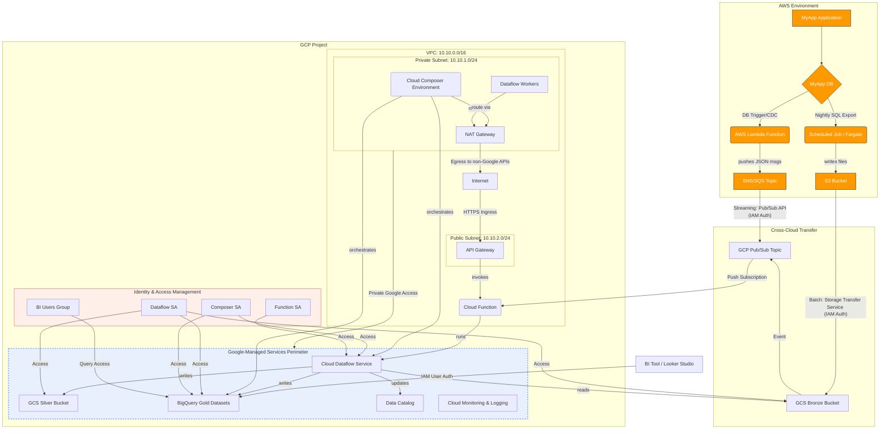
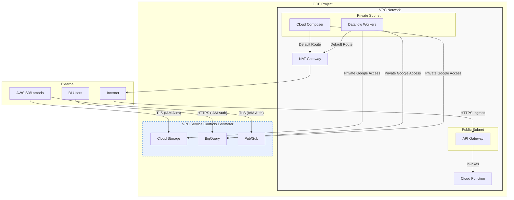

# Table of Contents

* [1. Overview & Executive Summary](#1-overview--executive-summary)
    * [1.1. Introduction & Business Problem](#11-introduction--business-problem)
    * [1.2. Proposed Solution](#12-proposed-solution)
    * [1.3. Key Benefits](#13-key-benefits)
* [2. Scope](#2-scope)
    * [2.1. In Scope](#21-in-scope)
    * [2.2. Out of Scope](#22-out-of-scope)
* [3. Business Requirements & Architectural Drivers](#3-business-requirements--architectural-drivers)
* [4. Cloud and Application Architecture](#4-cloud-and-application-architecture)
    * [4.1. Recommended Cloud Provider](#41-recommended-cloud-provider)
    * [4.2. Cloud Architecture Diagram](#42-cloud-architecture-diagram)
    * [4.3. Compute Architecture](#43-compute-architecture)
    * [4.4. Application Architecture](#44-application-architecture)
* [5. Network Architecture](#5-network-architecture)
    * [5.1. Network Topology](#51-network-topology)
    * [5.2. Traffic Flow](#52-traffic-flow)
    * [5.3. DNS & Connectivity](#53-dns--connectivity)
    * [5.4. Network Architecture Diagram](#54-network-architecture-diagram)
* [6. Data Storage & Management](#6-data-storage--management)
    * [6.1. Data Storage Solutions](#61-data-storage-solutions)
    * [6.2. Data Flow & Lifecycle](#62-data-flow--lifecycle)
    * [6.3. Backup and Recovery](#63-backup-and-recovery)
* [7. Data and Application Integration](#7-data-and-application-integration)
    * [7.1. Internal Integration](#71-internal-integration)
    * [7.2. External Integration](#72-external-integration)
* [8. Security & Compliance](#8-security--compliance)
    * [8.1. Identity and Access Management (IAM)](#81-identity-and-access-management-iam)
    * [8.2. Data Protection](#82-data-protection)
    * [8.3. Network Security](#83-network-security)
    * [8.4. Compliance](#84-compliance)
* [9. Deployment & Operations (DevOps)](#9-deployment--operations-devops)
    * [9.1. CI/CD Pipeline](#91-cicd-pipeline)
    * [9.2. Monitoring & Logging](#92-monitoring--logging)
    * [9.3. Disaster Recovery (DR)](#93-disaster-recovery-dr)
* [10. Scalability & Performance](#10-scalability--performance)
    * [10.1. Scalability](#101-scalability)
    * [10.2. Performance](#102-performance)
* [11. Cost Estimation & Optimization](#11-cost-estimation--optimization)
    * [11.1. High-Level Cost Breakdown](#111-high-level-cost-breakdown)
    * [11.2. Cost Optimization Strategies](#112-cost-optimization-strategies)
* [12. Considerations & Limitations](#12-considerations--limitations)
    * [12.1. Key Assumptions](#121-key-assumptions)
    * [12.2. Risks & Mitigations](#122-risks--mitigations)
    * [12.3. Known Limitations](#123-known-limitations)
 

# Cloud Solution Architecture
**Project:** Cross-Cloud Data Analytics Solution
**Version:** 2.0
**Date:** June 25, 2025

---

### 1. Overview & Executive Summary

#### 1.1. Introduction & Business Problem
The organization requires a centralized platform to perform comprehensive business intelligence and analytics. Critical business data resides within the "MyApp" application, hosted on AWS, which limits the ability of stakeholders to perform self-service analysis and derive timely insights. The core business problem is the siloed nature of this data and the lack of a robust, high-performance environment for data aggregation, reporting, and advanced analytics.

#### 1.2. Proposed Solution
This document outlines a cloud-native, cross-cloud solution that establishes a data pipeline from the AWS source system into a modern Lake House architecture built on Google Cloud Platform (GCP). Data will be securely transferred from AWS to Google Cloud Storage (GCS), processed by `Cloud Dataflow`, and loaded into `Google BigQuery` for analysis. Business users will access curated data via BI tools like Looker Studio, with the entire workflow orchestrated by `Cloud Composer`.

#### 1.3. Key Benefits
This architecture will provide significant benefits aligned with core business requirements:

-   **Scalability & Performance:** A serverless-first design that automatically scales to meet performance targets and fluctuating data volumes.
-   **Cost-Efficiency:** A consumption-based model that minimizes operational overhead and optimizes spend.
-   **Enhanced Analytics & Self-Service:** A centralized, performant data warehouse enabling self-service BI and reducing time-to-insight.
-   **Security & Governance:** A secure-by-design approach with robust data protection, governance, and compliance features.

---

### 2. Architectural Framework & Guiding Principles
This solution is designed in accordance with the principles of the Google Cloud Architecture Framework and the AWS Well-Architected Framework. The architectural decisions are deliberately mapped to the core pillars of both frameworks to ensure a balanced, robust, and future-proof design.

-   **Operational Excellence:** The design emphasizes automation, observability, and infrastructure as code to create a manageable and reliable system.
-   **Security:** Security is applied in layers, from a strong identity foundation and network perimeter to data-level encryption and protection.
-   **Reliability:** The architecture is built on highly available managed services and includes strategies for resiliency and disaster recovery.
-   **Performance Efficiency & Optimization:** The solution uses serverless and managed services to eliminate the need for capacity guessing and to ensure optimal performance for analytical workloads.
-   **Cost Optimization:** The architecture adopts a consumption-based model, using serverless technologies and optimization strategies to control costs without sacrificing performance.

---

### 3. Scope

#### 3.1. In Scope
-   Design and deployment of a Well-Architected data pipeline from AWS to GCP.
-   Implementation of a Medallion Lake House architecture on GCP.
-   Setup of `BigQuery` as the enterprise data warehouse.
-   Integration with a BI tool for self-service reporting.
-   Implementation of robust security, monitoring, and CI/CD automation.

#### 3.2. Out of Scope
-   Modifications to the source "MyApp" application on AWS.
-   Development of specific machine learning models (the architecture is ML-ready).
-   Management of the source AWS environment.

---

### 4. Cloud and Application Architecture

#### 4.1. Recommended Cloud Provider
Google Cloud Platform (GCP) is the chosen provider, aligning with the business requirement to leverage Google BigQuery. GCP's mature serverless data toolkit (`Dataflow`, `Cloud Functions`, `Pub/Sub`) directly supports the Well-Architected pillars of Performance Efficiency and Cost Optimization.

#### 4.2. Detailed Architecture Diagram
This diagram illustrates the full component and interaction flow, including networking and security overlays.

### 5. Network Architecture & Security
This design adheres to the Security pillar principle of applying security at all layers.

#### 5.1. Network Topology
-   **VPC:** A dedicated Virtual Private Cloud (VPC) is established in the target GCP region, providing a logically isolated network environment.
-   **Subnets:**
    -   *Private Subnets* (e.g., `10.10.1.0/24`): House all internal compute resources like `Cloud Composer` environments and `Cloud Dataflow` workers. These resources have no public IP addresses, preventing direct ingress from the internet.
    -   *Public Subnets* (e.g., `10.10.2.0/24`): Contain internet-facing resources like the API Gateway, which acts as a secure and managed entry point.
-   **Gateways:**
    -   *API Gateway:* Provides a secure, scalable, and monitored entry point for triggering the `Cloud Function` via HTTPS, protecting it from direct exposure.
    -   *NAT Gateway:* Allows resources in the private subnet (like `Composer`) to initiate outbound connections to the internet (e.g., for installing Python packages) without having a public IP address, maintaining security.
-   **Private Google Access:** Enabled for the private subnets, allowing internal resources to communicate with Google-managed services (GCS, BigQuery) over Google's internal network, enhancing security and performance.

#### 5.2. Security Perimeters & Data Protection
-   **VPC Service Controls:** A service perimeter is established around critical data services (`GCS`, `BigQuery`, `Dataflow`). This acts as a virtual data firewall, preventing data exfiltration by ensuring that these services can only be accessed by authorized identities from within the defined network boundary.
-   **Data Encryption:** All data is encrypted in transit (TLS 1.2+ for all API calls and transfers) and at rest (Google-managed AES-256 encryption for GCS and `BigQuery` by default), satisfying a core security principle.

#### 5.3. Network Architecture Diagram
This diagram focuses on the network-level components and traffic flow.

### 6. Identity and Access Management (IAM)
Aligned with the principle of implementing a strong identity foundation, access is meticulously controlled.

-   **Principle of Least Privilege:** Each service and user is granted only the permissions essential for its function.
-   **Dedicated Service Accounts:**
    -   *Dataflow SA:* Permissions to read from the Bronze GCS bucket and `Pub/Sub`, and write to the Silver/Gold GCS/`BigQuery` layers.
    -   *Cloud Function SA:* Permission only to invoke a `Dataflow` job.
    -   *Cloud Composer SA:* Permissions to orchestrate `Dataflow` jobs and `BigQuery` loads.
-   **User Access:** Business users are managed via Google Groups. These groups are assigned specific, read-only roles (e.g., `roles/bigquery.dataViewer`, `roles/lookerstudio.viewer`) on the Gold `BigQuery` datasets, preventing unauthorized data modification.

---

### 7. Reliability & Operational Excellence
This section addresses the Reliability and Operational Excellence pillars by designing for automation and resilience.

#### 7.1. Automation & Operations as Code
-   **Infrastructure as Code (IaC):** The entire GCP environment (VPC, subnets, IAM policies, `BigQuery` datasets) will be defined using `Terraform`. This ensures deployments are repeatable, auditable, and consistent, aligning with the "perform operations as code" principle.
-   **CI/CD Pipeline:** A `Cloud Build` pipeline will automatically test and deploy changes to both infrastructure (`Terraform`) and application code (`Dataflow` jobs) from a Git repository. This enables frequent, small, reversible changes, reducing the risk of deployment failures.

#### 7.2. Monitoring & Observability
-   **Centralized Observability:** `Cloud Monitoring` and `Cloud Logging` provide a unified platform to track performance metrics, query logs, and view application traces from all services.
-   **Proactive Alerting:** Alerts will be configured to notify the operations team of pipeline failures (e.g., `Dataflow` job errors, >5% error rate), performance degradation (e.g., high query latency), and security events, enabling rapid response.

#### 7.3. Resiliency and Disaster Recovery
-   **Managed Service Reliability:** The core components (`BigQuery`, `GCS`, `Dataflow`, `Pub/Sub`) are highly available, regional, or multi-regional services managed by Google, which abstracts away the need to manage underlying infrastructure resilience.
-   **Data Backup & Recovery:**
    -   *GCS:* Object versioning is enabled on all buckets to recover from accidental deletions. Cross-region replication can be configured for the Silver bucket to provide a DR copy.
    -   *BigQuery:* Uses a 7-day time travel feature for short-term recovery. For long-term backup and DR, scheduled snapshots will be exported to a GCS bucket in a different region.
-   **Pipeline Resiliency:** `Dataflow` jobs are designed to be fault-tolerant and will automatically retry failed operations. A dead-letter queue will be configured for data that repeatedly fails validation, preventing a single bad record from halting the entire pipeline.

---

### 8. Performance & Cost Optimization
This design uses serverless technologies to meet the principles of the Performance Efficiency and Cost Optimization pillars.

#### 8.1. Performance Strategies
-   **Use Serverless Architectures:** The core of the architecture (`Dataflow`, `BigQuery`, `Cloud Functions`) is serverless. This eliminates the need for capacity planning and ensures resources are provisioned on-demand to meet performance requirements.
-   **Optimized Data Structures:** Data is stored in the Silver layer in Parquet format, a columnar storage format that dramatically improves I/O performance for analytical engines like `BigQuery` and `Dataflow`.
-   **BigQuery Optimization:** Gold-layer tables in `BigQuery` will be partitioned by date and clustered by frequently used dimensions (e.g., `customer_id`). This minimizes the data scanned by queries, which simultaneously improves performance and reduces cost.

#### 8.2. Cost Optimization Strategies
-   **Adopt a Consumption Model:** Pay only for what you use. `Dataflow` bills for processing time, `BigQuery` for storage and queries, and `Functions` for invocations. There are no idle servers incurring costs.
-   **Minimize Data Egress:** Data will be compressed on the AWS side before transfer to reduce AWS's primary cross-cloud cost driver: data egress.
-   **Storage Tiering:** GCS lifecycle policies will automatically move older, less frequently accessed data from the Silver layer to cheaper storage classes (Nearline or Coldline), optimizing storage costs.
-   **Implement Cloud Financial Management:** GCP Budgets and alerts will be configured to monitor spending and prevent cost overruns.
