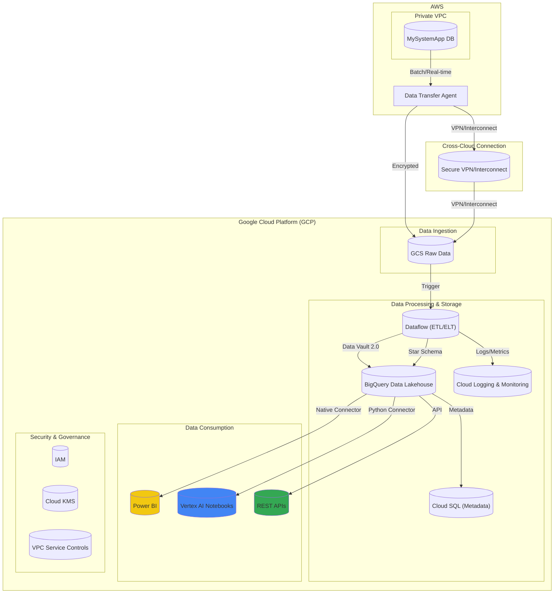
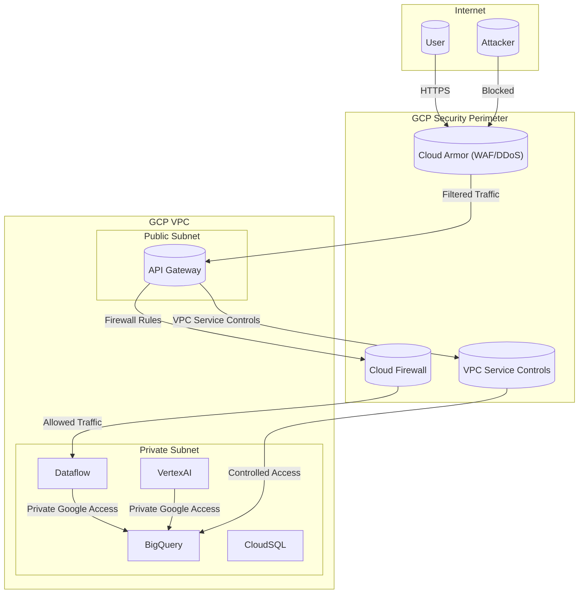

# Cloud Solution Architecture

**Project:** Cross-Cloud Data Lakehouse Analytics Platform

**Version:** 1.0

**Date:** June 27, 2025

## Table of Contents

  * [1. Overview & Executive Summary](https://www.google.com/search?q=%231-overview--executive-summary)
      * [1.1. Introduction & Business Problem](https://www.google.com/search?q=%2311-introduction--business-problem)
      * [1.2. Proposed Solution](https://www.google.com/search?q=%2312-proposed-solution)
      * [1.3. Key Benefits](https://www.google.com/search?q=%2313-key-benefits)
  * [2. Scope](https://www.google.com/search?q=%232-scope)
      * [2.1. In Scope](https://www.google.com/search?q=%2321-in-scope)
      * [2.2. Out of Scope](https://www.google.com/search?q=%2322-out-of-scope)
  * [3. Business Requirements & Architectural Drivers](https://www.google.com/search?q=%233-business-requirements--architectural-drivers)
      * [3.1. Key Requirements Summary](https://www.google.com/search?q=%2331-key-requirements-summary)
      * [3.2. Architectural Decisions](https://www.google.com/search?q=%2332-architectural-decisions)
  * [4. Cloud and Application Architecture](https://www.google.com/search?q=%234-cloud-and-application-architecture)
      * [4.1. Recommended Cloud Provider](https://www.google.com/search?q=%2341-recommended-cloud-provider)
      * [4.2. Architecture Diagram](https://www.google.com/search?q=%2342-architecture-diagram)
      * [4.3. Compute Architecture](https://www.google.com/search?q=%2343-compute-architecture)
      * [4.4. Application Architecture](https://www.google.com/search?q=%2344-application-architecture)
  * [5. Network Architecture](https://www.google.com/search?q=%235-network-architecture)
      * [5.1. Network Topology](https://www.google.com/search?q=%2351-network-topology)
      * [5.2. Traffic Flow](https://www.google.com/search?q=%2352-traffic-flow)
      * [5.3. DNS & Connectivity](https://www.google.com/search?q=%2353-dns--connectivity)
  * [6. Data Storage & Management](https://www.google.com/search?q=%236-data-storage--management)
      * [6.1. Data Storage Solutions](https://www.google.com/search?q=%2361-data-storage-solutions)
      * [6.2. Data Flow & Lifecycle](https://www.google.com/search?q=%2362-data-flow--lifecycle)
      * [6.3. Backup and Recovery](https://www.google.com/search?q=%2363-backup-and-recovery)
  * [7. Data and Application Integration](https://www.google.com/search?q=%237-data-and-application-integration)
      * [7.1. Internal Integration](https://www.google.com/search?q=%2371-internal-integration)
      * [7.2. External Integration](https://www.google.com/search?q=%2372-external-integration)
  * [8. Security & Compliance](https://www.google.com/search?q=%238-security--compliance)
      * [8.1. Identity and Access Management (IAM)](https://www.google.com/search?q=%2381-identity-and-access-management-iam)
      * [8.2. Data Protection](https://www.google.com/search?q=%2382-data-protection)
      * [8.3. Network Security](https://www.google.com/search?q=%2383-network-security)
      * [8.4. Compliance](https://www.google.com/search?q=%2384-compliance)
  * [9. Deployment & Operations (DevOps)](https://www.google.com/search?q=%239-deployment--operations-devops)
      * [9.1. CI/CD Pipeline](https://www.google.com/search?q=%2391-cicd-pipeline)
      * [9.2. Monitoring & Logging](https://www.google.com/search?q=%2392-monitoring--logging)
      * [9.3. Disaster Recovery (DR)](https://www.google.com/search?q=%2393-disaster-recovery-dr)
  * [10. Scalability & Performance](https://www.google.com/search?q=%2310-scalability--performance)
      * [10.1. Scalability](https://www.google.com/search?q=%23101-scalability)
      * [10.2. Performance](https://www.google.com/search?q=%23102-performance)
  * [11. Cost Estimation & Optimization](https://www.google.com/search?q=%2311-cost-estimation--optimization)
      * [11.1. High-Level Cost Breakdown](https://www.google.com/search?q=%23111-high-level-cost-breakdown)
      * [11.2. Cost Optimization Strategies](https://www.google.com/search?q=%23112-cost-optimization-strategies)
  * [12. Considerations & Limitations](https://www.google.com/search?q=%2312-considerations--limitations)
      * [12.1. Key Assumptions](https://www.google.com/search?q=%23121-key-assumptions)
      * [12.2. Risks & Mitigations](https://www.google.com/search?q=%23122-risks--mitigations)
      * [12.3. Known Limitations](https://www.google.com/search?q=%23123-known-limitations)

## 1\. Overview & Executive Summary

### 1.1. Introduction & Business Problem

The organization currently faces significant challenges in accessing and analyzing critical business data stored in MySystemApp, which is hosted within a private AWS network. This data isolation creates barriers to data-driven decision-making, limits analytical capabilities, and prevents the organization from leveraging modern cloud analytics tools. The current state requires manual data extraction processes, lacks real-time insights, and cannot support the growing demands for self-service analytics and advanced data science capabilities.

### 1.2. Proposed Solution

The proposed solution implements a comprehensive cloud analytics platform that bridges AWS and Google Cloud Platform (GCP) environments through a modern data lakehouse architecture. The solution will establish secure data ingestion pipelines from the AWS-hosted MySystemApp into a GCP-based analytics environment featuring Data Vault 2.0 methodology for the raw vault layer and star schema-modeled information marts. The platform will support multiple consumption patterns including Power BI reporting, Vertex AI notebooks for data science, and RESTful APIs for downstream system integration.

### 1.3. Key Benefits

  * **Unified Data Access:** Eliminate data silos by centralizing analytics in a cloud-native lakehouse architecture.
  * **Real-time Insights:** Enable near real-time data availability with \<5 minute latency for streaming workloads.
  * **Scalable Architecture:** Support concurrent access for 500+ users with auto-scaling capabilities.
  * **Advanced Analytics:** Provide data scientists with flexible, GPU-accelerated computing environments.
  * **Self-Service Capabilities:** Empower business users with intuitive reporting tools and pre-built templates.
  * **Cost Optimization:** Achieve 30% reduction in data processing costs through cloud-native efficiencies.
  * **Compliance & Governance:** Implement enterprise-grade security, audit trails, and data lineage tracking.

## 2\. Scope

### 2.1. In Scope

  * Secure cross-cloud connectivity between AWS private network and GCP.
  * Real-time and batch data ingestion pipelines from MySystemApp.
  * Data Vault 2.0 implementation for historical data preservation and auditability.
  * Star schema information marts for optimized analytical queries.
  * ETL/ELT transformation pipelines with comprehensive data quality validation.
  * Power BI integration with semantic models and self-service capabilities.
  * Vertex AI notebook environment for data science and machine learning workloads.
  * RESTful APIs and webhook integrations for downstream systems.
  * Comprehensive monitoring, alerting, and operational dashboards.
  * Data governance framework including cataloging, lineage, and access controls.
  * Disaster recovery and business continuity capabilities.

### 2.2. Out of Scope

  * Migration or modification of the source MySystemApp system.
  * End-user training and change management programs.
  * Third-party tool licensing and procurement.
  * Network infrastructure provisioning (VPN/Interconnect setup).
  * Custom application development beyond the analytics platform.
  * Data migration from legacy systems other than MySystemApp.
  * Mobile application development for analytics consumption.

## 3\. Business Requirements & Architectural Drivers

### 3.1. Key Requirements Summary

**Functional Requirements:**

  * Support ingestion of 5TB initial data load and 500GB daily incremental updates.
  * Handle peak processing loads of up to 10TB/hour with auto-scaling.
  * Provide query response times \<5 seconds for 95% of analytical queries.
  * Support 500+ concurrent users across multiple consumption tools.
  * Maintain 99.9% data accuracy and completeness across all transformations.
  * Enable real-time data streaming with \<5 minute end-to-end latency.

**Non-Functional Requirements:**

  * System availability \>99.9% excluding planned maintenance windows.
  * End-to-end encryption for data in transit and at rest.
  * Role-based access control with integration to enterprise identity systems.
  * Compliance with GDPR, CCPA, and industry security standards (SOC 2, ISO 27001).
  * Recovery Time Objective (RTO) \<4 hours and Recovery Point Objective (RPO) \<1 hour.
  * Comprehensive audit logging and data lineage tracking capabilities.

### 3.2. Architectural Decisions

  * **Requirement: Cross-Cloud Integration** -\> **Decision:** Implement secure VPN/Interconnect between AWS and GCP with dedicated data transfer agents and encrypted transmission protocols to ensure reliable, high-bandwidth connectivity while maintaining network isolation.
  * **Requirement: Historical Data Preservation** -\> **Decision:** Adopt Data Vault 2.0 methodology in the raw vault layer to maintain complete historical records, enable auditability, and support regulatory compliance through immutable data structures.
  * **Requirement: Multi-User Analytics** -\> **Decision:** Deploy cloud-native, auto-scaling infrastructure using GCP services (BigQuery, Dataflow, Cloud Storage) to dynamically handle varying user loads and processing demands.
  * **Requirement: Self-Service Analytics** -\> **Decision:** Implement Power BI integration with pre-built semantic models and standardized connectors to enable business users to create reports independently while maintaining data governance.
  * **Requirement: Advanced Analytics** -\> **Decision:** Provide Vertex AI managed notebook environment with GPU acceleration and integrated ML services to support sophisticated data science workloads and model development.
  * **Requirement: Data Quality Assurance** -\> **Decision:** Implement comprehensive data validation pipelines with automated quality checks, anomaly detection, and alerting mechanisms to ensure data reliability and trustworthiness.

## 4\. Cloud and Application Architecture

### 4.1. Recommended Cloud Provider

The recommended cloud provider for the analytics platform is **Google Cloud Platform (GCP)**.

**Justification:**

  * **Advanced Analytics and ML/AI:** The BRD specifies a requirement for advanced analytics and a Vertex AI managed notebook environment with GPU acceleration. GCP's strengths in these areas, particularly with services like BigQuery, Vertex AI, and its robust AI/ML ecosystem, make it a natural fit.
  * **Data Lakehouse Capabilities:** GCP's services, including Google Cloud Storage, BigQuery, and Dataflow, are well-suited for building a modern data lakehouse architecture as proposed in the BRD.
  * **Scalability and Performance:** The auto-scaling and serverless nature of many GCP services align with the requirements to handle peak processing loads of up to 10TB/hour and support 500+ concurrent users with low query response times.
  * **Power BI Integration:** The BRD calls for Power BI integration, and GCP's BigQuery has native connectors for Power BI, enabling both DirectQuery and Import modes as required.

While the source system is on AWS, a cross-cloud approach is explicitly stated as part of the solution. GCP's capabilities in data analytics and machine learning make it the ideal platform for the core analytics solution.

### 4.2. Architecture Diagram

### 4.3. Compute Architecture

  * **Dataflow:** This serverless, fully managed data processing service will be used for both batch and real-time ETL/ELT pipelines. Its auto-scaling capabilities are ideal for handling the specified peak processing loads of up to 10TB/hour without manual intervention.
  * **Vertex AI Notebooks:** For advanced analytics and machine learning, Vertex AI managed notebooks will provide data scientists with a flexible and powerful environment. The ability to attach GPU accelerators directly addresses the requirements for sophisticated workloads and model development.
  * **Cloud Functions:** Simple, event-driven tasks, such as triggering a Dataflow job upon the arrival of new data in Cloud Storage, will be handled by Cloud Functions. This serverless approach is cost-effective for sporadic workloads.

### 4.4. Application Architecture

An **event-driven, microservices-based architecture** is proposed.

  * **Data Ingestion:** The arrival of new data in Google Cloud Storage will trigger events that launch Dataflow pipelines for processing. This event-driven approach ensures low latency for real-time data streams.
  * **Data Processing:** The ETL/ELT logic will be encapsulated in modular Dataflow jobs, which can be developed, tested, and deployed independently. This aligns with a microservices approach, promoting agility and maintainability.
  * **Data Consumption:** The consumption layer is decoupled from the data storage and processing layers. Downstream systems and users will interact with the platform through well-defined interfaces, such as the BigQuery API, native connectors, and custom REST APIs.

## 5\. Network Architecture

### 5.1. Network Topology

  * **VPCs:** The GCP environment will be segmented into multiple Virtual Private Clouds (VPCs) to isolate different environments (e.g., development, staging, production) and functional layers (e.g., data ingestion, data processing, data consumption).
  * **Subnets:** Within each VPC, public and private subnets will be used to further segment the network. Public-facing components, such as the API Gateway, will reside in public subnets, while internal components, like the Cloud SQL metadata database, will be placed in private subnets.
  * **CIDR Blocks:** CIDR blocks will be carefully planned to avoid IP address conflicts and to allow for future expansion. A hierarchical approach to CIDR block allocation will be used, with larger blocks assigned to VPCs and smaller, non-overlapping blocks assigned to subnets.

### 5.2. Traffic Flow

  * **Ingress:** Data will enter the GCP environment from AWS through a secure VPN/Interconnect, landing in a GCS staging bucket. User access to Power BI and Vertex AI will be managed through their respective authentication mechanisms, with data queries sent to BigQuery over secure connections.
  * **Egress:** Downstream systems will access data via RESTful APIs exposed through an API Gateway, which will manage traffic and enforce rate limiting.
  * **Internal:** Communication between components within the GCP environment will primarily use private IP addresses. Private Google Access will be enabled for services in private subnets to access other Google Cloud services without traversing the public internet.

### 5.3. DNS & Connectivity

  * **DNS:** Cloud DNS will be used to manage the DNS records for any custom domains used for APIs or other services.
  * **Connectivity:** A high-bandwidth, low-latency connection between the AWS and GCP environments will be established using either a dedicated interconnect or a secure VPN tunnel. This connection will be encrypted to protect data in transit.

## 6\. Data Storage & Management

### 6.1. Data Storage Solutions

  * **Raw Data Storage:** Google Cloud Storage will be used for storing the raw data ingested from MySystemApp. Multi-regional storage will be used for critical data to ensure high availability, and lifecycle policies will be implemented to move older data to more cost-effective storage classes like Nearline or Coldline.
  * **Data Vault & Information Marts:** BigQuery will serve as the core of the data lakehouse. The Data Vault 2.0 raw vault will be implemented in BigQuery using hub, link, and satellite tables. This design supports historical data preservation and auditability. Star schema information marts, also in BigQuery, will provide optimized data models for analytical queries.
  * **Metadata Management:** A Cloud SQL for PostgreSQL instance will be used to store metadata, including data lineage information, operational metrics, and configuration parameters.

### 6.2. Data Flow & Lifecycle

  * **Ingestion:** Data will be extracted from MySystemApp, transmitted securely to GCP, and landed in a staging GCS bucket.
  * **Processing:** Dataflow pipelines will process the raw data, transforming it and loading it into the Data Vault and information marts in BigQuery. Data quality checks will be performed at this stage.
  * **Consumption:** Users will access the data through various tools. All access and usage will be tracked and monitored.
  * **Archival:** Data will be archived according to retention policies, with older data moved to cheaper storage tiers and eventually purged as required by regulations.

### 6.3. Backup and Recovery

  * **Automated Snapshots:** BigQuery's automated snapshot feature will be used to create daily snapshots of the datasets with a 30-day retention period.
  * **Cross-Region Replication:** Critical datasets in BigQuery and Cloud Storage will be replicated across regions to provide geographic redundancy and support disaster recovery.
  * **Point-in-Time Recovery:** BigQuery's time travel feature will be utilized for operational recovery, allowing for the restoration of data to any point within the past 7 days.

## 7\. Data and Application Integration

### 7.1. Internal Integration

  * **Service Communication:** REST APIs will be used for synchronous communication between platform components, while Cloud Pub/Sub will be used for asynchronous messaging and event-driven processing.
  * **Data Pipeline Orchestration:** Cloud Composer (managed Apache Airflow) will be used to orchestrate the data pipelines, managing dependencies between ingestion, transformation, and loading processes.
  * **Monitoring Integration:** Cloud Monitoring and Logging will provide centralized operational visibility, with custom dashboards and alerting rules for proactive issue detection.

### 7.2. External Integration

  * **Source System:** Secure API connections will be established with MySystemApp for data ingestion, using service accounts and API keys for authentication.
  * **Power BI:** Native BigQuery connectors will be used for Power BI integration, supporting both DirectQuery and Import modes.
  * **Downstream Systems:** RESTful APIs with comprehensive documentation, rate limiting, and monitoring will be provided for external system integration.
  * **Identity System:** SAML/OAuth 2.0 integration with the enterprise Active Directory will enable seamless single sign-on.

## 8\. Security & Compliance

### 8.1. Identity and Access Management (IAM)

  * **Authentication:** Integration with the enterprise identity provider will be established using SAML 2.0 and OAuth 2.0. Multi-factor authentication will be required for all administrative access.
  * **Authorization:** A role-based access control (RBAC) model will be implemented with granular permissions aligned to business functions. The principle of least privilege will be strictly enforced.
  * **Service Accounts:** Dedicated service accounts with rotating keys and minimal necessary permissions will be used for each component. Regular access reviews and automated de-provisioning will be implemented.

### 8.2. Data Protection

  * **Encryption at Rest:** All data will be encrypted using Google Cloud KMS with customer-managed encryption keys (CMEK). Different key rings will be used for different data sensitivity levels.
  * **Encryption in Transit:** TLS 1.3 will be used for all data transmission. A VPN tunnel with application-layer encryption will secure cross-cloud communication.
  * **Data Classification:** Automated data classification and labeling based on content analysis will be implemented.

### 8.3. Network Security

  * **Network Segmentation:** The use of private VPCs with subnet isolation will create distinct network layers for different functionalities.
  * **Perimeter Security:** Google Cloud Armor will provide a Web Application Firewall (WAF) and DDoS protection for API endpoints. VPC Service Controls will create a secure perimeter around sensitive data in BigQuery and Cloud Storage.
  * **Internal Security:** Private Google Access will be used for internal communication, preventing exposure to the public internet. Cloud Firewall rules will restrict traffic to necessary ports and protocols only.

### 8.4. Compliance

  * **GDPR & CCPA:** The architecture will incorporate features to support data subject rights, such as data disclosure, deletion, and opt-out capabilities, as well as data retention policies.
  * **SOC 2 & ISO 27001:** The platform will be built with controls for security, availability, processing integrity, confidentiality, and privacy, with regular third-party audits to ensure compliance.

## 9\. Deployment & Operations (DevOps)

### 9.1. CI/CD Pipeline

A comprehensive CI/CD pipeline will be established using Google Cloud's developer tools (Cloud Build, Cloud Deploy, Artifact Registry). The pipeline will automate the building, testing, and deployment of all platform components, including infrastructure as code (IaC), Dataflow jobs, and APIs.

### 9.2. Monitoring & Logging

  * **Centralized Logging:** Cloud Logging will be used to centralize all logs from the platform's components.
  * **Metrics & Dashboards:** Cloud Monitoring will be used to collect and visualize key performance indicators (KPIs) and operational metrics. Custom dashboards will be created to provide real-time visibility into the platform's health and performance.
  * **Alerting:** Alerting rules will be configured to proactively notify the operations team of any issues or anomalies.

### 9.3. Disaster Recovery (DR)

  * **Automated Failover:** The environment will be replicated in a secondary GCP region, with automated failover capabilities to meet the RTO of \<4 hours and RPO of \<1 hour.
  * **Regular Testing:** The DR plan will be regularly tested to ensure its effectiveness and to identify any potential issues.

## 10\. Scalability & Performance

### 10.1. Scalability

The serverless and auto-scaling nature of the chosen GCP services (Dataflow, BigQuery, Cloud Functions) will allow the platform to dynamically scale to handle varying user loads and processing demands, including the specified 500+ concurrent users and peak processing loads of up to 10TB/hour.

### 10.2. Performance

  * **Low-Latency Queries:** BigQuery's architecture is optimized for fast analytical queries. The use of star schema information marts, materialized views, and aggregate tables will further enhance query performance to meet the \<5 second response time requirement.
  * **GPU Acceleration:** The availability of GPU acceleration in Vertex AI Notebooks will provide the necessary performance for sophisticated data science and machine learning workloads.

## 11\. Cost Estimation & Optimization

### 11.1. High-Level Cost Breakdown

A detailed cost estimation will be provided in a separate document. However, the key cost drivers are expected to be:

  * **BigQuery:** Storage and query processing costs.
  * **Dataflow:** vCPU and memory usage for data processing jobs.
  * **Cloud Storage:** Storage and data transfer costs.
  * **Vertex AI:** Notebook instance and GPU usage costs.
  * **Network:** Data transfer costs for cross-cloud connectivity.

### 11.2. Cost Optimization Strategies

  * **Serverless:** The use of serverless services like Dataflow and Cloud Functions will help to minimize costs by only paying for the resources used during execution.
  * **Auto-scaling:** BigQuery and Dataflow's auto-scaling capabilities will ensure that resources are scaled up and down based on demand, avoiding over-provisioning.
  * **Storage Lifecycle Management:** Lifecycle policies in Cloud Storage will automatically move older data to cheaper storage tiers.
  * **Reserved Instances:** For predictable workloads, such as the Cloud SQL metadata database, reserved instances can be used to reduce costs.

## 12\. Considerations & Limitations

### 12.1. Key Assumptions

  * The source MySystemApp system can be accessed securely from the GCP environment.
  * The necessary network infrastructure (VPN/Interconnect) can be provisioned.
  * The enterprise identity provider supports SAML/OAuth 2.0 integration.

### 12.2. Risks & Mitigations

  * **Risk:** Data exfiltration during cross-cloud data transfer. **Mitigation:** Use of encrypted VPN/Interconnect and application-layer encryption.
  * **Risk:** Performance bottlenecks in the data pipelines. **Mitigation:** Use of auto-scaling Dataflow and regular performance testing.
  * **Risk:** Unauthorized access to sensitive data. **Mitigation:** Implementation of a robust IAM model with the principle of least privilege, and VPC Service Controls.

### 12.3. Known Limitations

  * The solution is dependent on the availability and performance of both the AWS and GCP cloud platforms.
  * The cost of the solution is subject to changes in the pricing of the underlying cloud services.
  * The solution does not include end-user training, which will need to be addressed separately.
