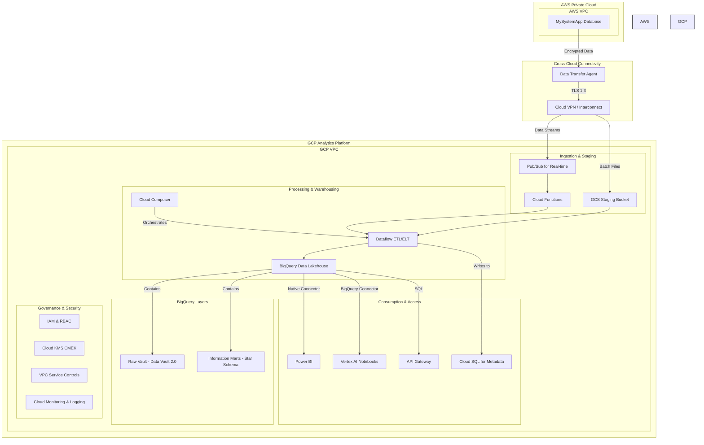
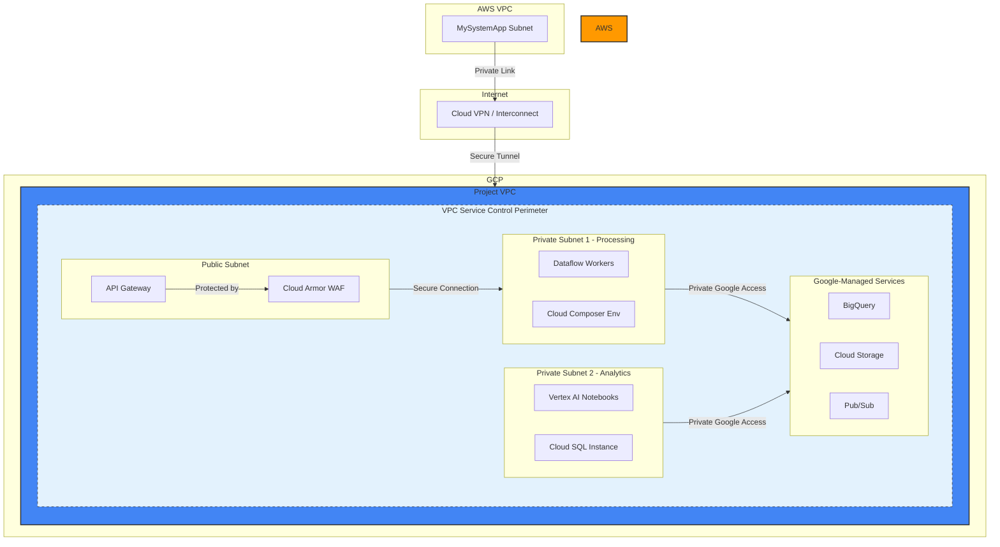

# Cloud Solution Architecture

**Project:** Cross-Cloud Data Lakehouse Analytics Platform

**Version:** 1.0

**Date:** June 26, 2025

**Table of Contents**

1.  [Overview & Executive Summary](https://www.google.com/search?q=%231-overview--executive-summary)
    1.  [Introduction & Business Problem](https://www.google.com/search?q=%2311-introduction--business-problem)
    2.  [Proposed Solution](https://www.google.com/search?q=%2312-proposed-solution)
    3.  [Key Benefits](https://www.google.com/search?q=%2313-key-benefits)
2.  [Scope](https://www.google.com/search?q=%232-scope)
    1.  [In Scope](https://www.google.com/search?q=%2321-in-scope)
    2.  [Out of Scope](https://www.google.com/search?q=%2322-out-of-scope)
3.  [Business Requirements & Architectural Drivers](https://www.google.com/search?q=%233-business-requirements--architectural-drivers)
    1.  [Key Requirements Summary](https://www.google.com/search?q=%2331-key-requirements-summary)
    2.  [Architectural Decisions](https://www.google.com/search?q=%2332-architectural-decisions)
4.  [Cloud and Application Architecture](https://www.google.com/search?q=%234-cloud-and-application-architecture)
    1.  [Recommended Cloud Provider](https://www.google.com/search?q=%2341-recommended-cloud-provider)
    2.  [Solution Architecture Diagram](https://www.google.com/search?q=%2342-solution-architecture-diagram)
    3.  [Compute Architecture](https://www.google.com/search?q=%2343-compute-architecture)
    4.  [Application Architecture](https://www.google.com/search?q=%2344-application-architecture)
5.  [Network Architecture](https://www.google.com/search?q=%235-network-architecture)
    1.  [Network Topology Diagram](https://www.google.com/search?q=%2351-network-topology-diagram)
    2.  [Network Topology Description](https://www.google.com/search?q=%2352-network-topology-description)
    3.  [Traffic Flow](https://www.google.com/search?q=%2353-traffic-flow)
    4.  [DNS & Connectivity](https://www.google.com/search?q=%2354-dns--connectivity)
6.  [Data Storage & Management](https://www.google.com/search?q=%236-data-storage--management)
    1.  [Data Storage Solutions](https://www.google.com/search?q=%2361-data-storage-solutions)
    2.  [Data Flow & Lifecycle](https://www.google.com/search?q=%2362-data-flow--lifecycle)
    3.  [Backup and Recovery](https://www.google.com/search?q=%2363-backup-and-recovery)
7.  [Data and Application Integration](https://www.google.com/search?q=%237-data-and-application-integration)
    1.  [Internal Integration](https://www.google.com/search?q=%2371-internal-integration)
    2.  [External Integration](https://www.google.com/search?q=%2372-external-integration)
8.  [Security & Compliance](https://www.google.com/search?q=%238-security--compliance)
    1.  [Security Architecture Diagram](https://www.google.com/search?q=%2381-security-architecture-diagram)
    2.  [Identity and Access Management (IAM)](https://www.google.com/search?q=%2382-identity-and-access-management-iam)
    3.  [Data Protection](https://www.google.com/search?q=%2383-data-protection)
    4.  [Network Security](https://www.google.com/search?q=%2384-network-security)
    5.  [Compliance](https://www.google.com/search?q=%2385-compliance)
9.  [Deployment & Operations (DevOps)](https://www.google.com/search?q=%239-deployment--operations-devops)
    1.  [CI/CD Pipeline](https://www.google.com/search?q=%2391-cicd-pipeline)
    2.  [Monitoring & Logging](https://www.google.com/search?q=%2392-monitoring--logging)
    3.  [Disaster Recovery (DR)](https://www.google.com/search?q=%2393-disaster-recovery-dr)
10. [Scalability & Performance](https://www.google.com/search?q=%2310-scalability--performance)
    1.  [Scalability](https://www.google.com/search?q=%23101-scalability)
    2.  [Performance](https://www.google.com/search?q=%23102-performance)
11. [Cost Estimation & Optimization](https://www.google.com/search?q=%2311-cost-estimation--optimization)
    1.  [High-Level Cost Breakdown](https://www.google.com/search?q=%23111-high-level-cost-breakdown)
    2.  [Cost Optimization Strategies](https://www.google.com/search?q=%23112-cost-optimization-strategies)
12. [Considerations & Limitations](https://www.google.com/search?q=%2312-considerations--limitations)
    1.  [Key Assumptions](https://www.google.com/search?q=%23121-key-assumptions)
    2.  [Risks & Mitigations](https://www.google.com/search?q=%23122-risks--mitigations)
    3.  [Known Limitations](https://www.google.com/search?q=%23123-known-limitations)

## 1\. Overview & Executive Summary

### 1.1. Introduction & Business Problem

The organization currently faces significant challenges in accessing and analyzing critical business data stored in MySystemApp, which is hosted within a private AWS network. This data isolation creates barriers to data-driven decision-making, limits analytical capabilities, and prevents the organization from leveraging modern cloud analytics tools. The current state necessitates manual data extraction, lacks real-time insights, and cannot support growing demands for self-service analytics and advanced data science.

### 1.2. Proposed Solution

The proposed solution is a highly scalable, secure, and performant cross-cloud analytics platform. It bridges the existing AWS environment with Google Cloud Platform (GCP), establishing a modern data lakehouse architecture. The solution will securely ingest data in near real-time from the AWS-hosted MySystemApp into a GCP-based analytics environment. This environment will leverage Google Cloud Storage for raw data, BigQuery for the data lakehouse (implementing Data Vault 2.0 for the raw vault and star schemas for information marts), and a suite of GCP services for processing, orchestration, and consumption. This architecture will empower the organization with unified data access and advanced analytical capabilities.

### 1.3. Key Benefits

This cloud solution architecture is designed to deliver tangible business value by addressing the core problems outlined in the BRD.

  * **Unified Data Access & Real-time Insights**: By creating a central data lakehouse in GCP, the solution eliminates data silos. Data pipelines designed for \<5 minute latency will provide near real-time insights, enabling more agile and informed decision-making.
  * **Scalability and Performance**: Leveraging GCP's managed and serverless services like Dataflow and BigQuery ensures the platform can auto-scale to handle 500+ concurrent users and peak processing loads up to 10TB/hour, while maintaining query response times of less than 5 seconds.
  * **Advanced & Self-Service Analytics**: The platform provides a dedicated, GPU-accelerated Vertex AI environment for data scientists and integrates seamlessly with Power BI, empowering business users with self-service reporting capabilities.
  * **Cost Efficiency**: By utilizing cloud-native services, automated data lifecycle management, and resource right-sizing, the architecture is designed to achieve a significant reduction in data processing costs.
  * **Enhanced Security & Compliance**: The solution implements a defense-in-depth security model, featuring end-to-end encryption with customer-managed keys (CMEK), fine-grained IAM controls, VPC Service Controls, and robust audit logging, designed to meet GDPR, CCPA, and SOC 2 standards.

## 2\. Scope

### 2.1. In Scope

  * Secure, reliable, and high-bandwidth cross-cloud connectivity between the private AWS network and the GCP environment.
  * Development of real-time streaming and batch data ingestion pipelines from the MySystemApp source system.
  * Implementation of a Data Vault 2.0 model in BigQuery for the raw vault layer, ensuring full auditability and historical data preservation.
  * Creation of star schema-based information marts in BigQuery, optimized for analytical queries.
  * ETL/ELT transformation pipelines using Dataflow, including comprehensive data quality validation and error handling.
  * Integration with Power BI, providing semantic models to support self-service reporting.
  * Provisioning of a managed Vertex AI notebook environment with GPU support for data science and machine learning.
  * Deployment of secure RESTful APIs via API Gateway for downstream system data consumption.
  * A comprehensive monitoring and alerting solution using Cloud Monitoring for operational visibility.
  * A robust data governance framework including a data catalog, data lineage tracking, and role-based access control (RBAC).
  * A multi-region disaster recovery strategy to meet RTO/RPO requirements.

### 2.2. Out of Scope

  * Any migration or modification of the source MySystemApp system in AWS.
  * Development of end-user training materials or change management programs.
  * Procurement and licensing of third-party tools, including Power BI.
  * Provisioning of the underlying network connectivity (VPN/Interconnect). This document assumes the connection is provisioned.
  * Custom application development beyond the defined analytics platform components and APIs.
  * Data migration from any legacy systems other than MySystemApp.
  * Development of a mobile application for analytics consumption.

## 3\. Business Requirements & Architectural Drivers

### 3.1. Key Requirements Summary

| Category | Requirement | Priority |
| :--- | :--- | :--- |
| **Functional** | | |
| Data Volume | Support 5TB initial load and 500GB daily incremental updates. | High |
| Processing Load | Handle peak processing loads of up to 10TB/hour with auto-scaling. | High |
| Performance | Provide query response times \<5 seconds for 95% of analytical queries. | High |
| Concurrency | Support 500+ concurrent users. | High |
| Data Quality | Maintain 99.9% data accuracy and completeness. | High |
| Latency | Enable real-time data streaming with \<5 minute end-to-end latency. | High |
| **Non-Functional** | | |
| Availability | System availability \>99.9%. | High |
| Security | End-to-end encryption for data in transit and at rest; RBAC. | High |
| Compliance | Adherence to GDPR, CCPA, SOC 2, ISO 27001. | High |
| Disaster Recovery | RTO \<4 hours; RPO \<1 hour. | High |
| Governance | Comprehensive audit logging and data lineage tracking. | High |

### 3.2. Architectural Decisions

| Requirement | Architectural Decision | Justification (Alignment with Well-Architected Framework) |
| :--- | :--- | :--- |
| Securely bridge AWS and GCP environments. | Establish a secure, high-bandwidth Cloud VPN or Interconnect. Data will be ingested via agents that use TLS 1.3 encryption. | **Security**: Ensures data is encrypted in transit. **Performance**: Dedicated connectivity minimizes latency and provides predictable bandwidth. |
| Maintain complete, auditable historical records. | Implement a Data Vault 2.0 architecture in BigQuery for the raw vault layer. | **Reliability**: Data Vault's insert-only nature prevents data loss and provides a full audit trail. **Performance**: Hub, Link, and Satellite structures are optimized for large-scale parallel loading. |
| Support 500+ concurrent users and variable processing loads. | Utilize a serverless and auto-scaling architecture with GCP Dataflow and BigQuery. | **Cost Optimization**: Pay-per-use and auto-scaling prevent overprovisioning. **Performance**: Services scale automatically to meet peak demand without manual intervention. |
| Enable business user self-service analytics. | Integrate Power BI using the native BigQuery connector and provide pre-built, governed semantic models (information marts). | **Operational Excellence**: Empowers users and reduces reliance on IT for standard reports. **Security**: Central models and row-level security ensure users only see the data they are authorized to access. |
| Support advanced data science and ML workloads. | Provision a managed Vertex AI environment with on-demand GPU acceleration and integration with BigQuery ML. | **Performance Optimization**: Provides data scientists with powerful, scalable compute for complex modeling. **Cost Optimization**: GPU resources are provisioned on-demand, avoiding idle costs. |
| Ensure data reliability and trustworthiness. | Implement a multi-stage data quality framework within Dataflow pipelines, including validation, cleansing, and anomaly detection with alerts. | **Reliability**: Guarantees that data is accurate and complete before it's made available for consumption, building trust in the platform. |
| Achieve \>99.9% availability and RTO \< 4h, RPO \< 1h. | Deploy all critical services across multiple GCP Availability Zones. Use multi-regional GCS buckets and BigQuery datasets for critical data. Implement and regularly test a DR plan. | **Reliability**: A multi-AZ/multi-region architecture protects against localized failures and meets stringent RTO/RPO targets. |

## 4\. Cloud and Application Architecture

### 4.1. Recommended Cloud Provider

The primary cloud provider for the analytics platform will be **Google Cloud Platform (GCP)**. The source system will remain on **Amazon Web Services (AWS)**.

**Justification**: This choice directly aligns with the BRD, which specifies building a GCP-based analytics environment to process data originating from an AWS-hosted application. GCP is selected for its strengths in data analytics, particularly with services like BigQuery, Dataflow, and Vertex AI, which provide a powerful, scalable, and integrated serverless platform ideal for meeting the project's performance and scalability requirements.

### 4.2. Solution Architecture Diagram

### 4.3. Compute Architecture

The compute architecture is designed to be serverless and event-driven where possible to maximize scalability and cost-efficiency.

  * **Data Ingestion (Streaming)**: **Cloud Functions** will be used to process incoming real-time messages from Pub/Sub. This is a cost-effective choice for light, event-driven transformations before handing off to the main processing pipeline.
  * **Data Processing (ETL/ELT)**: **Cloud Dataflow** is the primary service for all batch and streaming data transformation pipelines. Its serverless, auto-scaling nature is perfectly suited to handle the project's variable loads (up to 10TB/hour). It provides a unified model for both batch and streaming data, simplifying development and operations.
  * **Data Science & ML**: **Vertex AI Managed Notebooks** will provide the environment for data scientists. This managed service simplifies the provisioning and management of JupyterLab environments. On-demand access to various CPU and GPU configurations ensures that data scientists have the power they need for model training without incurring costs for idle high-performance hardware.
  * **API Hosting**: **Cloud Functions** or **Cloud Run** will be used to host the RESTful API endpoints, fronted by **API Gateway**. This serverless approach ensures that compute resources for the API are only consumed when requests are made, aligning with a cost-optimized, scalable model.
  * **Workflow Orchestration**: **Cloud Composer (Managed Apache Airflow)** will be used to schedule, monitor, and manage the complex data pipeline workflows. It provides robust dependency management and visibility into pipeline execution, which is critical for operational excellence.

### 4.4. Application Architecture

The platform follows a modern, multi-layered **Event-Driven Architecture**.

  * **Ingestion Layer**: This layer is responsible for capturing data. For batch, files are landed in Cloud Storage. For streaming, messages are pushed to Pub/Sub topics. This decouples the source system from the processing system, enhancing reliability.
  * **Processing Layer**: Orchestrated by Cloud Composer, Dataflow jobs are triggered by new data arriving in GCS (batch) or Pub/Sub (streaming). These jobs perform the necessary transformations, data quality checks, and load the data into the appropriate BigQuery layers (Data Vault, then Information Marts).
  * **Storage Layer**: This is the data lakehouse itself, residing in BigQuery and GCS. It's structured to support different analytical needs: the Data Vault for historical fidelity and audit, and the star schema marts for high-performance business intelligence.
  * **Consumption Layer**: This layer provides various interfaces for different user personas. Power BI connects directly to the information marts in BigQuery. Vertex AI notebooks access both the raw vault and marts for deep analysis. The API Gateway provides programmatic access for other applications. This multi-modal access ensures the platform serves all defined business needs.

This architecture ensures a clean separation of concerns, enhances scalability by allowing each layer to scale independently, and improves reliability by decoupling components with asynchronous messaging patterns.

## 5\. Network Architecture

### 5.1. Network Topology Diagram

### 5.2. Network Topology Description

The network is designed based on a defense-in-depth and least-privilege model.

  * **VPC**: A single GCP Virtual Private Cloud (VPC) will be created to host all platform resources. This VPC will be segmented into multiple subnets.
  * **CIDR Blocks**: The VPC will be allocated a `/16` CIDR block to ensure ample IP address space for future expansion. Subnets will be carved out of this block (e.g., `/24`) for different functional layers.
  * **Subnet Segmentation**:
      * **Public Subnet**: A restricted public subnet will host the API Gateway and the Cloud Armor WAF. This subnet will be the only part of the architecture with a route to the internet.
      * **Private Subnets**: Multiple private subnets will be used to isolate resources. For example, a dedicated subnet for Dataflow workers and Cloud Composer, and another for Vertex AI and Cloud SQL. Firewall rules will be strictly configured to only allow necessary traffic between these subnets.
  * **Private Google Access**: All private subnets will be configured with Private Google Access. This allows resources without public IP addresses (like Dataflow workers) to securely access the public endpoints of Google services like BigQuery, GCS, and Pub/Sub over Google's internal network, enhancing security.
  * **VPC Service Controls**: A VPC Service Control perimeter will be established around the project's resources, including the GCS buckets and BigQuery datasets. This creates a virtual security boundary that helps prevent data exfiltration by blocking access to services from outside the perimeter, even with valid credentials.

### 5.3. Traffic Flow

  * **Ingress (Data)**: Data from the AWS source will flow through the secure Cloud VPN/Interconnect tunnel directly into the GCP VPC. Batch files will be sent to a GCS landing zone, and real-time streams will be published to a Pub/Sub topic. This traffic does not traverse the public internet.
  * **Ingress (Users)**: API traffic from external systems will be routed through the Cloud Armor WAF to the API Gateway in the public subnet. Power BI and data scientist access to GCP services will be authenticated via IAM and will not require direct ingress into the VPC.
  * **Internal**: All communication between GCP resources (e.g., Dataflow to BigQuery, Vertex AI to GCS) will occur within the GCP VPC, using Private Google Access. This keeps service-to-service traffic off the public internet.
  * **Egress**: Egress traffic will be highly restricted. The only planned egress is for sending event notifications to downstream systems via webhooks, which will be initiated from Cloud Functions through a NAT Gateway to provide a static source IP.

### 5.4. DNS & Connectivity

  * **DNS**: Google Cloud DNS will be used for any internal service discovery needs. Public-facing APIs will have their DNS records managed externally, pointing to the API Gateway endpoint.
  * **Connectivity**: A high-availability Cloud VPN or a dedicated Cloud Interconnect will be the primary method for linking the on-premises AWS VPC to the GCP VPC. This is a critical component and should be configured with redundancy to avoid a single point of failure, aligning with the project's high-availability requirements.

## 6\. Data Storage & Management

### 6.1. Data Storage Solutions

The data storage strategy employs a multi-tiered approach to optimize for cost, performance, and analytical needs.

  * **Raw Data / Landing Zone**: **Google Cloud Storage (GCS)** will be used for the initial landing and staging of raw data from the source system.
      * **Justification**: GCS provides virtually unlimited, durable, and cost-effective object storage. Its different storage classes (Standard, Nearline, Coldline) are ideal for implementing data lifecycle management. Multi-regional buckets will be used for critical data to ensure redundancy.
  * **Raw Vault (Data Vault 2.0)**: **Google BigQuery** will house the Data Vault 2.0 model.
      * **Justification**: BigQuery's serverless, scalable architecture is perfectly suited for the large-scale, insert-heavy workloads typical of a Data Vault. Its support for partitioning (on load date) and clustering (on business keys) will ensure efficient data loading and querying, even with petabytes of data. The immutable nature of Data Vault aligns well with BigQuery's append-optimized storage.
  * **Information Marts (Star Schema)**: **Google BigQuery** will also host the star schema information marts.
      * **Justification**: BigQuery is a columnar data warehouse optimized for analytical queries. Storing the marts here allows for extremely fast aggregations and joins, directly meeting the \<5 second query performance requirement. The separation of marts into different datasets provides logical organization by business domain.
  * **Metadata**: **Cloud SQL for PostgreSQL** will be used to store system metadata.
      * **Justification**: A relational database is ideal for storing structured metadata such as data lineage information, operational metrics, pipeline configurations, and audit logs. Cloud SQL provides a fully managed, reliable, and backed-up PostgreSQL service, reducing operational overhead.

### 6.2. Data Flow & Lifecycle

The data lifecycle is managed through an automated, multi-stage pipeline.

1.  **Ingestion**: Raw data is extracted from MySystemApp and lands in a GCS Staging bucket. An event notification (e.g., Pub/Sub message) is triggered.
2.  **Processing (Data Vault)**: A Dataflow pipeline, orchestrated by Cloud Composer, is triggered by the ingestion event. It reads the raw data, applies basic cleansing and standardization, calculates hash keys, and loads the data into the appropriate Hub, Link, and Satellite tables in the BigQuery Raw Vault.
3.  **Processing (Information Marts)**: Once the Data Vault load is complete, another orchestrated Dataflow job reads from the Raw Vault tables, applies complex business rules and aggregations, and populates the fact and dimension tables in the star schema Information Marts.
4.  **Consumption**: Business users and data scientists access the optimized Information Marts for their analyses. Data scientists may also access the Raw Vault for deeper, historical analysis.
5.  **Archival & Purge**: GCS Lifecycle Management policies automatically transition raw data in the staging bucket from Standard to Nearline, then to Coldline storage, and finally delete it based on defined retention policies (e.g., delete after 90 days). Data in BigQuery will be subject to dataset-level retention policies to comply with GDPR and CCPA requirements.

### 6.3. Backup and Recovery

The backup and recovery strategy is designed to meet the RTO of \<4 hours and RPO of \<1 hour.

  * **Primary Backup**: BigQuery's built-in snapshot functionality will be used to take automated daily snapshots of all critical datasets. These snapshots will have a default retention of 30 days and will be replicated to a secondary GCP region for geographic redundancy.
  * **Operational Recovery**: For quick recovery from operational errors (e.g., a bad data load), BigQuery's **Time Travel** feature will be utilized. This allows any table to be restored to any point-in-time within the last 7 days without needing to perform a full restore from a snapshot.
  * **Disaster Recovery**: A complete, automated replication of the environment's infrastructure (as code) and data (via snapshots and replication) will be maintained in a secondary GCP region. This plan will be tested regularly (e.g., quarterly) to ensure it can meet the defined RTO and RPO in case of a regional disaster.

## 7\. Data and Application Integration

### 7.1. Internal Integration

Internal services will communicate using a combination of synchronous and asynchronous patterns to ensure loose coupling and reliability.

  * **Service Communication**:
      * **REST APIs**: For synchronous, request-response interactions between microservices (e.g., an orchestration service querying a metadata service), internal REST APIs will be used, hosted on Cloud Run or Cloud Functions.
      * **Asynchronous Messaging**: For decoupling processes and handling events, **Cloud Pub/Sub** will be the primary mechanism. For example, the ingestion process will publish a message to a Pub/Sub topic upon file arrival, which in turn triggers the Dataflow processing pipeline. This event-driven approach enhances scalability and resilience.
  * **Data Pipeline Integration**: **Cloud Composer (Managed Apache Airflow)** is the core orchestrator for the entire data platform. It will define complex workflows as Directed Acyclic Graphs (DAGs), managing dependencies, retries, and error handling for all ingestion, transformation, and loading processes. It will integrate directly with Dataflow, BigQuery, and Cloud Storage.
  * **Monitoring Integration**: All services, including Cloud Functions, Dataflow, BigQuery, and Composer, will be configured to send logs and metrics to **Cloud Monitoring and Cloud Logging**. This provides a single pane of glass for operational visibility, enabling the creation of centralized dashboards and proactive alerting rules.

### 7.2. External Integration

The platform is designed to integrate securely and efficiently with several external systems.

  * **Source System (MySystemApp)**: Secure connectivity will be established from GCP to the private AWS network. Data extraction will be performed via secure data transfer agents that communicate with MySystemApp's database or its APIs. Authentication will be managed using dedicated service accounts with IAM and stored, rotated credentials in GCP Secret Manager. The integration will support both push (MySystemApp triggering data sends) and pull (GCP orchestrator requesting data) patterns to provide flexibility.
  * **Power BI**: The native **BigQuery connector for Power BI** will be used. This connector supports both `DirectQuery` mode (for near real-time dashboards) and `Import` mode (for high-performance in-memory analytics). Authentication will be managed through service principals, and data security will be enforced using BigQuery's row-level security, ensuring Power BI users only see data they are permitted to access.
  * **Downstream System APIs**: To serve data to other applications, a set of **RESTful API endpoints** will be exposed via **API Gateway**. These APIs will be well-documented, secure, and monitored. API Gateway will handle authentication (via API keys or OAuth), rate limiting to protect backend services, and request/response validation. For event-driven integrations, the API layer will also support publishing messages to Pub/Sub topics, which can then be subscribed to by external systems via authenticated push webhooks.
  * **Identity System**: To provide a seamless and secure user experience, the platform will integrate with the enterprise Active Directory (AD) using **SAML 2.0 or OAuth 2.0**. This will enable single sign-on (SSO) for data scientists accessing Vertex AI, business users accessing Power BI, and administrators accessing the GCP console.

## 8\. Security & Compliance

### 8.1. Security Architecture Diagram

```mermaid
graph TD
    %% Main Groups
    subgraph " "
        direction LR
        subgraph Users & External Systems
            direction TB
            BI_User[Power BI User]
            DS_User[Data Scientist]
            App[Downstream Application]
        end

        subgraph GCP Platform
            direction TB
            APIGateway[API Gateway]
            BigQuery[BigQuery]
            VertexAI[Vertex AI]
            PowerBI_Connector[Power BI Connector]
        end
    end

    subgraph GCP Security Controls
        direction TB
        subgraph Perimeter [VPC Service Control Perimeter]
            subgraph NetworkSecurity [Network Layer]
                direction TB
                WAF[Cloud Armor WAF]
                Firewall[VPC Firewall Rules]
                PrivateAccess[Private Google Access]
            end
            subgraph IdentityAccess [Identity & Access Layer]
                direction TB
                IAM[IAM with RBAC]
                AD_SSO[Enterprise AD SSO]
                MFA[MFA for Admins]
            end
            subgraph DataProtection [Data Protection Layer]
                direction TB
                KMS[Cloud KMS with CMEK]
                EncryptionRest[Encryption at Rest]
                EncryptionTransit[Encryption in Transit TLS 1.3]
                DataClassification[Data Classification & Labeling]
            end
            subgraph Auditing [Audit & Monitoring Layer]
                direction TB
                AuditLogs[Cloud Audit Logs]
                Monitoring[Cloud Monitoring]
            end
        end
    end


    %% Connections
    BI_User -- "SAML/SSO" --> AD_SSO
    DS_User -- "SAML/SSO" --> AD_SSO
    App -- "API Key" --> WAF

    WAF --> APIGateway
    IAM ==> BigQuery
    IAM ==> VertexAI
    IAM ==> PowerBI_Connector
    
    KMS -- "Protects Data In" --> BigQuery
    EncryptionRest -- "Protects Data In" --> BigQuery
    EncryptionTransit -- "Protects Data In" --> BigQuery

    AuditLogs -- "Monitors" --> BigQuery
    AuditLogs -- "Monitors" --> VertexAI
    Monitoring -- "Monitors" --> BigQuery
    Monitoring -- "Monitors" --> VertexAI


    %% Styling
    style GCP Security Controls fill:#f0f4ff,stroke:#4285F4,stroke-width:1px
    style Perimeter fill:#e3f2fd,stroke:#4285F4,stroke-width:2px,stroke-dasharray: 5 5
```

### 8.2. Identity and Access Management (IAM)

  * **Authentication**: User authentication will be federated with the enterprise's Active Directory via SAML 2.0, enabling a secure Single Sign-On (SSO) experience for all users (analysts, data scientists, administrators). Multi-Factor Authentication (MFA) will be strictly enforced for any administrative access to the GCP environment.
  * **Authorization**: A granular Role-Based Access Control (RBAC) model will be implemented using GCP IAM. Custom roles will be created to adhere to the principle of least privilege. For example, a `DataAnalyst` role might have `bigquery.dataViewer` access only to specific information mart datasets, while a `DataEngineer` role will have permissions to run Dataflow jobs and write to the raw vault.
  * **Service Account Management**: Each application and service component will use its own dedicated IAM service account with the minimal set of permissions required for its function. Service account keys will be managed and automatically rotated by GCP, and their usage will be regularly audited to detect and disable any unused or overly permissive accounts.

### 8.3. Data Protection

  * **Encryption at Rest**: All data stored in Google Cloud Storage and BigQuery will be encrypted at rest by default. To meet compliance requirements, this will be augmented with **Customer-Managed Encryption Keys (CMEK)** using **Google Cloud KMS**. Separate key rings will be created for different data sensitivity levels (e.g., PII, Financial), providing an additional layer of access control and an independently verifiable audit trail for key usage.
  * **Encryption in Transit**: All data transmitted between platform components, from the AWS source, and to end-user tools like Power BI will be encrypted using **TLS 1.3**. The cross-cloud VPN/Interconnect tunnel provides an encrypted channel, and application-layer encryption will be enforced on top of this.
  * **Data Classification and Masking**: Automated data classification tools within GCP will be used to scan for and label sensitive data (e.g., PII) upon ingestion. BigQuery's column-level security and dynamic data masking capabilities will be used to redact or mask sensitive columns in real-time based on the user's role, preventing unauthorized exposure of sensitive information in reports and queries.

### 8.4. Network Security

  * **Network Segmentation**: The platform will reside in a dedicated VPC, segmented into private subnets for different layers (e.g., processing, analytics). VPC firewall rules will be configured to deny all traffic by default, only allowing specific protocols and ports required for service-to-service communication.
  * **Perimeter Security**: A **VPC Service Control** perimeter will be enforced around the project's critical services (BigQuery, GCS, Cloud KMS). This acts as a service-level firewall, preventing data exfiltration by blocking access from unauthorized networks and restricting data movement outside the defined perimeter. For the public-facing API, **Cloud Armor (WAF)** will provide protection against DDoS attacks, SQL injection, and other common web exploits.
  * **Internal Security**: Communication between resources in private subnets and Google-managed services will use **Private Google Access**, keeping all traffic on Google's internal network and avoiding exposure to the public internet. Network monitoring and intrusion detection will be enabled to identify anomalous traffic patterns.

### 8.5. Compliance

The architecture is designed to support adherence to the following standards:

  * **GDPR/CCPA**: Data retention policies in GCS and BigQuery will be configured for automated data purging. The Data Vault architecture provides a clear audit trail for data lineage, and processes will be established to handle data subject access and deletion requests.
  * **SOC 2 Type II / ISO 27001**: The combination of IAM controls, encryption, network security, audit logging, and operational monitoring provides the technical foundation required for these attestations. All controls will be documented, and evidence will be collected from Cloud Audit Logs and other sources to support regular third-party audits.

## 9\. Deployment & Operations (DevOps)

### 9.1. CI/CD Pipeline

A mature, automated CI/CD pipeline is fundamental to the operational excellence of this platform.

  * **Source Control**: All artifacts, including Dataflow pipeline code, Cloud Composer DAGs, API function code, and infrastructure definitions (Terraform), will be stored in a **Git-based repository** (e.g., GitHub, Cloud Source Repositories). Branch protection rules will be enforced, requiring pull requests and peer reviews for all changes to the `main` branch.
  * **Build & Test Pipeline**: **Cloud Build** will be used to automate the build and test process. When code is merged, Cloud Build will trigger a pipeline that:
    1.  Runs unit and integration tests.
    2.  Performs static code analysis and security scans.
    3.  Builds container images for execution environments.
    4.  Stores the container artifacts in Artifact Registry.
  * **Deployment Strategy**: A **blue-green deployment** strategy will be used for critical components like the data processing pipelines and APIs. A new "green" version of the service is deployed alongside the existing "blue" version. After validation, traffic is switched to the new version. This allows for near-zero downtime deployments and provides an immediate rollback path by simply switching traffic back to the "blue" environment if an issue is detected.

### 9.2. Monitoring & Logging

Proactive and comprehensive monitoring is key to meeting the platform's \>99.9% availability target.

  * **Application & Infrastructure Monitoring**: **Cloud Monitoring** will be the central tool for collecting and visualizing metrics. It will be used to track system health (CPU, memory), application performance (pipeline throughput, query latency), and custom business KPIs. Proactive alerting rules with defined escalation procedures will be created to notify the operations team of any deviations from established baselines.
  * **Data Quality Monitoring**: Dataflow pipelines will include steps for automated data quality validation. Metrics on data completeness, accuracy, and timeliness will be published as custom metrics to Cloud Monitoring. Any significant data quality issues will trigger high-priority alerts to the data engineering team.
  * **Centralized Logging**: **Cloud Logging** will aggregate logs from all GCP services (Dataflow, Cloud Functions, BigQuery, etc.). This provides a centralized and searchable repository for troubleshooting, security auditing, and performance analysis.
  * **Operational Dashboards**: A set of dashboards will be created in Cloud Monitoring to provide at-a-glance visibility into the health of the platform. These will include a data pipeline dashboard (showing job status, throughput, latency), a resource utilization dashboard, and a user activity dashboard.

### 9.3. Disaster Recovery (DR)

The DR strategy is designed to meet the stringent RTO of \<4 hours and RPO of \<1 hour.

  * **Multi-Region Architecture**: The primary DR strategy involves a full, automated replication of the platform in a secondary GCP region. This includes:
      * **Infrastructure**: Replicated using Infrastructure as Code (Terraform) via the CI/CD pipeline.
      * **Data**: Critical GCS buckets and BigQuery datasets will be configured for cross-region replication.
      * **Configuration**: All configurations and metadata stored in Cloud SQL will be replicated to a read replica in the DR region.
  * **Automated Failover**: In the event of a primary region failure, documented and tested runbooks (automated scripts) will be executed to promote the secondary region to become the new primary. This includes promoting the Cloud SQL replica, updating DNS records, and redirecting data ingestion pipelines.
  * **Regular Testing**: The entire DR failover and failback process will be tested on a regular basis (e.g., quarterly) to ensure its effectiveness and to familiarize the operations team with the procedures.

## 10\. Scalability & Performance

### 10.1. Scalability

The architecture is designed for massive scale by leveraging GCP's elastic and managed services.

  * **Horizontal Scaling**:
      * **Cloud Dataflow**: Automatically scales the number of worker nodes up or down based on the volume of data being processed and the complexity of the transformation logic. This ensures that peak loads (10TB/hour) can be handled efficiently without manual intervention.
      * **BigQuery**: As a serverless data warehouse, BigQuery automatically allocates the necessary compute resources (slots) to execute queries in parallel, ensuring consistent performance even with hundreds of concurrent users.
      * **Cloud Storage**: Scales seamlessly and automatically as data volume grows from the initial 5TB load to subsequent daily updates.
  * **Vertical Scaling**: For stateful components, vertical scaling provides on-demand performance.
      * **Vertex AI Notebooks**: Data scientists can dynamically select more powerful machine types with additional CPUs, RAM, or GPUs for specific tasks like model training, and then scale back down to a more cost-effective instance for general analysis.
      * **Cloud SQL**: The database instance size can be vertically scaled up or down with minimal downtime to match the metadata workload.
  * **Global Scaling**: The architecture can be deployed across multiple GCP regions to provide low-latency data access for a global user base and to comply with data residency regulations.

### 10.2. Performance

Multiple strategies are employed to meet the stringent performance requirement of \<5 second query response time.

  * **Query Optimization**:
      * **BigQuery Partitioning & Clustering**: All large fact tables in BigQuery will be partitioned by date (e.g., `transaction_date`) and clustered by frequently filtered columns (e.g., `customer_id`, `product_category`). This dramatically reduces the amount of data scanned for each query.
      * **Materialized Views**: For common and complex aggregations (e.g., daily sales summaries), materialized views will be pre-calculated and stored. Queries hitting these views will return in milliseconds.
  * **In-Memory Caching**:
      * **BigQuery BI Engine**: BI Engine will be enabled for the Power BI connection. It provides an in-memory analysis service that intelligently caches frequently accessed data, accelerating query response times to the sub-second level for dashboards and interactive reports.
      * **Application-Level Caching**: For the REST APIs, a caching layer (e.g., using Memorystore for Redis) will be implemented to cache common query results, reducing the load on BigQuery and providing faster responses to downstream applications.
  * **Network Performance**: For any static assets associated with the platform's user interfaces (if any), a **Content Delivery Network (CDN)** will be used to cache content at edge locations closer to users, minimizing latency and improving the user experience.

## 11\. Cost Estimation & Optimization

### 11.1. High-Level Cost Breakdown

The following is a Rough Order of Magnitude (ROM) estimate for monthly operating costs, based on the requirements in the BRD. Actual costs will vary based on usage.

| Service | Estimated Monthly Cost (USD) | Notes |
| :--- | :--- | :--- |
| BigQuery (Storage & Compute) | $15,000 - $25,000 | Primary cost driver. Dependent on query complexity, concurrency, and data growth. |
| Cloud Storage (GCS) | $3,000 - $5,000 | Includes multi-region storage for critical data and archival tiers. |
| Cloud Dataflow | $8,000 - $12,000 | Dependent on data volume and processing hours for both batch and streaming jobs. |
| Network & Data Transfer | $2,000 - $4,000 | Primarily cross-cloud data transfer costs from AWS to GCP. |
| Other Services & Operations | $1,000 - $2,000 | Includes Composer, Monitoring, Logging, API Gateway, etc. |
| **Total Estimated Range** | **$29,000 - $48,000** | |

### 11.2. Cost Optimization Strategies

A multi-faceted approach to cost optimization will be implemented to ensure the platform operates within budget and meets the 30% cost reduction target.

  * **Data Lifecycle Management**: This is a key strategy for storage costs. GCS lifecycle policies will automatically transition raw and staging data to cheaper storage tiers (Nearline, Coldline) and eventually delete it. This prevents indefinite storage of non-essential raw data.
  * **Resource Right-Sizing & Elasticity**: The serverless nature of Dataflow and BigQuery inherently optimizes costs by matching resources to demand. For provisioned resources like Vertex AI notebooks and Cloud SQL, usage will be regularly monitored to ensure instances are right-sized for their workload. Development environments will be scripted to shut down outside of business hours.
  * **Reserved Capacity**: For predictable, steady-state workloads, **Committed Use Discounts (CUDs)** will be purchased for services like BigQuery and Cloud SQL. A one- or three-year commitment can provide significant savings (up to 70%) compared to on-demand pricing. **Sustained use discounts** will automatically apply to resources that run for a significant portion of the month.
  * **Query and Pipeline Optimization**: BigQuery costs are driven by data scanned. Enforcing best practices such as partitioning, clustering, and avoiding `SELECT *` will be critical. Dataflow pipelines will be optimized to use efficient windowing strategies and worker configurations to minimize processing costs. Slot reservations for BigQuery will be considered for predictable, large-scale analytical workloads.

## 12\. Considerations & Limitations

### 12.1. Key Assumptions

The design of this architecture is based on the following assumptions derived from the BRD:

  * The data structures and APIs of the source MySystemApp are stable and will not undergo major changes during the project's implementation phase.
  * A reliable and sufficient network connection (VPN/Interconnect) between the AWS and GCP environments will be provisioned and available.
  * Key business stakeholders and subject matter experts will be available and will actively participate in requirements validation, UAT, and feedback sessions.
  * The projected data growth will remain within a manageable range (not exceeding 200% of initial estimates) in the first year of operation.
  * There will be no significant changes to the specified compliance and data residency requirements during the project lifecycle.

### 12.2. Risks & Mitigations

| Risk | Likelihood | Impact | Mitigation Strategy |
| :--- | :--- | :--- | :--- |
| **Cross-Cloud Connectivity Failure** | Medium | High | Implement a highly-available, redundant network connection (e.g., dual VPN tunnels or primary/backup Interconnects). Use Cloud Monitoring for proactive monitoring of network health with automated alerts for outages. |
| **Data Volume Exceeds Projections** | Medium | Medium | The architecture is designed with auto-scaling services (Dataflow, BigQuery, GCS). Performance and load testing will be conducted at 10x the expected data volumes to validate scalability and identify potential bottlenecks early. |
| **Data Security Breach** | Low | High | A defense-in-depth security model is a core part of the design. This includes VPC Service Controls, end-to-end encryption with CMEK, principle of least privilege IAM, WAF, and continuous security monitoring to minimize the attack surface and detect threats. A formal incident response plan will be developed and tested. |
| **Vendor Lock-in** | Medium | Low | While the platform is built on GCP, open standards and technologies will be used where practical (e.g., Apache Airflow in Composer, SQL for queries). Data will be stored in standard formats (e.g., Parquet in GCS) to ensure portability if a future migration is ever required. |

### 12.3. Known Limitations

  * **Real-time Processing Latency**: The BRD specifies a \<5 minute latency target. While the architecture is designed to meet this, achieving it for 100% of data types may be challenging due to source system constraints, network variability, and the complexity of certain Dataflow transformations. The system is better described as "near real-time."
  * **Cross-Cloud Data Transfer Costs**: Transferring 500GB of data daily from AWS to GCP will incur significant data egress costs from AWS. This is an unavoidable cost of the cross-cloud architecture and must be carefully budgeted for.
  * **Compliance Complexity**: Managing and auditing compliance across two different cloud platforms (AWS for the source, GCP for analytics) introduces additional complexity compared to a single-cloud solution. This will require diligent documentation and potentially more complex audit procedures.
  * **Operational Complexity**: The multi-cloud nature of this solution requires a team with specialized expertise in both AWS (for data extraction and networking) and GCP (for the data platform). This increases the operational overhead and talent requirements compared to a single-provider architecture.
