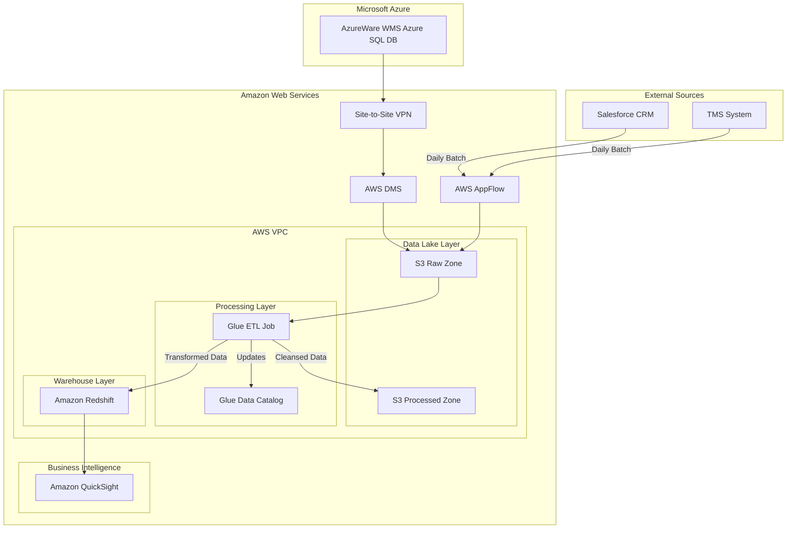

# Cloud Solution Architecture

**Project: Project Unify**
**Version: 1.0**
**Date: 2025-07-11**

-----

### 1\. Overview & Executive Summary

#### 1.1. Introduction & Business Problem

Global Logistics Corp. (GLC) is hindered by significant operational inefficiencies due to data fragmentation. Key systems, including the Azure-based Warehouse Management System (AzureWare), Salesforce CRM, and the Transportation Management System (TMS), operate in silos. This segregation makes it impossible to gain a holistic view of the supply chain, accurately assess client profitability, or perform the predictive analytics necessary for proactive decision-making. The current reliance on manual, spreadsheet-based analysis is slow, error-prone, and unscalable, preventing GLC from leveraging its data as a strategic asset.

#### 1.2. Proposed Solution

This document outlines a modern, multi-cloud analytics platform designed to centralize and unify data from GLC's disparate systems. The proposed architecture establishes an **Analytics Lakehouse on Amazon Web Services (AWS)**. It will ingest near real-time transactional data from the AzureWare WMS on Microsoft Azure, along with daily batch data from Salesforce and the TMS.

Key AWS services at the core of this solution include:

  * **Amazon S3** for a scalable and durable data lake.
  * **AWS Glue** for serverless data integration, ETL, and cataloging.
  * **Amazon Redshift** as a high-performance cloud data warehouse.
  * **Amazon QuickSight** for business intelligence and interactive dashboarding.
  * **AWS Database Migration Service (DMS)** and **AWS Site-to-Site VPN** to establish a secure and efficient data bridge from Azure to AWS.

#### 1.3. Key Benefits

This solution directly addresses the core business challenges by transforming fragmented data into a unified, actionable asset. The architecture is designed to deliver the following key benefits:

| Benefit Category | Description |
| :--- | :--- |
| **Data-Driven Decision Making** | Provides a single source of truth in Amazon Redshift, enabling a 360-degree view of client profitability and operational performance. |
| **Operational Efficiency** | Automates data ingestion and transformation, drastically reducing the time for end-to-end order fulfillment analysis and eliminating manual, error-prone spreadsheet processes. |
| **Performance & Scalability** | Leverages a cloud-native architecture that meets sub-10-second dashboard load times and sub-15-minute data latency requirements. The platform is designed to scale seamlessly with a 30% year-over-year data growth. |
| **Proactive Insights** | Enables proactive SLA breach detection and alerting through near real-time data availability and powerful BI tools, shifting the business from a reactive to a proactive posture. |
| **Security and Governance** | Implements robust security controls, including end-to-end encryption and role-based access, to protect sensitive data and ensure compliance with regulations like GDPR. |
| **Future-Proof Foundation** | Establishes a flexible and scalable "Analytics Lakehouse" that can easily accommodate future phases, such as the development of machine learning models for predictive analytics. |

-----

### 2\. Scope

#### 2.1. In Scope

  * **Systems Integration:** AzureWare (WMS), Salesforce (CRM), and the corporate TMS.
  * **Core Platform Build:** The AWS Analytics Lakehouse, including the Amazon S3 data lake, AWS Glue ETL pipelines, and the Amazon Redshift data warehouse.
  * **Data Processes:** Automated data ingestion, cleansing, transformation, cataloging, and storage.
  * **Initial BI Functionality:** Delivery of two pre-built, interactive dashboards in Amazon QuickSight: "Operations Health" and "Client Profitability".
  * **Target User Groups:** Operations Management, Finance Department, Client Account Managers, and Executive Leadership.

#### 2.2. Out of Scope

  * **Source System Modification:** No changes will be made to the underlying architecture or functionality of AzureWare, Salesforce, or the TMS.
  * **Transactional Write-Back:** The data flow is one-way into the analytics platform; there will be no real-time updates back to the source systems.
  * **Advanced Analytics:** The development and implementation of machine learning models for predictive analytics are not part of this project phase.
  * **End-User Training:** Training for business users on Amazon QuickSight will be managed under a separate initiative.

-----

### 3\. Business Requirements & Architectural Drivers

#### 3.1. Key Requirements Summary

The architecture is driven by the following critical business requirements extracted from the BRD:

| ID | Requirement Category | Requirement Description |
| :--- | :--- | :--- |
| **FR-1** | Data Ingestion | Near real-time (\<15 min latency) ingestion from Azure SQL and daily batch ingestion from Salesforce & TMS. |
| **FR-2** | Data Transformation | Unify and cleanse data from all sources into business-centric models; calculate key metrics like OTIF and Client Profitability. |
| **FR-3** | Analytics & BI | Provide pre-built dashboards (Ops, Client) and allow ad-hoc SQL queries for power users. |
| **FR-4** | Security & Access | Implement Role-Based Access Control (RBAC) and Row-Level Security for client-specific data. |
| **NFR-1** | Performance | Dashboards must load in \<10 seconds; end-to-end data latency from AzureWare \<15 minutes. |
| **NFR-2** | Scalability | Support 30% YoY data volume growth and 100 concurrent dashboard users during peak hours. |
| **NFR-3** | Availability | The AWS analytics platform must maintain 99.5% uptime. |
| **NFR-4** | Security & Compliance | Encrypt all data at rest and in transit; ensure GDPR compliance for PII. |
| **NFR-5**| Governance | Maintain a comprehensive data catalog and implement automated data quality checks with alerting. |
| **NFR-6** | Data Retention | Raw data must be retained for 7 years; processed data indefinitely. |

#### 3.2. Architectural Decisions

Each architectural choice is a direct response to the requirements, guided by the principles of the AWS Well-Architected Framework.

| Requirement ID | Architectural Decision | Rationale & Fulfilled Requirement |
| :--- | :--- | :--- |
| **FR-1, NFR-1** | Use **AWS Database Migration Service (DMS)** with Change Data Capture (CDC) for Azure SQL ingestion. | Provides low-latency, near real-time replication to meet the \<15 minute data latency requirement. It is a managed service, reducing operational overhead. (Operational Excellence) |
| **FR-1** | Use **AWS Glue Python Shell jobs or AWS AppFlow** for Salesforce/TMS ingestion. | Provides robust, serverless, and cost-effective batch processing capabilities for daily API/file-based extracts. (Cost Optimization, Operational Excellence) |
| **FR-2, NFR-5** | Use **AWS Glue (ETL & Data Catalog)** for data transformation and governance. | A serverless Spark environment that scales automatically for data processing. The integrated Data Catalog is essential for data governance and meets the requirement for a central metadata repository. (Performance Efficiency, Operational Excellence) |
| **FR-3, NFR-1, NFR-2** | Use **Amazon Redshift** as the data warehouse. | A high-performance, petabyte-scale data warehouse optimized for BI and analytical queries. Its concurrency scaling feature supports 100+ concurrent users, and its performance ensures \<10 second dashboard loads. (Performance Efficiency) |
| **FR-4, NFR-4** | Implement security in-depth using **IAM Roles, Redshift RBAC, and VPC Endpoints**. | This layered approach ensures least-privilege access. Redshift's native support for Row-Level Security directly fulfills the requirement to restrict client manager data visibility. (Security) |
| **NFR-2**| Design the architecture with **loosely coupled, managed services (S3, Glue, Redshift)**. | Loosely coupled architecture promotes scalability. Managed services allow each component to scale independently to handle the 30% YoY data growth without a complete re-architecture. (Performance Efficiency, Reliability) |
| **NFR-3** | Deploy resources across **multiple Availability Zones (Multi-AZ)** within a single AWS Region. | This is a foundational best practice for achieving high availability and meeting the 99.5% uptime target by protecting against single data center failures. (Reliability) |
| **NFR-4** | Use **AWS Site-to-Site VPN** for Azure-to-AWS connectivity and enable **encryption on all storage services**. | The VPN provides a secure, encrypted tunnel for data in transit. SSE on S3 and native Redshift encryption protect data at rest, fulfilling all encryption requirements. (Security) |

-----

### 4\. Cloud and Application Architecture

#### 4.1. Recommended Cloud Provider

**Amazon Web Services (AWS)** is the recommended cloud provider for the analytics platform. This decision is driven by the BRD's specification of AWS services and AWS's market-leading, mature, and deeply integrated suite of serverless analytics services (S3, Glue, Redshift, QuickSight) that directly map to the project's requirements for scalability, performance, and managed operations.

#### 4.2. Architecture Diagram

The diagram below illustrates the multi-cloud architecture, detailing the flow of data from source systems in Azure into the AWS Analytics Lakehouse for processing, storage, and visualization.

**Diagram Explanation:**

1.  A secure **Site-to-Site VPN** connects the Azure VNet and the AWS VPC.
2.  **AWS DMS** performs ongoing replication from the Azure SQL DB, landing data in the **S3 Raw Zone**.
3.  **AWS AppFlow** performs daily batch extractions from **Salesforce and the TMS**, also landing data in the S3 Raw Zone.
4.  An **AWS Glue ETL job** is triggered to read from the Raw Zone, cleanse and transform the data, and update the **Glue Data Catalog**.
5.  The Glue job writes transformed, structured data to **Amazon Redshift** for fast querying and writes a cleansed copy to the **S3 Processed Zone** for long-term storage and potential future use.
6.  **Amazon QuickSight** connects to Redshift, providing BI dashboards to business users.

#### 4.3. Compute Architecture

The compute architecture is predominantly **serverless**, minimizing operational overhead and aligning costs directly with usage.

  * **ETL and Data Processing:** **AWS Glue** will be used. This is a fully managed, serverless Apache Spark service. It automatically provisions, manages, and scales the required compute resources for ETL jobs, freeing the data engineering team from infrastructure management.
  * **Orchestration and Automation:** **AWS Step Functions** and **AWS Lambda** will be used to orchestrate the daily batch jobs and automate responses to events (e.g., triggering a Glue job upon file arrival in S3). This serverless approach is highly cost-effective and reliable for event-driven workflows.

**Rationale:** A serverless compute strategy directly supports the **Operational Excellence** and **Cost Optimization** pillars of the AWS Well-Architected Framework. It eliminates the need for patching, scaling, and managing servers, allowing the team to focus on business logic.

#### 4.4. Application Architecture

The solution employs a hybrid **Event-Driven and Batch Processing** architecture.

  * **Event-Driven:** The ingestion from the AzureWare WMS is event-driven. A change in the source database is an event that is captured by DMS and triggers the downstream processing pipeline. This pattern is essential for meeting the near real-time data latency requirement of under 15 minutes.
  * **Batch Processing:** Ingestion from Salesforce and the TMS is handled via scheduled daily batch jobs, which aligns with their less stringent latency requirements and is a cost-effective method for bulk data movement.

**Rationale:** This dual-pattern approach provides the flexibility to meet the distinct requirements of different source systems efficiently and cost-effectively, a core tenet of the **Performance Efficiency** pillar.

-----

### 5\. Network Architecture

#### 5.1. Network Topology

  * **AWS Virtual Private Cloud (VPC):** A new, dedicated VPC will be created in AWS to provide a logically isolated network environment.
  * **Subnetting Strategy:** The VPC will be segmented into private and public subnets across at least two Availability Zones for high availability.
      * **Private Subnets:** All data-centric resources, including the Amazon Redshift cluster and AWS Glue VPC endpoints, will be placed in private subnets with no direct internet access, adhering to the principle of least privilege.
      * **Public Subnets:** Will contain the NAT Gateways to allow resources in private subnets (like Glue jobs) to access external endpoints if necessary (e.g., downloading libraries), without being publicly exposed.
  * **CIDR Blocks:** A non-overlapping CIDR block (e.g., 10.10.0.0/16) will be selected to prevent conflicts with GLC's existing Azure or on-premises networks.

#### 5.2. Traffic Flow

  * **Multi-Cloud Traffic (Azure -\> AWS):** All data traffic from the Azure SQL DB will be encrypted and routed securely through the Site-to-Site VPN connection. It will never traverse the public internet.
  * **External Integration Traffic (Salesforce/TMS -\> AWS):** Traffic from cloud-based external systems like Salesforce will be ingested via AWS AppFlow, which uses encrypted TLS 1.2 connections over the public internet.
  * **Internal AWS Traffic:** To enhance security and performance, **VPC Endpoints** (for S3 and Glue) will be used. This ensures that traffic between our application components and these AWS services stays within the AWS network backbone.
  * **User Traffic (BI):** End-users will access QuickSight dashboards securely over the internet via HTTPS.

#### 5.3. DNS & Connectivity

  * **Cloud-to-Cloud Connectivity:** An **AWS Site-to-Site VPN** will be established between the GLC Azure Virtual Network (VNet) and the AWS VPC. This provides a stable, secure, and encrypted connection for the DMS replication traffic.
  * **DNS:** Amazon Route 53 will be used for any public-facing DNS needs, though none are required for this phase. Internal DNS resolution will be handled by the default VPC DNS resolver.

-----

### 6\. Data Storage & Management

#### 6.1. Data Storage Solutions

The architecture utilizes a Lakehouse pattern, leveraging different storage solutions for specific needs.

| Data Store | AWS Service | Purpose | Rationale |
| :--- | :--- | :--- | :--- |
| **Data Lake** | **Amazon S3** | Storage of raw, immutable source data and cleansed, processed data in Parquet format. | Unmatched durability (99.999999999%) and scalability to handle 30% YoY growth. Its cost-effectiveness and integration with Glue and Redshift make it the ideal foundation for the lakehouse. |
| **Data Warehouse** | **Amazon Redshift** | The central, high-performance analytical engine for all BI dashboards and ad-hoc queries. | Massively Parallel Processing (MPP) architecture delivers low-latency query results required for \<10s dashboard loads. Provides standard SQL interface for power users and robust concurrency features. |

#### 6.2. Data Flow & Lifecycle

1.  **Ingestion:** Raw data lands in the `s3://project-unify-raw/` bucket.
2.  **Transformation:** Glue ETL jobs process raw data, staging the output in the `s3://project-unify-processed/` bucket in the optimized Apache Parquet format.
3.  **Loading:** The processed data is loaded into Amazon Redshift using the `COPY` command for optimal performance.
4.  **Archival & Retention:** An **S3 Lifecycle Policy** will be configured on the `project-unify-raw` bucket to automatically transition data older than 30 days to S3 Standard-IA, and then to S3 Glacier Deep Archive after 90 days, where it will be retained for 7 years before deletion, meeting cost and compliance goals. Processed data in Redshift will be retained indefinitely for trend analysis.

#### 6.3. Backup and Recovery

  * **Amazon Redshift:** Automated snapshots will be enabled, with a recovery point objective (RPO) of 8 hours and a recovery time objective (RTO) of 4 hours. Snapshots will be copied to a secondary DR region.
  * **Amazon S3:** Bucket Versioning will be enabled on all S3 buckets to protect against accidental deletions or overwrites. Cross-Region Replication (CRR) will be configured for the raw and processed data buckets to the DR region for business continuity.

-----

### 7\. Data and Application Integration

#### 7.1. Internal Integration

  * **API/Service Communication:** Communication between components is primarily asynchronous and event-driven.
  * **Messaging/Eventing:** **Amazon S3 Events** will be used to trigger data processing. When a new file is delivered to the S3 Raw Zone by DMS or AppFlow, an S3 event will trigger an AWS Lambda function, which in turn starts the appropriate AWS Glue ETL job.
  * **Orchestration:** **AWS Step Functions** will be used to manage and orchestrate the multi-step daily batch ingestion workflows from Salesforce and TMS, providing error handling, retries, and state management.

#### 7.2. External Integration

  * **AzureWare (Azure SQL):** **AWS Database Migration Service (DMS)** is the chosen tool. It will be configured with a source endpoint in Azure and a target endpoint in AWS. An ongoing replication task using Change Data Capture (CDC) will stream changes from Azure to the S3 raw bucket. This is the most efficient method to meet the near real-time (\<15 min) requirement.
  * **CRM (Salesforce) & TMS:** **AWS AppFlow** provides a fully-managed, no-code integration service with a native Salesforce connector. It will be used for the daily batch extraction. For the TMS, which uses file extracts, a Glue Python Shell job will be used to fetch and land the files in S3.

-----

### 8\. Security & Compliance

#### 8.1. Identity and Access Management (IAM)

  * **Principle of Least Privilege:** This principle will be strictly enforced. All IAM roles and policies will grant only the permissions necessary for a service to perform its function.
  * **Service Access:** AWS services (Glue, Redshift, DMS) will use **IAM Roles** to securely access other AWS resources (e.g., S3 buckets) without the need for long-term credentials.
  * **User Access:** User access to QuickSight and Redshift will be managed via **IAM Identity Center**, federating with GLC's corporate identity provider (e.g., Azure AD). This centralizes user management and enforces corporate authentication standards.

#### 8.2. Data Protection

  * **Encryption at Rest:** All data stored in Amazon S3 will be encrypted using Server-Side Encryption with S3-Managed Keys (SSE-S3). The Amazon Redshift cluster will be launched with encryption enabled. This fulfills the NFR for data-at-rest encryption.
  * **Encryption in Transit:** All data transfer between Azure and AWS will be encrypted by the **Site-to-Site VPN**. All access to AWS APIs, S3, and QuickSight will be over TLS 1.2 or higher. This fulfills the NFR for data-in-transit encryption.

#### 8.3. Network Security

  * **Perimeter Security:** The network perimeter is secured by the VPC. Network ACLs will be used as a stateless firewall for subnets, and Security Groups will act as stateful firewalls for resources like the Redshift cluster.
  * **Internal Security:** Access to the Redshift cluster will be tightly controlled by a security group that only allows inbound traffic from the AWS Glue service (via its VPC endpoint). All other traffic will be denied.

#### 8.4. Compliance

  * **GDPR:** The solution addresses the GDPR compliance requirement by proposing a PII handling strategy. During the Glue ETL process, a data discovery and classification step will identify PII within fields like `DestinationAddress`. This PII will be masked or tokenized before being loaded into the main Redshift tables accessible by business users, ensuring sensitive personal data is protected. The raw, unaltered data containing PII will remain encrypted and archived in a restricted-access S3 location.

-----

### 9\. Deployment & Operations (DevOps)

#### 9.1. CI/CD Pipeline

A fully automated CI/CD pipeline will be implemented using AWS Developer Tools to ensure rapid, reliable, and repeatable deployments.

  * **Source:** AWS CodeCommit will host all Infrastructure as Code (Terraform) and ETL script (PySpark) repositories.
  * **Build:** AWS CodeBuild will be used to validate Terraform code, run unit tests on Python scripts, and package deployment artifacts.
  * **Deploy:** AWS CodePipeline will orchestrate the entire workflow, deploying infrastructure changes and updated Glue jobs automatically to development, staging, and production environments with manual approval gates for production promotion.

#### 9.2. Monitoring & Logging

  * **Amazon CloudWatch** will be the central service for monitoring, logging, and alerting.
  * **Metrics:** Key metrics will be monitored, including Redshift CPU Utilization, storage capacity, Glue ETL job execution time and success/failure rates, and DMS replication latency.
  * **Logs:** All application and service logs will be centralized in CloudWatch Logs for analysis and troubleshooting.
  * **Alarms:** CloudWatch Alarms will be configured to meet NFRs. An alarm will trigger if DMS replication latency exceeds 15 minutes or if a data quality check in a Glue job fails, sending an alert to the data engineering team via Amazon SNS.

#### 9.3. Disaster Recovery (DR)

An **Active-Passive DR strategy** will be implemented to ensure business continuity.

  * **DR Site:** A secondary AWS Region will be designated as the DR site.
  * **Data Replication:** Amazon S3 Cross-Region Replication (CRR) will continuously replicate data from the primary region's data lake to the DR region. Automated Redshift snapshot copies will also be sent to the DR region.
  * **Recovery:** In the event of a primary region failure, the entire infrastructure stack can be provisioned in the DR region using the Terraform IaC scripts from the CI/CD pipeline. A DNS cutover in Route 53 would redirect QuickSight users to the newly active environment. This strategy balances cost with a robust recovery capability.

-----

### 10\. Scalability & Performance

#### 10.1. Scalability

The architecture is designed for elastic scalability to meet both current and future demand.

  * **Storage:** Amazon S3 provides virtually limitless scalability for the data lake, easily accommodating the 30% YoY growth projection.
  * **Compute:** AWS Glue is serverless and scales compute resources for ETL jobs automatically based on workload demands.
  * **Data Warehouse:** Amazon Redshift's **Concurrency Scaling** feature will be enabled, which automatically adds transient cluster capacity to handle spikes in concurrent queries, ensuring performance for the 100 concurrent users. **Elastic Resize** allows for the seamless scaling of the base cluster to handle long-term data volume growth.

#### 10.2. Performance

Multiple features are leveraged to meet the stringent performance requirements.

  * **Query Performance:** Amazon Redshift's columnar storage and MPP architecture are designed for the high-speed analytical queries needed to meet the **\<10 second dashboard load time**.
  * **BI Performance:** Amazon QuickSight's **SPICE (Super-fast, Parallel, In-memory Calculation Engine)** will be used for key dashboards. It pre-aggregates and caches data in-memory for extremely fast visualizations.
  * **Data Latency:** AWS DMS using CDC ensures the **\<15 minute end-to-end data latency** requirement is met for the most time-sensitive data from the WMS.

-----

### 11\. Cost Estimation & Optimization

#### 11.1. High-Level Cost Breakdown

A precise cost estimation requires detailed usage profiling. However, the primary cost drivers can be categorized in a Rough Order of Magnitude (ROM) as follows:

| Cost Category | Key AWS Services | Primary Cost Driver |
| :--- | :--- | :--- |
| **Compute** | Amazon Redshift, AWS Glue | Redshift node hours, Glue DPU hours |
| **Storage** | Amazon S3, Redshift Managed Storage | GB-months of data stored |
| **Data Transfer** | AWS Site-to-Site VPN, DMS, NAT Gateway | GB of data transferred from Azure to AWS |
| **Operations & BI** | Amazon QuickSight, CloudWatch | QuickSight user/session licenses, CloudWatch logs ingested |

#### 11.2. Cost Optimization Strategies

The following strategies will be implemented to ensure the platform operates in a cost-effective manner, adhering to the Cost Optimization pillar.

  * **Utilize Reserved Instances:** For the production Amazon Redshift cluster, which will have a predictable, steady-state workload, purchasing **Reserved Instances** for a 1- or 3-year term will yield significant savings over on-demand pricing.
  * **Right-Sizing:** AWS Compute Optimizer will be used periodically to analyze Redshift and Glue usage to ensure resources are right-sized.
  * **Automated Tiering:** **S3 Intelligent-Tiering** will be used for the processed data zone to automatically move data to the most cost-effective storage tier based on access patterns.
  * **Serverless First:** The extensive use of serverless services like Glue, Lambda, and AppFlow eliminates costs associated with idle compute capacity.
  * **Resource Scheduling:** Development and staging Redshift clusters will be scripted to pause during non-business hours, reducing costs by up to 70%.

-----

### 12\. Considerations & Limitations

#### 12.1. Key Assumptions

  * **API Availability:** Stable and documented APIs or other data access methods are available and will be maintained for Salesforce and the TMS.
  * **Network Performance:** The network connection between Azure and AWS has sufficient bandwidth and stability to support the DMS replication latency targets.
  * **Data Quality:** Source systems are considered the source of truth. While the ETL process will cleanse and standardize data, it is assumed that the source data is fundamentally accurate.
  * **Stakeholder Availability:** Business and IT stakeholders will be available for timely validations and testing.

#### 12.2. Risks & Mitigations

| Risk | Likelihood | Impact | Mitigation Strategy |
| :--- | :--- | :--- | :--- |
| **Source System API Changes** | Medium | Medium | Decouple extraction logic into dedicated Glue jobs/Lambda functions. This isolates the impact and allows for focused updates without re-architecting the entire pipeline. |
| **Data Quality Issues from Source** | Medium | High | Implement extensive, automated data quality checks and validation rules within the Glue ETL jobs as per FR 5.5.2. Failed checks will quarantine data and trigger CloudWatch alerts. |
| **VPN Connectivity Instability** | Low | High | Deploy the AWS Site-to-Site VPN across two tunnels for redundancy. Monitor the connection with CloudWatch and set up alarms for downtime. |
| **Cost Overruns** | Medium | Medium | Implement AWS Budgets with alerts. Enforce tagging for cost allocation. Regularly review costs against KPIs and use the optimization strategies outlined in section 11.2. |

#### 12.3. Known Limitations

  * The solution delivers a near real-time analytics platform with a latency of up to 15 minutes; it is not a true, sub-second real-time streaming solution.
  * This architecture focuses on establishing the foundational analytics platform. The development of predictive machine learning models is explicitly out of scope for this phase.
  * The success of the platform is dependent on the quality and consistency of the data provided by the source systems. Significant data quality issues at the source may require remediation efforts that are outside the scope of this project.
