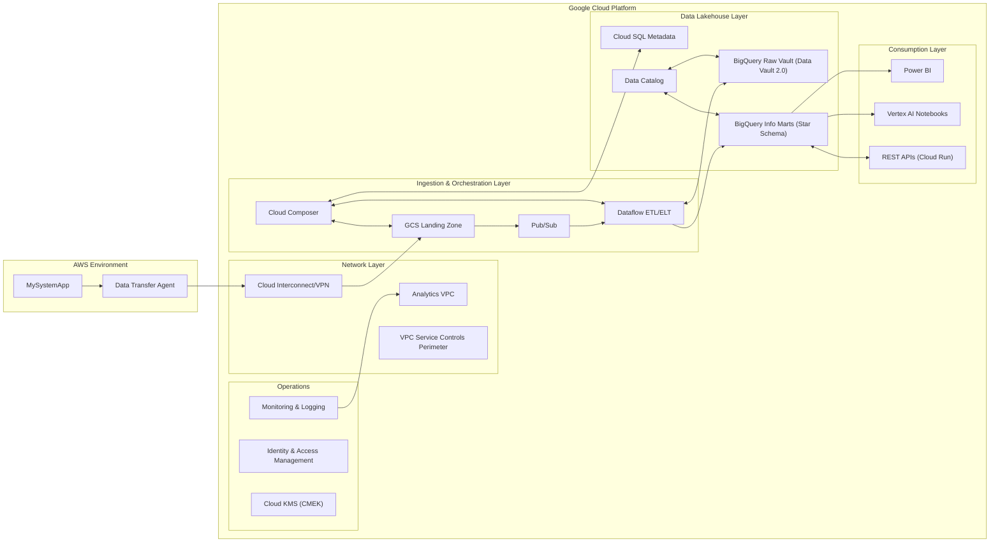

# Cloud Solution Architecture
**Project:** Cross-Cloud Data Lakehouse Analytics Platform
**Version:** 1.0
**Date:** 11/07/2025

---

### 1. Overview & Executive Summary

#### 1.1. Introduction & Business Problem
The organization currently faces significant challenges in accessing and analyzing critical business data stored in `MySystemApp`, which is hosted within a private AWS network. This data isolation creates barriers to data-driven decision making, limits analytical capabilities, and prevents the organization from leveraging modern cloud analytics tools. The current state requires manual data extraction processes, lacks real-time insights, and cannot support the growing demands for self-service analytics and advanced data science capabilities.

#### 1.2. Proposed Solution
The proposed solution implements a comprehensive cloud analytics platform that bridges the existing AWS environment and a new Google Cloud Platform (GCP) environment through a modern data lakehouse architecture. The architecture will establish secure, high-bandwidth data ingestion pipelines from the AWS-hosted `MySystemApp` into a GCP-based analytics environment. This environment will leverage Google Cloud Storage for raw data landing, BigQuery for the structured lakehouse, and Dataflow for scalable ETL/ELT processing. The data model will feature a Data Vault 2.0 methodology for the auditable raw vault layer and star schema-modeled information marts for business intelligence. This platform will support multiple consumption patterns, including Power BI reporting, Vertex AI notebooks for data science, and RESTful APIs for downstream system integration.

#### 1.3. Key Benefits
This solution is designed to directly address the stated business problems and deliver measurable value through the following key benefits:

| Benefit | Architectural Enabler |
| :--- | :--- |
| **Unified Data Access** | Centralizes all analytics data from the siloed AWS source into a GCP-based BigQuery lakehouse, providing a single source of truth. |
| **Real-time Insights** | Implements low-latency streaming data ingestion pipelines using Dataflow, enabling data availability in near real-time (<5 minute latency). |
| **Scalable Architecture** | Utilizes serverless and auto-scaling GCP services (BigQuery, Dataflow, Cloud Storage) to dynamically manage resources, supporting 500+ concurrent users and peak loads up to 10TB/hour. |
| **Advanced Analytics** | Provides data scientists with a managed Vertex AI notebook environment featuring on-demand GPU acceleration for complex machine learning model development. |
| **Self-Service Capabilities** | Integrates Power BI with BigQuery via optimized connectors and pre-built semantic models (information marts), empowering business users. |
| **Cost Optimization** | Leverages cloud-native efficiencies such as serverless processing, auto-scaling, and tiered storage to achieve a 30% reduction in data processing costs. |
| **Compliance & Governance**| Implements enterprise-grade security (VPC Service Controls, CMEK), granular IAM, and automated data lineage tracking to meet stringent compliance standards. |

---

### 2. Scope

#### 2.1. In Scope
The scope of this solution architecture includes the design and deployment of the following components:
* Secure cross-cloud connectivity between the source AWS private network and the target GCP environment.
* Real-time and batch data ingestion pipelines from `MySystemApp`.
* Implementation of a Data Vault 2.0 model in BigQuery for the raw vault layer.
* Development of star schema information marts in BigQuery for business domain reporting.
* ETL/ELT transformation pipelines using Dataflow, including comprehensive data quality validation checks.
* Integration with Power BI, providing semantic models for self-service analytics.
* A managed Vertex AI notebook environment for data science and machine learning.
* Development of RESTful APIs and webhook integrations for downstream data consumption.
* A comprehensive monitoring, alerting, and operational dashboarding framework.
* A data governance framework covering data cataloging, lineage, and role-based access controls.
* A multi-region disaster recovery and business continuity plan.

#### 2.2. Out of Scope
The following items are explicitly excluded from the scope of this project:
* Any migration or modification of the source `MySystemApp` system in AWS.
* End-user training programs and organizational change management.
* Procurement and licensing of third-party tools, including Power BI.
* Provisioning of the underlying physical network infrastructure for VPN/Interconnect connectivity.
* Custom application development beyond the defined analytics platform APIs.
* Data migration from any legacy systems other than `MySystemApp`.
* Development of a mobile application for analytics consumption.

---

### 3. Business Requirements & Architectural Drivers

#### 3.1. Key Requirements Summary
The architecture is driven by the following critical business requirements, summarized from the Business Requirements Document.

**Functional Requirements:**
| Requirement ID | Description |
| :--- | :--- |
| FR-01 | Support an initial data load of 5TB and ongoing daily incremental updates of 500GB. |
| FR-02 | Handle peak data processing loads of up to 10TB/hour with dynamic auto-scaling. |
| FR-03 | Achieve query response times of less than 5 seconds for 95% of all analytical queries. |
| FR-04 | Support 500+ concurrent users for reporting, data science, and API access. |
| FR-05 | Enable near real-time data streaming with an end-to-end latency of less than 5 minutes. |

**Non-Functional Requirements:**
| Requirement ID | Description |
| :--- | :--- |
| NFR-01 | Ensure system availability of >99.9%, excluding planned maintenance. |
| NFR-02 | All data must be encrypted at rest and in transit using strong, managed encryption protocols. |
| NFR-03 | Implement Role-Based Access Control (RBAC) integrated with the enterprise identity provider. |
| NFR-04 | Ensure compliance with GDPR, CCPA, SOC 2, and ISO 27001 standards. |
| NFR-05 | Achieve a Recovery Time Objective (RTO) of <4 hours and a Recovery Point Objective (RPO) of <1 hour. |
| NFR-06 | Implement comprehensive audit logging and end-to-end data lineage tracking. |
| NFR-07 | Achieve a 30% reduction in data processing costs compared to previous manual methods. |

#### 3.2. Architectural Decisions
The following table outlines the key architectural decisions made to satisfy the corresponding business requirements. This mapping provides the rationale ("the why") for the chosen technical approach.

| Requirement(s) | Architectural Decision & Rationale |
| :--- | :--- |
| **FR-01, FR-02, NFR-07:** High-volume, scalable data processing with cost optimization. | **Decision:** Utilize **Google Dataflow** for ETL/ELT pipelines. **Rationale:** Dataflow is a serverless, auto-scaling service capable of handling terabyte-scale processing loads efficiently. Its consumption-based pricing model directly supports the cost reduction goals by eliminating idle compute resources. |
| **NFR-02, NFR-04:** Historical data preservation, auditability, and compliance. | **Decision:** Adopt **Data Vault 2.0** methodology for the raw vault layer in BigQuery. **Rationale:** Data Vault's immutable structure (Hubs, Links, Satellites) provides a complete, non-destructive history of all source data, which is essential for audit trails and regulatory compliance like GDPR. |
| **FR-03, FR-04:** Fast query performance for a high number of concurrent users. | **Decision:** Deploy **Google BigQuery** as the central data lakehouse with **Star Schema** information marts. **Rationale:** BigQuery's serverless, distributed architecture is designed for high-concurrency and fast analytical queries. Star schemas provide an optimized, denormalized structure for BI tools, while features like BigQuery BI Engine ensure sub-second response times for cached queries. |
| **NFR-03, NFR-04:** Secure cross-cloud data transfer and access control. | **Decision:** Establish a secure **Cloud Interconnect/VPN** between AWS and GCP, and enforce security perimeters with **VPC Service Controls**. **Rationale:** A dedicated, encrypted connection is critical for securely transferring sensitive data. VPC Service Controls create a virtual perimeter around GCP services (GCS, BigQuery) to prevent data exfiltration, a key control for compliance. |
| **Advanced Analytics & GPU Needs** | **Decision:** Provide **Vertex AI Managed Notebooks**. **Rationale:** This managed environment simplifies the data science workflow by providing pre-configured, secure notebooks with integrated access to BigQuery and the ability to attach GPU accelerators on-demand, fulfilling the requirement for advanced analytics without the overhead of infrastructure management. |
| **NFR-05:** High availability and stringent RTO/RPO targets. | **Decision:** Implement a **multi-region architecture** for all critical components. **Rationale:** Replicating GCS buckets, BigQuery datasets, and CI/CD artifacts across two GCP regions provides the foundation for rapid failover, ensuring the <4-hour RTO and <1-hour RPO can be met during a regional outage. |
| **Data Quality Assurance** | **Decision:** Integrate automated **data quality validation** steps within Dataflow pipelines. **Rationale:** Building quality checks directly into the transformation logic ensures that data integrity issues are caught and handled early, preventing the propagation of bad data and supporting the 99.9% accuracy requirement. |

---

### 4. Cloud and Application Architecture

#### 4.1. Recommended Cloud Provider
The primary analytics platform will be implemented on **Google Cloud Platform (GCP)**. The source `MySystemApp` will remain in its existing **Amazon Web Services (AWS)** private network.

**Rationale:** GCP is selected as the strategic platform for this solution due to its mature, serverless, and highly integrated data and analytics suite. Services like BigQuery, Dataflow, and Vertex AI are industry leaders and directly address the core requirements of large-scale analytics, streaming ingestion, and machine learning without significant operational overhead. This aligns with the principles of operational excellence and cost optimization outlined in the Google Cloud Well-Architected Framework.

#### 4.2. Architecture Diagram
The following diagram illustrates the end-to-end architecture, from data ingestion in AWS to consumption in GCP.

**Diagram Explanation:**

1.  A **Data Transfer Agent** securely extracts data from `MySystemApp` within the private **AWS Environment**.
2.  Data is transmitted via an encrypted **Cloud Interconnect/VPN** link to the **GCP Environment**.
3.  Raw data lands in a **GCS Landing Zone**. The arrival of new data publishes a message to **Pub/Sub**.
4.  The Pub/Sub message triggers a **Dataflow** pipeline, which validates the raw data and loads it into the **BigQuery Raw Vault** using the Data Vault 2.0 model.
5.  Subsequent Dataflow pipelines transform the data from the Raw Vault into business-oriented **BigQuery Information Marts** using star schema models.
6.  **Cloud Composer** orchestrates the entire workflow, managing dependencies between ingestion and transformation jobs.
7.  Metadata, lineage, and operational metrics are stored in **Cloud SQL**, while business and technical metadata is discoverable via **Data Catalog**.
8.  Data is consumed by three primary channels: **Power BI** for business intelligence, **Vertex AI Notebooks** for data science, and **REST APIs** for downstream applications.
9.  The entire GCP environment is enclosed within a **VPC Service Controls Perimeter** and managed by a suite of **Operations** services including IAM, KMS, and Monitoring.

#### 4.3. Compute Architecture

The solution employs a serverless-first compute strategy to maximize scalability and cost-efficiency.

| Service | Configuration | Purpose & Rationale |
| :--- | :--- | :--- |
| **Google Dataflow** | Streaming & Batch Jobs, Auto-scaling | **ETL/ELT Processing:** Chosen for its serverless, fully managed nature. It automatically scales worker resources based on data volume, satisfying the 10TB/hour peak processing requirement while minimizing costs during idle periods. |
| **Google Cloud Composer 2** | Managed Apache Airflow | **Workflow Orchestration:** Provides a robust, familiar environment for orchestrating complex, multi-step data pipelines with dependencies. Its managed nature reduces operational overhead compared to a self-hosted Airflow instance. |
| **Google Vertex AI Managed Notebooks**| JupyterLab Environment, GPU-enabled | **Data Science & ML:** Offers a secure, collaborative environment for data scientists. The ability to attach GPUs on-demand meets the requirement for advanced, computationally intensive analytics workloads without maintaining dedicated hardware. |
| **Google Cloud Run** | Container-based, Auto-scaling | **API Hosting:** Provides a serverless platform to deploy the containerized RESTful APIs. It scales automatically from zero to handle API requests, ensuring high availability and a pay-per-use cost model ideal for variable traffic. |

#### 4.4. Application Architecture

The solution is designed as an **Event-Driven, Data Lakehouse Architecture**.

  * **Event-Driven:** The architecture is decoupled and responsive. Data processing is initiated by events (e.g., a new file arriving in GCS triggers a Pub/Sub message, which starts a Dataflow job). This pattern, facilitated by **Pub/Sub**, improves scalability and resilience, as components are not tightly dependent on one another.
  * **Lakehouse:** This architecture combines the benefits of a data lake and a data warehouse.
      * **Google Cloud Storage** acts as the scalable, cost-effective data lake for storing vast amounts of raw, unstructured, and semi-structured data.
      * **Google BigQuery** provides the data warehouse capabilities, imposing structure, governance, and high-performance SQL analytics directly on the data, supporting both the Data Vault and Star Schema models.

-----

### 5\. Network Architecture

#### 5.1. Network Topology

The network is segmented to enforce the principle of least privilege and provide strong isolation between environments and functional layers.

  * **AWS VPC:** The existing private AWS VPC hosting `MySystemApp` will be the source. No changes will be made to its topology.
  * **GCP VPC:** A new Virtual Private Cloud (VPC) will be created in GCP.
      * **CIDR Range:** A non-overlapping IP range will be allocated (e.g., 10.10.0.0/16).
      * **Subnets:** The VPC will be segmented into private subnets dedicated to different functional layers (e.g., Ingestion, Processing, Analytics, Management). This isolates resources and contains the blast radius of any potential security event.
      * **Private Google Access:** Will be enabled for all private subnets, allowing internal resources like Dataflow workers to access GCP APIs without requiring public IP addresses, enhancing security.

#### 5.2. Traffic Flow

Data flow is strictly controlled at every boundary.

  * **Ingress (AWS to GCP):** Data is pulled from `MySystemApp` by a secure agent and sent exclusively over the dedicated VPN/Interconnect to a GCS landing bucket. All other ingress traffic is denied by default.
  * **Internal (GCP):**
      * Dataflow workers will run in a private subnet and communicate with GCS, Pub/Sub, and BigQuery via Private Google Access.
      * Analysts and data scientists will access Vertex AI and BigQuery through the GCP console or Power BI service, which are protected by IAM and VPC Service Controls.
      * The REST APIs will be fronted by **API Gateway** and an **Internal Load Balancer**, exposing them securely only within the VPC or to authorized external consumers.
  * **Egress:** All outbound traffic from the VPC is denied by default. Necessary egress (e.g., for software updates) is routed through a **NAT Gateway** with strict firewall rules to control and log destinations.

#### 5.3. DNS & Connectivity

  * **Cross-Cloud Connectivity:** A high-availability **Cloud VPN** or **Cloud Interconnect** (Partner or Dedicated) connection will be established between the AWS source VPC and the GCP analytics VPC. This provides a secure, reliable, and high-bandwidth path for data ingestion.
  * **DNS:** **Cloud DNS** will be used to manage private DNS zones within the GCP VPC, allowing services to resolve each other using predictable, friendly names instead of IP addresses.

-----

### 6\. Data Storage & Management

#### 6.1. Data Storage Solutions

The storage strategy is tiered and purpose-built to balance performance, cost, and governance requirements.

| Data Type | Storage Solution | Configuration | Rationale |
| :--- | :--- | :--- | :--- |
| **Raw & Staging Data** | Google Cloud Storage (GCS) | Multi-regional, Standard/Nearline/Coldline classes | GCS is chosen for its immense scalability, durability, and low cost. A multi-regional configuration provides high availability for critical landing data. Lifecycle policies will automatically transition older data to cheaper storage tiers to meet cost optimization goals. |
| **Raw Vault (Historical)** | Google BigQuery | Partitioned by `load_date`, Clustered on business keys | BigQuery is the core of the lakehouse, providing serverless, petabyte-scale analytical power. Using the Data Vault 2.0 model here ensures a complete, auditable history is preserved. Partitioning and clustering are critical for optimizing query performance and cost control. |
| **Information Marts** | Google BigQuery | Star Schema, Materialized Views, BI Engine enabled | Star schemas in BigQuery are the consumption layer, optimized for fast BI queries. Materialized views pre-calculate common aggregations, and BI Engine provides in-memory caching to deliver sub-second query response for Power BI, meeting the \<5 second performance requirement. |
| **Operational Metadata**| Google Cloud SQL (PostgreSQL)| High Availability (HA) configuration | A managed relational database is required for the transactional nature of metadata (e.g., pipeline logs, configurations, lineage). Cloud SQL for PostgreSQL is chosen for its managed operations, reliability, and compatibility with Cloud Composer. |

#### 6.2. Data Flow & Lifecycle

1.  **Ingestion:** Data is extracted from `MySystemApp`, lands in a GCS staging bucket, and is immediately cataloged.
2.  **Processing:** Dataflow pipelines are triggered to load the data into the BigQuery Raw Vault (Data Vault 2.0).
3.  **Transformation:** Separate Dataflow jobs read from the Raw Vault, apply business logic and data quality rules, and populate the user-facing Information Marts (Star Schema).
4.  **Consumption:** Business users, data scientists, and applications query the Information Marts.
5.  **Archival & Purge:** GCS Lifecycle Management policies automatically move raw data from Standard to Nearline, then to Coldline storage. Data in BigQuery and GCS is purged based on documented retention policies to comply with regulations like GDPR.

#### 6.3. Backup and Recovery

The backup strategy is designed to meet the RTO/RPO of \<4 hours / \<1 hour respectively.

  * **Primary Backups:** Automated daily snapshots of BigQuery datasets are configured and retained for 30 days. Critical GCS buckets are configured with cross-region replication for geographic redundancy.
  * **Point-in-Time Recovery (PITR):** BigQuery's Time Travel feature is leveraged for operational recovery, allowing any table to be restored to any point in the last 7 days. This is a crucial tool for recovering from logical corruption or user error.
  * **Disaster Recovery (DR):** The entire environment is defined using Terraform (IaC). In a disaster, pipelines can be deployed to a secondary GCP region, and data can be restored from cross-region snapshots and replicas. This process is tested semi-annually.

-----

### 7\. Data and Application Integration

#### 7.1. Internal Integration

  * **Service Communication:**
      * **Asynchronous/Event-Driven:** **Cloud Pub/Sub** is used as the messaging backbone to decouple services. This is a core component of the event-driven architecture, enabling scalable and resilient communication between the ingestion and processing layers.
      * **Synchronous:** **REST APIs** built on Cloud Run and fronted by API Gateway will be used for synchronous, request-response interactions where needed.
  * **Pipeline Integration:** **Cloud Composer** orchestrates all data pipelines, managing complex dependencies, retries, and error handling, ensuring reliable end-to-end execution.
  * **Monitoring Integration:** All services are configured to export logs and metrics to **Cloud Monitoring and Logging**, providing a unified plane of glass for operational visibility and proactive alerting.

#### 7.2. External Integration

  * **Source System (`MySystemApp`):** Secure data transfer agents will connect to `MySystemApp` via its exposed database links and APIs, using authenticated service accounts and encrypted connections.
  * **Power BI:** Users will connect to BigQuery using the native Power BI connector, which supports both **DirectQuery** for real-time data and **Import** mode for performance. Access is secured via service principal authentication passed from Power BI to GCP, enforcing row-level security defined in BigQuery.
  * **Downstream Systems:** A public-facing **API Gateway** will expose managed RESTful API endpoints for external consumption. The gateway will enforce security policies, rate limiting, and monitoring. Webhook support will be provided for pushing event notifications to subscribed systems.
  * **Identity System:** The platform will integrate with the enterprise **Active Directory** using **SAML 2.0**, enabling seamless Single Sign-On (SSO) for all users across Power BI and GCP components.

-----

### 8\. Security & Compliance

#### 8.1. Identity and Access Management (IAM)

  * **Authentication:** All user access will be federated through the enterprise identity provider using SAML 2.0. Multi-factor authentication (MFA) will be enforced for all access, especially for roles with elevated privileges.
  * **Authorization:** A strict Role-Based Access Control (RBAC) model will be implemented using GCP IAM. The **principle of least privilege** is paramount; users and service accounts will only be granted the permissions essential to perform their duties.
  * **Service Accounts:** Each application component and pipeline will use a dedicated, single-purpose service account. Keys will be managed by GCP and automatically rotated. Unused service accounts will be automatically disabled and periodically reviewed for deletion.

#### 8.2. Data Protection

  * **Encryption at Rest:** All data stored in GCS and BigQuery will be encrypted by default. This will be augmented with **Customer-Managed Encryption Keys (CMEK)** managed in **Cloud KMS**. Separate keys will be used for data of different sensitivity levels, giving the organization full control over data access.
  * **Encryption in Transit:** All network traffic will be encrypted using **TLS 1.3**. The cross-cloud connection via VPN/Interconnect will also be encrypted, ensuring end-to-end protection.
  * **Data Loss Prevention (DLP):** Cloud DLP APIs will be used to automatically scan and classify data upon ingestion, identifying and tagging PII and other sensitive information to enforce appropriate handling policies.

#### 8.3. Network Security

  * **Network Segmentation:** The GCP VPC will be segmented into private subnets with default-deny **firewall rules**, strictly limiting traffic between layers.
  * **Perimeter Security:**
      * **VPC Service Controls:** A service perimeter will be established around all sensitive data services (GCS, BigQuery, Dataflow) to create a virtual security boundary. This control prevents data exfiltration by restricting data movement to only authorized networks and identities.
      * **Cloud Armor (WAF):** The public-facing API Gateway will be protected by Cloud Armor to defend against DDoS attacks and common web application vulnerabilities (e.g., OWASP Top 10).

#### 8.4. Compliance

The architecture incorporates controls to meet the specified regulatory requirements:

| Compliance Standard | Architectural Controls & Processes |
| :--- | :--- |
| **GDPR** | Data classification (Cloud DLP), encryption with CMEK, documented data subject request (DSR) procedures, data retention and purge policies via GCS Lifecycle. |
| **CCPA** | Similar controls to GDPR, with specific processes for data disclosure and deletion requests as mandated by the act. |
| **SOC 2 Type II** | Implementation of robust controls across security, availability, and confidentiality. Comprehensive audit trails via Cloud Audit Logs, and regular third-party audits of the control environment. |
| **ISO 27001** | Use of ISO 27001-certified GCP services, implementation of a formal risk management framework, and strict IAM and network security controls. |

-----

### 9\. Deployment & Operations (DevOps)

#### 9.1. CI/CD Pipeline

A fully automated CI/CD pipeline is fundamental to the operational excellence of this platform.

  * **Source Control:** All artifacts, including Terraform code (IaC), Dataflow pipeline definitions, and SQL scripts, will be stored in a **Git-based repository**. Branch protection rules will require peer reviews for all changes to the `main` branch.
  * **Build & Test:** **Cloud Build** will be used to automate the build and testing process. Each commit will trigger a build that runs static code analysis, unit tests, and data quality validation tests in a containerized environment.
  * **Deployment:** A **Blue-Green deployment strategy** will be used for critical API components and Dataflow pipelines. This allows a new version to be deployed alongside the old version; traffic is only switched over after the new version is fully validated, enabling zero-downtime releases and instant rollbacks.

#### 9.2. Monitoring & Logging

  * **Centralized Logging:** All services will be configured to stream logs to **Cloud Logging**. This provides a centralized location for searching, analyzing, and auditing all operational logs.
  * **Proactive Monitoring:** **Cloud Monitoring** will be used to track key performance indicators (KPIs), resource utilization, and data quality metrics. **Custom dashboards** will provide at-a-glance views of platform health. Proactive **alerting** will be configured to notify the operations team of anomalies or threshold breaches via PagerDuty and Slack.
  * **Data Governance:** **Data Catalog** will automatically ingest technical metadata from BigQuery and GCS. Business metadata will be added manually to create a comprehensive, searchable catalog. Data lineage will be automatically tracked by Dataflow and BigQuery, providing end-to-end visibility into data transformations.

#### 9.3. Disaster Recovery (DR)

The DR strategy is designed to meet the RTO \< 4 hours and RPO \< 1 hour targets.

  * **Multi-Region Architecture:** A primary GCP region (e.g., `us-central1`) and a secondary DR region (e.g., `us-east1`) will be used. Critical data in GCS and BigQuery will be replicated across these regions. CI/CD artifacts and IaC configurations will also be replicated.
  * **Automated Failover:** In the event of a primary region failure, DNS records will be automatically updated to redirect traffic to the secondary region. A documented and tested runbook will guide the process of promoting the secondary region's data pipelines and services to become active.
  * **Regular Testing:** The DR plan will be tested semi-annually through simulated failover exercises to ensure its effectiveness and validate that RTO/RPO targets can be met.

-----

### 10\. Scalability & Performance

#### 10.1. Scalability

The architecture is designed to scale horizontally to meet fluctuating demand without manual intervention.

  * **Processing & Storage:** **Dataflow**, **BigQuery**, and **Cloud Storage** are serverless services that scale automatically. Dataflow scales its worker pool to match job complexity, while BigQuery allocates compute resources on a per-query basis. This model directly supports the peak load and concurrent user requirements.
  * **Compute:** **Vertex AI Notebooks** and **Cloud SQL** instances can be dynamically scaled (vertical scaling) to meet the needs of specific workloads or usage patterns. APIs on **Cloud Run** scale horizontally based on the number of incoming requests.
  * **Global Scaling:** The use of multi-region storage and GCP's global network allows the platform to be extended to other geographic regions in the future to optimize latency for a global user base.

#### 10.2. Performance

Multiple strategies are employed to meet the stringent performance requirements.

  * **Query Optimization:**
      * **Partitioning & Clustering:** BigQuery tables will be partitioned by date (e.g., `load_date`, `transaction_date`) and clustered by frequently filtered columns (e.g., `customer_id`, `product_id`). This dramatically reduces the amount of data scanned per query, lowering cost and improving speed.
      * **Materialized Views:** Pre-aggregated tables will be created for common dashboard queries, providing pre-computed results for maximum performance.
  * **Caching Strategy:**
      * **BigQuery BI Engine:** This in-memory analysis service will be enabled to provide sub-second query response times for data frequently accessed by Power BI.
      * **API Caching:** Responses from frequently requested, non-volatile API endpoints will be cached at the API Gateway layer to reduce load on the backend.
  * **Network Performance:** A **Content Delivery Network (CDN)** will be used to cache and serve static assets for any user-facing frontends, reducing latency for globally distributed users.

-----

### 11\. Cost Estimation & Optimization

#### 11.1. High-Level Cost Breakdown

The following provides a rough order of magnitude (ROM) monthly cost estimate based on the requirements. This is not a formal quote and is subject to change based on actual usage.

| Service Category | Estimated Monthly Cost (USD) |
| :--- | :--- |
| BigQuery Storage and Compute | $15,000 - $25,000 |
| Cloud Storage | $3,000 - $5,000 |
| Dataflow Processing | $8,000 - $12,000 |
| Network and Data Transfer | $2,000 - $4,000 |
| Monitoring and Operations | $1,000 - $2,000 |
| **Total Estimated Range** | **$29,000 - $48,000** |

*Note: This estimate does not include the one-time costs for setting up Cloud Interconnect/VPN.*

#### 11.2. Cost Optimization Strategies

The architecture incorporates several strategies to ensure costs are managed effectively and the 30% reduction target is met.

  * **Data Lifecycle Management:** GCS lifecycle policies will automatically transition raw and processed data to lower-cost storage tiers (Nearline, Coldline, Archive) based on access frequency and retention requirements.
  * **Resource Right-Sizing & Auto-scaling:** The serverless and auto-scaling nature of Dataflow, Cloud Run, and BigQuery ensures that compute resources are closely matched to demand, eliminating payment for idle resources. This is a core tenet of cloud cost optimization.
  * **Reserved Capacity:**
      * **Committed Use Discounts (CUDs):** For predictable, baseline BigQuery compute usage, 1-year or 3-year CUDs will be purchased to achieve significant savings over on-demand pricing.
      * **Sustained Use Discounts:** Where applicable, costs for resources like VMs in Cloud Composer will automatically benefit from sustained use discounts.
  * **Query Optimization:** Efficient query patterns, along with BigQuery partitioning and clustering, not only improve performance but also directly reduce costs by minimizing the amount of data processed.

-----

### 12\. Considerations & Limitations

#### 12.1. Key Assumptions

The design of this architecture is based on the following key assumptions:

  * The data structures and APIs of the source `MySystemApp` will remain stable throughout the project's implementation phase.
  * Sufficient network bandwidth will be provisioned for the cross-cloud connection to handle projected data volumes without becoming a bottleneck.
  * Business stakeholders will be available and actively participate in requirements validation, UAT, and feedback sessions.
  * Data growth projections are accurate and will not exceed 200% of the estimated volumes in the first two years.
  * The specified regulatory requirements (GDPR, CCPA, etc.) will not undergo major changes that would necessitate a significant architectural redesign.

#### 12.2. Risks & Mitigations

The following potential risks have been identified, along with proposed mitigation strategies.

| Risk | Mitigation Strategy |
| :--- | :--- |
| **Cross-Cloud Connectivity Failure** | Implement redundant VPN tunnels or a secondary Cloud Interconnect link. Configure comprehensive monitoring with automated alerts and a clear failover runbook. |
| **Unexpected Data Volume Growth**| The architecture is built on auto-scaling services (GCS, Dataflow, BigQuery) designed for massive scale. Perform load testing at 3x the projected volume to validate performance and identify any potential bottlenecks early. |
| **Security Breach / Data Exfiltration** | Employ a defense-in-depth security model. VPC Service Controls provide a strong perimeter. All data is encrypted with CMEK. IAM is strictly controlled. Continuous monitoring and threat detection are in place, with a documented incident response plan. |
| **Vendor Lock-in** | While the solution leverages GCP's managed services for efficiency, open standards are used where practical (e.g., SQL for BigQuery, Apache Airflow in Composer). Data will be stored in open formats (e.g., Parquet in GCS) to ensure portability if ever required. |

#### 12.3. Known Limitations

  * **Streaming Latency:** The \<5 minute latency target is achievable for most data streams but may be challenging for exceptionally large or complex records that require significant transformation. This will be monitored, and specific pipelines may require optimization.
  * **Cross-Cloud Data Transfer Costs:** While ingress to GCP is free, data transfer *out* of AWS for the initial load and ongoing updates will incur costs. These costs are significant and must be carefully budgeted for.
  * **Compliance & Operational Complexity:** Operating a multi-cloud architecture adds inherent complexity to compliance audits and day-to-day operations. This requires specialized expertise and rigorous documentation to manage effectively.

<!-- end list -->
