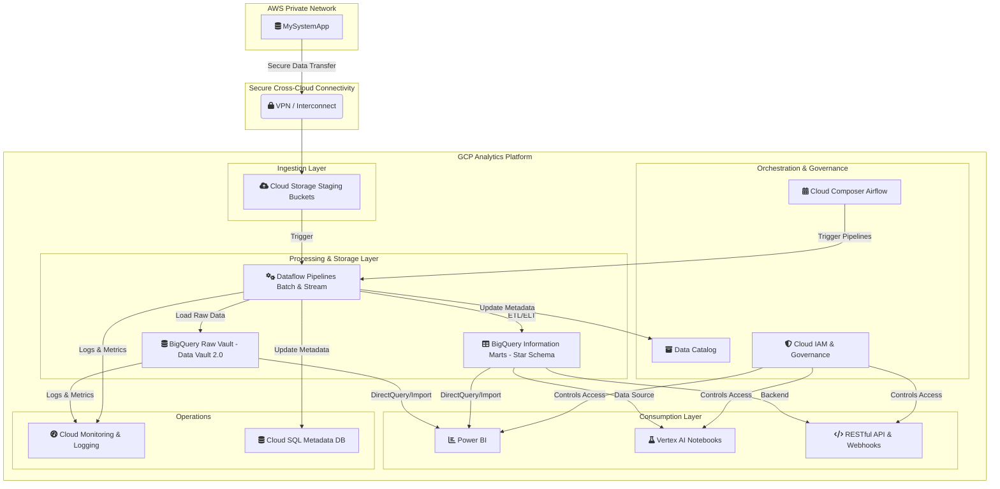
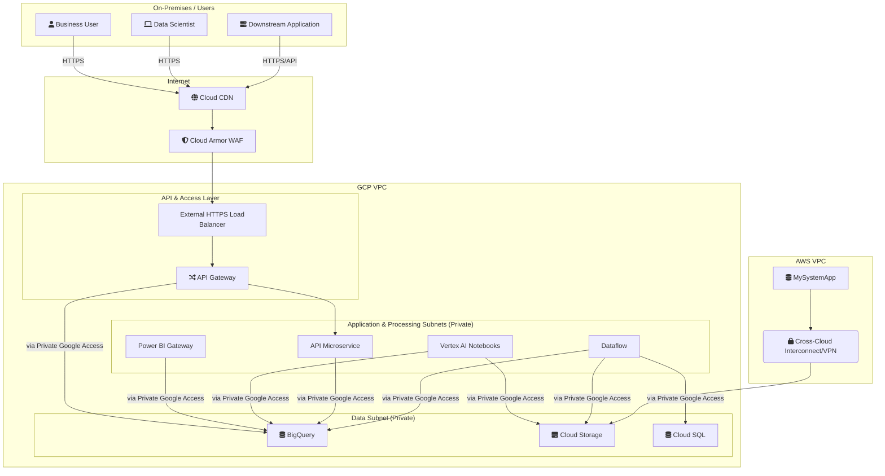
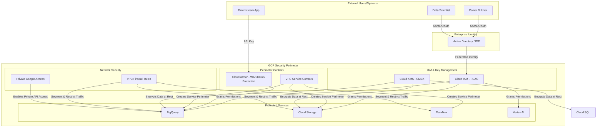

# Cloud Solution Architecture

**Project:** Cross-Cloud Data Lakehouse Analytics Platform

**Version:** 1.0

**Date:** June 25, 2025

## Table of Contents

  - [1. Overview & Executive Summary](https://www.google.com/search?q=%231-overview--executive-summary)
      - [1.1. Introduction & Business Problem](https://www.google.com/search?q=%2311-introduction--business-problem)
      - [1.2. Proposed Solution](https://www.google.com/search?q=%2312-proposed-solution)
      - [1.3. Key Benefits](https://www.google.com/search?q=%2313-key-benefits)
  - [2. Scope](https://www.google.com/search?q=%232-scope)
      - [2.1. In Scope](https://www.google.com/search?q=%2321-in-scope)
      - [2.2. Out of Scope](https://www.google.com/search?q=%2322-out-of-scope)
  - [3. Business Requirements & Architectural Drivers](https://www.google.com/search?q=%233-business-requirements--architectural-drivers)
      - [3.1. Key Requirements Summary](https://www.google.com/search?q=%2331-key-requirements-summary)
      - [3.2. Architectural Decisions](https://www.google.com/search?q=%2332-architectural-decisions)
  - [4. Cloud and Application Architecture](https://www.google.com/search?q=%234-cloud-and-application-architecture)
      - [4.1. Recommended Cloud Provider](https://www.google.com/search?q=%2341-recommended-cloud-provider)
      - [4.2. Architecture Diagram](https://www.google.com/search?q=%2342-architecture-diagram)
      - [4.3. Compute Architecture](https://www.google.com/search?q=%2343-compute-architecture)
      - [4.4. Application Architecture](https://www.google.com/search?q=%2344-application-architecture)
  - [5. Network Architecture](https://www.google.com/search?q=%235-network-architecture)
      - [5.1. Network Topology](https://www.google.com/search?q=%2351-network-topology)
      - [5.2. Network Architecture Diagram](https://www.google.com/search?q=%2352-network-architecture-diagram)
      - [5.3. Traffic Flow](https://www.google.com/search?q=%2353-traffic-flow)
      - [5.4. DNS & Connectivity](https://www.google.com/search?q=%2354-dns--connectivity)
  - [6. Data Storage & Management](https://www.google.com/search?q=%236-data-storage--management)
      - [6.1. Data Storage Solutions](https://www.google.com/search?q=%2361-data-storage-solutions)
      - [6.2. Data Flow & Lifecycle](https://www.google.com/search?q=%2362-data-flow--lifecycle)
      - [6.3. Backup and Recovery](https://www.google.com/search?q=%2363-backup-and-recovery)
  - [7. Data and Application Integration](https://www.google.com/search?q=%237-data-and-application-integration)
      - [7.1. Internal Integration](https://www.google.com/search?q=%2371-internal-integration)
      - [7.2. External Integration](https://www.google.com/search?q=%2372-external-integration)
  - [8. Security & Compliance](https://www.google.com/search?q=%238-security--compliance)
      - [8.1. Security Diagram](https://www.google.com/search?q=%2381-security-diagram)
      - [8.2. Identity and Access Management (IAM)](https://www.google.com/search?q=%2382-identity-and-access-management-iam)
      - [8.3. Data Protection](https://www.google.com/search?q=%2383-data-protection)
      - [8.4. Network Security](https://www.google.com/search?q=%2384-network-security)
      - [8.5. Compliance](https://www.google.com/search?q=%2385-compliance)
  - [9. Deployment & Operations (DevOps)](https://www.google.com/search?q=%239-deployment--operations-devops)
      - [9.1. CI/CD Pipeline](https://www.google.com/search?q=%2391-cicd-pipeline)
      - [9.2. Monitoring & Logging](https://www.google.com/search?q=%2392-monitoring--logging)
      - [9.3. Disaster Recovery (DR)](https://www.google.com/search?q=%2393-disaster-recovery-dr)
  - [10. Scalability & Performance](https://www.google.com/search?q=%2310-scalability--performance)
      - [10.1. Scalability](https://www.google.com/search?q=%23101-scalability)
      - [10.2. Performance](https://www.google.com/search?q=%23102-performance)
  - [11. Cost Estimation & Optimization](https://www.google.com/search?q=%2311-cost-estimation--optimization)
      - [11.1. High-Level Cost Breakdown](https://www.google.com/search?q=%23111-high-level-cost-breakdown)
      - [11.2. Cost Optimization Strategies](https://www.google.com/search?q=%23112-cost-optimization-strategies)
  - [12. Considerations & Limitations](https://www.google.com/search?q=%2312-considerations--limitations)
      - [12.1. Key Assumptions](https://www.google.com/search?q=%23121-key-assumptions)
      - [12.2. Risks & Mitigations](https://www.google.com/search?q=%23122-risks--mitigations)
      - [12.3. Known Limitations](https://www.google.com/search?q=%23123-known-limitations)

## 1\. Overview & Executive Summary

### 1.1. Introduction & Business Problem

The organization currently faces significant challenges in accessing and analyzing critical business data stored in MySystemApp, which is hosted within a private AWS network. This data isolation creates barriers to data-driven decision making, limits analytical capabilities, and prevents the organization from leveraging modern cloud analytics tools. The current state requires manual data extraction processes, lacks real-time insights, and cannot support the growing demands for self-service analytics and advanced data science capabilities.

### 1.2. Proposed Solution

The proposed solution implements a comprehensive cloud analytics platform that bridges AWS and Google Cloud Platform (GCP) environments through a modern data lakehouse architecture. The solution will establish secure data ingestion pipelines from the AWS-hosted MySystemApp into a GCP-based analytics environment featuring Data Vault 2.0 methodology for the raw vault layer and star schema-modeled information marts. The platform will support multiple consumption patterns including Power BI reporting, Vertex AI notebooks for data science, and RESTful APIs for downstream system integration.

### 1.3. Key Benefits

  * **Unified Data Access:** Eliminate data silos by centralizing analytics in a cloud-native lakehouse architecture.
  * **Real-time Insights:** Enable near real-time data availability with \<5 minute latency for streaming workloads.
  * **Scalable Architecture:** Support concurrent access for 500+ users with auto-scaling capabilities.
  * **Advanced Analytics:** Provide data scientists with flexible, GPU-accelerated computing environments.
  * **Self-Service Capabilities:** Empower business users with intuitive reporting tools and pre-built templates.
  * **Cost Optimization:** Achieve 30% reduction in data processing costs through cloud-native efficiencies.
  * **Compliance & Governance:** Implement enterprise-grade security, audit trails, and data lineage tracking.

## 2\. Scope

### 2.1. In Scope

  * Secure cross-cloud connectivity between AWS private network and GCP.
  * Real-time and batch data ingestion pipelines from MySystemApp.
  * Data Vault 2.0 implementation for historical data preservation and auditability.
  * Star schema information marts for optimized analytical queries.
  * ETL/ELT transformation pipelines with comprehensive data quality validation.
  * Power BI integration with semantic models and self-service capabilities.
  * Vertex AI notebook environment for data science and machine learning workloads.
  * RESTful APIs and webhook integrations for downstream systems.
  * Comprehensive monitoring, alerting, and operational dashboards.
  * Data governance framework including cataloging, lineage, and access controls.
  * Disaster recovery and business continuity capabilities.

### 2.2. Out of Scope

  * Migration or modification of the source MySystemApp system.
  * End-user training and change management programs.
  * Third-party tool licensing and procurement.
  * Network infrastructure provisioning (VPN/Interconnect setup).
  * Custom application development beyond the analytics platform.
  * Data migration from legacy systems other than MySystemApp.
  * Mobile application development for analytics consumption.

## 3\. Business Requirements & Architectural Drivers

### 3.1. Key Requirements Summary

**Functional Requirements:**

  * Support ingestion of 5TB initial data load and 500GB daily incremental updates.
  * Handle peak processing loads of up to 10TB/hour with auto-scaling.
  * Provide query response times \<5 seconds for 95% of analytical queries.
  * Support 500+ concurrent users across multiple consumption tools.
  * Maintain 99.9% data accuracy and completeness across all transformations.
  * Enable real-time data streaming with \<5 minute end-to-end latency.

**Non-Functional Requirements:**

  * System availability \>99.9% excluding planned maintenance windows.
  * End-to-end encryption for data in transit and at rest.
  * Role-based access control with integration to enterprise identity systems.
  * Compliance with GDPR, CCPA, and industry security standards (SOC 2, ISO 27001).
  * Recovery Time Objective (RTO) \<4 hours and Recovery Point Objective (RPO) \<1 hour.
  * Comprehensive audit logging and data lineage tracking capabilities.

### 3.2. Architectural Decisions

| Requirement | Decision |
| :--- | :--- |
| **Cross-Cloud Integration** | Implement secure VPN/Interconnect between AWS and GCP with dedicated data transfer agents and encrypted transmission protocols to ensure reliable, high-bandwidth connectivity while maintaining network isolation. |
| **Historical Data Preservation** | Adopt Data Vault 2.0 methodology in the raw vault layer to maintain complete historical records, enable auditability, and support regulatory compliance through immutable data structures. |
| **Multi-User Analytics** | Deploy cloud-native, auto-scaling infrastructure using GCP services (BigQuery, Dataflow, Cloud Storage) to dynamically handle varying user loads and processing demands. |
| **Self-Service Analytics** | Implement Power BI integration with pre-built semantic models and standardized connectors to enable business users to create reports independently while maintaining data governance. |
| **Advanced Analytics** | Provide a Vertex AI managed notebook environment with GPU acceleration and integrated ML services to support sophisticated data science workloads and model development. |
| **Data Quality Assurance** | Implement comprehensive data validation pipelines with automated quality checks, anomaly detection, and alerting mechanisms to ensure data reliability and trustworthiness. |

## 4\. Cloud and Application Architecture

### 4.1. Recommended Cloud Provider

The primary cloud provider for this solution is **Google Cloud Platform (GCP)**. The source data originates from an application hosted in a private AWS network, necessitating a secure cross-cloud connection. GCP is recommended due to its robust and scalable data analytics services, particularly BigQuery, Dataflow, and Vertex AI, which are central to meeting the project's functional and non-functional requirements.

### 4.2. Architecture Diagram

### 4.3. Compute Architecture

The compute architecture is designed to be serverless and auto-scaling to meet the dynamic processing demands of the platform.

  * **Dataflow:** As a fully managed and serverless data processing service, Dataflow is ideal for executing both batch and streaming ETL/ELT pipelines. Its ability to auto-scale resources based on data volume and processing complexity directly addresses the requirement to handle peak loads of up to 10TB/hour.
  * **Vertex AI Managed Notebooks:** This service provides data scientists with a managed Jupyter notebook environment that integrates seamlessly with other GCP services. The inclusion of optional GPU acceleration is critical for meeting the advanced analytics requirement for sophisticated machine learning workloads.
  * **Cloud Functions:** For lightweight, event-driven tasks such as triggering data pipelines upon file arrival in Cloud Storage or handling webhook notifications, Cloud Functions offers a cost-effective and scalable serverless solution.

### 4.4. Application Architecture

The solution will be built on an **event-driven microservices architecture** to ensure scalability, resilience, and maintainability.

  * **Event-Driven:** Cloud Pub/Sub will be used as the messaging backbone to decouple services. For example, the arrival of new data in Cloud Storage will publish a message to a Pub/Sub topic, which in turn triggers a Dataflow pipeline. This asynchronous pattern enhances scalability and fault tolerance.
  * **Microservices:** The platform's functionalities will be broken down into smaller, independent services. For instance, a dedicated microservice will manage the RESTful API endpoints, another will handle data quality validation, and others will manage specific data transformations. This approach allows for independent development, deployment, and scaling of each component. This modularity is managed and orchestrated by Cloud Composer.

## 5\. Network Architecture

### 5.1. Network Topology

  * **GCP Virtual Private Cloud (VPC):** A dedicated VPC will be created in GCP to host all platform resources, ensuring network isolation from other projects and the public internet.
  * **CIDR Blocks:** A non-overlapping CIDR block (e.g., `10.10.0.0/16`) will be allocated to the GCP VPC to prevent IP address conflicts with the AWS network.
  * **Subnet Segmentation:** The VPC will be segmented into multiple private subnets across at least two availability zones for high availability. Each layer of the architecture (ingestion, processing, API) will reside in its own subnet to enforce the principle of least privilege through firewall rules. No public subnets will be used for the core infrastructure, minimizing the attack surface.

### 5.2. Network Architecture Diagram

### 5.3. Traffic Flow

  * **Ingress (External Users):** User traffic from Power BI, Vertex AI Notebooks, and downstream applications will be routed through Cloud Armor (WAF) for protection against web attacks and DDoS. The External HTTPS Load Balancer will then distribute traffic to the appropriate backend services, such as the API Gateway.
  * **Ingress (AWS Data):** Data from the MySystemApp in AWS will be securely transmitted over a dedicated VPN or Cross-Cloud Interconnect, landing directly into a private Cloud Storage staging bucket. This traffic will not traverse the public internet.
  * **Internal Traffic:** All communication between services within the GCP VPC will use private IP addresses. Private Google Access will be enabled for subnets, allowing internal resources to reach Google APIs (like BigQuery and Cloud Storage) without needing external IP addresses, thus enhancing security.
  * **Egress:** Egress traffic will be controlled through a NAT Gateway and Cloud Router to manage and monitor outbound connections from the private subnets.

### 5.4. DNS & Connectivity

  * **DNS:** Cloud DNS will be used to manage all private and public DNS zones for the solution, providing a reliable and low-latency DNS service.
  * **Cross-Cloud Connectivity:** A high-bandwidth, low-latency connection will be established between the AWS and GCP VPCs using either a dedicated Cross-Cloud Interconnect or a redundant set of Cloud VPN tunnels. This is critical for meeting the \<5 minute latency requirement for real-time data ingestion.

## 6\. Data Storage & Management

### 6.1. Data Storage Solutions

  * **Raw Data & Staging:** Google Cloud Storage (GCS) will serve as the landing zone for raw data from MySystemApp. GCS is chosen for its high durability, scalability, and cost-effectiveness. Lifecycle management policies will automatically transition data from Standard to Nearline and then to Coldline storage tiers to optimize costs based on access frequency.
  * **Raw Vault (Data Vault 2.0):** Google BigQuery will be used to implement the Data Vault 2.0 model. Its serverless, highly scalable nature is perfect for handling large datasets and complex queries. Hub, Link, and Satellite tables will be created within BigQuery datasets. Tables will be partitioned by load date and clustered on business keys to optimize query performance and cost.
  * **Information Marts (Star Schema):** BigQuery will also host the star schema information marts. These marts will be organized into separate datasets for each business domain (e.g., Sales, Financials) for clarity and access control. Materialized views and BI Engine will be used extensively to accelerate query performance for Power BI dashboards, meeting the \<5 second query response requirement.
  * **Metadata:** A Cloud SQL for PostgreSQL instance will be used to store all platform metadata. This includes data lineage information, operational metrics, pipeline configurations, and data quality results. A relational database is chosen for its transactional integrity and ability to handle structured metadata effectively.

### 6.2. Data Flow & Lifecycle

1.  **Ingestion:** Secure agents in the AWS environment will extract data in near real-time and batch modes from MySystemApp. Data is transmitted via the secure cross-cloud link and lands in a GCS staging bucket. A Cloud Function is triggered upon new file arrival.
2.  **Processing:** The Cloud Function trigger initiates a Dataflow pipeline. The pipeline validates the raw data, loads it into the BigQuery Raw Vault (Data Vault 2.0 tables), applies business logic and transformations, and populates the star schema-based Information Marts. Data quality checks are performed at each step.
3.  **Consumption:** Business users access the Information Marts via Power BI for self-service reporting. Data scientists query both the Raw Vault and Information Marts using Vertex AI notebooks for exploratory analysis and model training. Downstream applications integrate via a RESTful API built on Cloud Run, which queries the Information Marts.
4.  **Archival & Purge:** GCS Lifecycle policies automatically move raw data to archival storage tiers. A data retention policy, managed in Cloud Composer, will periodically run jobs to archive historical data from BigQuery to GCS Coldline and eventually purge data according to regulatory requirements (e.g., GDPR, CCPA).

### 6.3. Backup and Recovery

  * **BigQuery:** BigQuery's inherent durability and 7-day time travel feature provide robust protection against operational errors. For disaster recovery, automated daily snapshots of critical BigQuery datasets will be taken and replicated to a secondary GCP region. This strategy supports the \<1 hour RPO requirement.
  * **Cloud Storage:** GCS buckets will be configured for multi-regional storage for critical raw data and cross-region replication for backups, ensuring high availability and disaster recovery.
  * **Cloud SQL:** Automated daily backups and point-in-time recovery will be enabled for the metadata database. Backups will be replicated to the DR region to meet the RTO/RPO targets.

## 7\. Data and Application Integration

### 7.1. Internal Integration

  * **Service Communication:** A combination of REST APIs and event-driven messaging will be used.
      * **REST APIs:** Synchronous communication between microservices (e.g., the API service requesting data from a data processing service) will be handled via REST APIs deployed on Cloud Run, secured with IAM.
      * **Asynchronous Messaging:** Cloud Pub/Sub will be the core of the event-driven architecture, decoupling services. For example, the ingestion service will publish a "new data arrived" message, which is subscribed to by the Dataflow processing service. This ensures resilience and scalability.
  * **Workflow Orchestration:** Cloud Composer (managed Apache Airflow) will be used to orchestrate the end-to-end data pipelines. It will manage dependencies between different tasks, such as ingestion, Data Vault loading, and Information Mart population, and handle retries and error alerting.

### 7.2. External Integration

  * **Source System (MySystemApp on AWS):** A secure data transfer agent will be deployed in the AWS environment. This agent will use the MySystemApp's APIs or a direct database connection to extract data. Authentication will be managed through dedicated service accounts and securely stored API keys/credentials in AWS Secrets Manager, accessed only by the agent.
  * **Power BI:** Users will connect to BigQuery using the native Power BI connector. This supports both DirectQuery for real-time data and Import mode for performance. Data access will be secured through service principal authentication and enforced with BigQuery's row-level security to ensure users only see the data they are authorized for.
  * **Downstream Systems (API):** A set of RESTful API endpoints will be exposed using API Gateway and Cloud Run. These APIs will be documented using the OpenAPI specification. API Gateway will enforce rate limiting, API key authentication, and monitoring to protect the backend services. Webhooks will be supported via Pub/Sub push subscriptions to notify external systems of key business events.
  * **Enterprise Identity:** GCP IAM will be federated with the organization's enterprise Active Directory using SAML/OAuth 2.0. This provides a seamless and secure single sign-on (SSO) experience for all users accessing GCP resources, Power BI reports, and Vertex AI notebooks.

## 8\. Security & Compliance

### 8.1. Security Diagram

### 8.2. Identity and Access Management (IAM)

  * **Authentication:** User authentication will be federated with the enterprise identity provider (e.g., Active Directory) using SAML 2.0/OAuth 2.0. This enables single sign-on (SSO) for all users. Multi-factor authentication (MFA) will be enforced for all administrative and privileged access.
  * **Authorization:** A stringent Role-Based Access Control (RBAC) model will be implemented using GCP IAM. Custom IAM roles will be created to adhere to the principle of least privilege, granting users and services only the permissions necessary for their functions.
  * **Service Accounts:** Each microservice and pipeline component will have its own dedicated IAM service account. These accounts will be granted minimal permissions. Service account keys will be managed and rotated automatically using GCP's built-in capabilities to minimize the risk of compromised credentials.

### 8.3. Data Protection

  * **Encryption at Rest:** All data stored in Cloud Storage, BigQuery, and Cloud SQL will be encrypted at rest by default. For enhanced security and control, Customer-Managed Encryption Keys (CMEK) managed in Google Cloud KMS will be used. Separate cryptographic key rings will be maintained for different data sensitivity levels, providing granular control over data access.
  * **Encryption in Transit:** All data transmitted between the user and the platform, and between internal services, will be encrypted using TLS 1.3. The VPN/Interconnect connection between AWS and GCP will be encrypted, and additional application-layer encryption will be applied to the data payload before transmission.
  * **Data Classification and Masking:** Cloud Data Loss Prevention (DLP) will be used to automatically scan and classify sensitive data within Cloud Storage and BigQuery. Based on this classification, automated policies will be applied, such as masking or tokenizing PII in non-production environments or restricting access to tables containing sensitive information.

### 8.4. Network Security

  * **VPC Service Controls:** A service perimeter will be established using VPC Service Controls around the core data services (BigQuery, Cloud Storage). This creates a virtual security boundary, preventing data exfiltration by restricting data movement to only authorized networks and services, even if credentials are compromised.
  * **Firewall Rules:** Granular VPC firewall rules will be configured to control traffic between subnets. The default-deny rule will be enforced, and only traffic on specifically required ports and protocols (e.g., HTTPS) will be allowed between application tiers.
  * **Web Application Firewall (WAF):** Cloud Armor will be deployed at the network edge in front of all API endpoints. It will provide protection against common web vulnerabilities (OWASP Top 10) and volumetric DDoS attacks.
  * **Private Google Access:** Compute resources in private subnets will use Private Google Access to communicate with Google APIs and services (like BigQuery and GCS) over Google's internal network, avoiding any exposure to the public internet.

### 8.5. Compliance

  * **Audit Logging:** Comprehensive audit logs will be enabled for all services. Cloud Audit Logs will capture all admin activities and data access events for BigQuery and Cloud Storage. These logs will be stored securely in a dedicated GCS bucket with immutable retention policies to support compliance audits and forensic analysis.
  * **Data Governance and Lineage:** Data Catalog will be used to automatically catalog all data assets in BigQuery and Cloud Storage. Data lineage tracking will be implemented using Dataflow and Cloud Composer logs, providing a clear audit trail of how data is transformed and moved through the platform, a key requirement for GDPR and CCPA.
  * **Compliance Standards:** The architecture is designed to meet GDPR, CCPA, and SOC 2 requirements. This includes implementing data subject access request (DSAR) procedures, enforcing data retention policies, and ensuring all security controls are documented and auditable.

## 9\. Deployment & Operations (DevOps)

### 9.1. CI/CD Pipeline

  * **Source Control:** A Git-based repository (e.g., GitHub, Cloud Source Repositories) will be the single source of truth for all application code, infrastructure as code (Terraform), and data pipeline definitions. Branch protection rules and mandatory code reviews will be enforced.
  * **Continuous Integration:** Cloud Build will be used to automate the build, testing, and packaging of application components and data pipelines. Each commit will trigger a build that runs unit tests, static code analysis, and security scans.
  * **Continuous Deployment:** Cloud Deploy will be used to manage the deployment process to different environments (Dev, Staging, Prod). A blue-green deployment strategy will be used for critical components like the API service, allowing for zero-downtime releases and instant rollbacks. Canary releases will be used for gradual rollouts of new features.

### 9.2. Monitoring & Logging

  * **Centralized Logging:** All application, system, and audit logs will be centralized in Cloud Logging. Structured logging (JSON) will be enforced to facilitate easier searching and analysis.
  * **Metrics & Monitoring:** Cloud Monitoring will be used to collect performance metrics from all GCP services and custom application metrics. Custom dashboards will be created to provide at-a-glance views of system health, pipeline status, data quality metrics, and key business KPIs.
  * **Alerting:** Proactive alerting will be configured in Cloud Monitoring. Alerts will be triggered based on thresholds for key metrics (e.g., high error rates, increased latency, data quality failures) and will be sent to the operations team via PagerDuty and Slack for timely response.

### 9.3. Disaster Recovery (DR)

  * **RTO/RPO:** The architecture is designed to meet an RTO of \<4 hours and an RPO of \<1 hour.
  * **Multi-Regional Architecture:** A warm standby model will be implemented. The entire infrastructure will be replicated in a secondary GCP region using Terraform. Data will be asynchronously replicated to the DR region, including GCS cross-region replication and BigQuery dataset snapshots.
  * **Automated Failover:** In the event of a primary region failure, DNS will be updated via a semi-automated script to redirect traffic to the load balancer in the DR region. Cloud Composer will be used to orchestrate the failover of data pipelines. The process will be documented and tested regularly through DR drills.

## 10\. Scalability & Performance

### 10.1. Scalability

  * **Horizontal Scaling:** The architecture is designed for horizontal scalability.
      * **Dataflow:** Will automatically scale worker nodes up or down based on the volume of data and the complexity of transformations.
      * **BigQuery:** As a serverless data warehouse, it scales its compute and storage resources automatically to handle massive datasets and high concurrency of queries.
      * **Cloud Run:** The API microservice will automatically scale the number of container instances based on incoming request traffic.
  * **Vertical Scaling:** While horizontal scaling is preferred, certain components will leverage vertical scaling.
      * **Vertex AI Notebooks:** Data scientists can dynamically change the machine type of their notebook instances, including adding powerful GPUs, to match the computational needs of their specific analysis or model training task.
      * **Cloud SQL:** The instance size for the metadata database can be increased during a maintenance window if required, although the initial sizing will be planned for projected growth.

### 10.2. Performance

  * **Query Performance:** The \<5 second query response time for 95% of queries will be achieved through several BigQuery optimizations:
      * **Partitioning and Clustering:** Tables will be partitioned by date and clustered by frequently filtered columns to reduce the amount of data scanned per query.
      * **Materialized Views:** Pre-computed materialized views will be created for common and complex aggregations used in Power BI dashboards.
      * **BI Engine:** BigQuery BI Engine will be used to provide in-memory, sub-second responses for frequently accessed datasets in Power BI.
  * **Ingestion Latency:** The \<5 minute end-to-end latency for streaming data will be met by using a streaming Dataflow pipeline that ingests data directly from Pub/Sub and writes to BigQuery in near real-time.
  * **API Performance:** The RESTful API will be optimized for low latency by using Cloud Run for fast container start-up times and by implementing application-level caching for frequently requested data. The Global External HTTPS Load Balancer with Cloud CDN will ensure low-latency access for geographically distributed users.

## 11\. Cost Estimation & Optimization

### 11.1. High-Level Cost Breakdown

The following is a Rough Order of Magnitude (ROM) monthly cost estimate. Actual costs will vary based on usage.

| Service Category | Estimated Monthly Cost (USD) | Notes |
| :--- | :--- | :--- |
| BigQuery Storage & Compute | $15,000 - $25,000 | Primary cost driver, dependent on query volume and data size. |
| Cloud Storage | $3,000 - $5,000 | Includes staging, raw data, and backup storage with lifecycle policies. |
| Dataflow Processing | $8,000 - $12,000 | Dependent on data volume for batch and streaming jobs. |
| Network & Data Transfer | $2,000 - $4,000 | Includes cross-cloud transfer from AWS and egress traffic. |
| Monitoring & Operations | $1,000 - $2,000 | Includes Cloud Monitoring, Logging, and Composer costs. |
| **Total Estimated Range** | **$29,000 - $48,000** | **This is a high-level estimate and should be refined.** |

### 11.2. Cost Optimization Strategies

  * **Data Lifecycle Management:** Implement GCS lifecycle policies to automatically transition aging data to cheaper storage classes (Nearline, Coldline, Archive), significantly reducing storage costs.
  * **Resource Right-Sizing & Auto-scaling:** All compute services are serverless or configured to auto-scale, ensuring that we only pay for the resources we consume. This avoids the cost of over-provisioning.
  * **Committed Use Discounts (CUDs):** For predictable workloads like the Cloud SQL instance and a baseline level of BigQuery compute, 1-year or 3-year CUDs will be purchased to achieve significant savings over on-demand pricing.
  * **Query Optimization:** Enforce BigQuery best practices, such as avoiding `SELECT *` and using partitions, to minimize the amount of data scanned per query. Set up budget alerts to monitor query costs.
  * **Spot VMs:** For non-critical, fault-tolerant batch processing workloads that can be orchestrated by Cloud Composer, consider using Spot VMs in Dataflow to achieve up to 90% savings on compute costs.

## 12\. Considerations & Limitations

### 12.1. Key Assumptions

  * **Source System Stability:** The architecture assumes that the APIs and data structures of the source MySystemApp will remain stable during the implementation period. Any significant changes could require rework of the ingestion pipelines.
  * **Network Performance:** It is assumed that a stable, high-bandwidth network connection between AWS and GCP can be provisioned and will be sufficient for the projected data volumes.
  * **Stakeholder Availability:** The successful design and validation of the platform rely on the active participation and feedback from business stakeholders.
  * **Data Growth Projections:** The architecture is designed based on current data growth projections. A growth rate exceeding 200% of the estimate may require re-evaluation of the scaling strategy.
  * **Stable Regulatory Landscape:** The compliance framework is based on current GDPR, CCPA, and SOC 2 requirements and assumes no major changes during implementation.

### 12.2. Risks & Mitigations

| Risk | Likelihood | Impact | Mitigation Strategy |
| :--- | :--- | :--- | :--- |
| **Cross-Cloud Connectivity Failure** | Medium | High | Implement a redundant Cloud VPN setup alongside a primary Cross-Cloud Interconnect. Set up comprehensive monitoring with Cloud Monitoring to detect connectivity issues and trigger automated alerts for failover. |
| **Data Volume Exceeds Projections** | Medium | Medium | Design the architecture for elastic scalability from the outset. Use serverless and auto-scaling services (Dataflow, BigQuery, Cloud Run). Conduct rigorous load testing using realistic data volumes to validate scaling mechanisms and identify bottlenecks before they impact production. |
| **Security Breach / Data Exfiltration** | Low | High | Implement a defense-in-depth security model: VPC Service Controls for a data perimeter, Cloud Armor WAF, IAM with least privilege, and end-to-end encryption (CMEK). Continuously monitor for threats using Security Command Center and have a documented incident response plan. |
| **Vendor Lock-in** | Low | Medium | Mitigate lock-in by using open standards and technologies where possible (e.g., Apache Airflow in Cloud Composer, SQL for queries). Maintain data portability by storing raw data in open formats (e.g., Avro, Parquet) on GCS, allowing for easier migration to other platforms if ever required. |

### 12.3. Known Limitations

  * **Real-time Processing Latency:** While the goal is \<5 minute latency, achieving this for all data types and under all network conditions may be challenging. Initial batch loads or complex transformations might exceed this target.
  * **Cross-Cloud Data Transfer Costs:** The ongoing cost of transferring data from AWS to GCP can be significant, especially for high-volume scenarios. This cost is a direct trade-off for achieving a unified analytics platform and must be continuously monitored.
  * **Compliance Complexity:** Operating in a multi-cloud environment can add complexity to compliance audits and documentation. It requires careful management of controls and evidence gathering across both AWS and GCP.
  * **Operational Overhead:** While heavily automated, managing components across two different cloud providers introduces operational complexity and requires specialized skill sets in both AWS and GCP, potentially increasing training and staffing costs.
