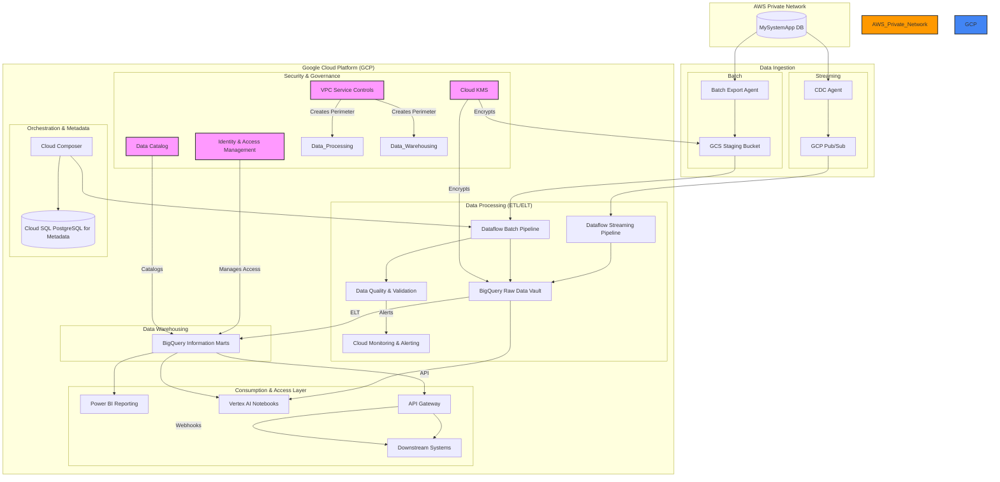
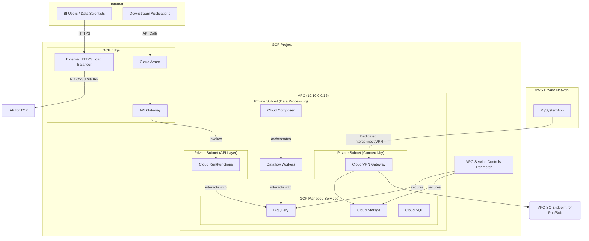
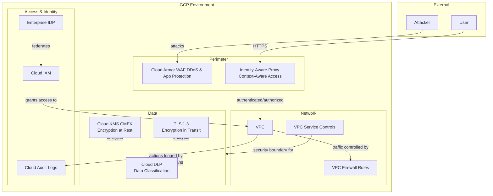

# Cloud Solution Architecture

**Project:** Cross-Cloud Data Lakehouse Analytics Platform

**Version:** 1.0

**Date:** June 25, 2025

-----

### Table of Contents

1.  [Overview & Executive Summary](https://www.google.com/search?q=%231-overview--executive-summary)
2.  [Scope](https://www.google.com/search?q=%232-scope)
3.  [Business Requirements & Architectural Drivers](https://www.google.com/search?q=%233-business-requirements--architectural-drivers)
4.  [Cloud and Application Architecture](https://www.google.com/search?q=%234-cloud-and-application-architecture)
5.  [Network Architecture](https://www.google.com/search?q=%235-network-architecture)
6.  [Data Storage & Management](https://www.google.com/search?q=%236-data-storage--management)
7.  [Data and Application Integration](https://www.google.com/search?q=%237-data-and-application-integration)
8.  [Security & Compliance](https://www.google.com/search?q=%238-security--compliance)
9.  [Deployment & Operations (DevOps)](https://www.google.com/search?q=%239-deployment--operations-devops)
10. [Scalability & Performance](https://www.google.com/search?q=%2310-scalability--performance)
11. [Cost Estimation & Optimization](https://www.google.com/search?q=%2311-cost-estimation--optimization)
12. [Considerations & Limitations](https://www.google.com/search?q=%2312-considerations--limitations)

-----

## 1\. Overview & Executive Summary

### 1.1. Introduction & Business Problem

The organization is currently unable to perform effective and timely data analysis due to critical business data being isolated within the `MySystemApp`, hosted in a private AWS network. This data silo inhibits data-driven decision-making, restricts the use of modern analytics tools, and relies on slow, manual data extraction processes. The existing setup cannot provide real-time insights or support the increasing demand for self-service analytics and advanced data science, creating a significant barrier to competitive agility and operational intelligence.

### 1.2. Proposed Solution

This document outlines a cloud solution architecture for a modern, cross-cloud analytics platform. The proposed solution establishes a secure data pipeline to ingest data from the AWS-hosted `MySystemApp` into a data lakehouse built on Google Cloud Platform (GCP). The architecture leverages a Data Vault 2.0 methodology for the raw vault layer to ensure data integrity and auditability, with star schema-based information marts for optimized reporting and analytics.

The primary cloud provider for the analytics platform is **Google Cloud Platform (GCP)**. Key services utilized include:

  * **Google Cloud Storage (GCS):** For the raw data landing zone.
  * **Cloud Dataflow:** For scalable, serverless batch and stream data processing.
  * **BigQuery:** As the core data warehouse for the Data Vault, information marts, and high-speed querying.
  * **Cloud Composer:** For orchestrating complex data pipelines.
  * **Vertex AI:** To provide managed notebook environments for data science.
  * **Cloud Functions & API Gateway:** To serve data via RESTful APIs.
  * **Power BI (via BigQuery Connector):** For business intelligence and reporting.

### 1.3. Key Benefits

This solution is designed to directly address the business problems and requirements, providing the following key benefits:

  * **Unified Data Access:** Eliminates data silos by creating a central, authoritative analytics platform in GCP, enabling a holistic view of business operations.
  * **Scalability and Performance:** The serverless and auto-scaling nature of services like BigQuery and Dataflow will effortlessly handle the initial 5TB load, 500GB daily updates, and peak loads up to 10TB/hour, supporting over 500 concurrent users with query response times under 5 seconds.
  * **Real-time Insights:** Enables streaming data ingestion with latency under 5 minutes, empowering the business to make decisions based on the most current data available.
  * **Advanced Analytics & Self-Service:** Provides a powerful, GPU-accelerated Vertex AI environment for data scientists while empowering business users with direct access to curated data marts via Power BI, fostering a data-driven culture.
  * **Cost-Effectiveness:** Leverages cloud-native, serverless technologies to reduce data processing costs by an estimated 30% and optimize total cost of ownership (TCO).
  * **Enhanced Security and Compliance:** Implements a robust security posture with end-to-end encryption, VPC Service Controls, and detailed auditing, ensuring compliance with GDPR, CCPA, and SOC 2 standards.

## 2\. Scope

### 2.1. In Scope

The solution architecture defined in this document covers the following components and functionalities as specified in the BRD:

  * Secure, dedicated cross-cloud connectivity between the source AWS network and the target GCP environment.
  * Development of both real-time streaming and batch data ingestion pipelines from `MySystemApp`.
  * Implementation of a Data Vault 2.0 model in BigQuery for the raw vault layer.
  * Creation of star schema information marts in BigQuery for optimized business domain analytics.
  * Building robust ETL/ELT transformation pipelines using Dataflow, including comprehensive data quality validation checks.
  * Integration with Power BI, providing semantic models to enable self-service reporting.
  * Provisioning of a Vertex AI managed notebook environment with GPU capabilities for data science workloads.
  * Development and exposure of RESTful APIs for downstream system integration.
  * A comprehensive monitoring, logging, and alerting framework using Cloud Monitoring and Logging.
  * Implementation of a data governance framework, including a data catalog, data lineage tracking, and granular access controls.
  * A multi-region disaster recovery plan to meet RTO/RPO requirements.

### 2.2. Out of Scope

The following items are explicitly out of scope for this architectural design and its subsequent implementation:

  * Any migration or modification of the source `MySystemApp` application or its underlying AWS infrastructure.
  * Development of end-user training materials or change management programs.
  * Procurement and management of third-party software licenses (e.g., Power BI).
  * Provisioning of the physical network infrastructure for the VPN/Interconnect connection.
  * Development of custom end-user applications beyond the defined analytics platform APIs.
  * Migration of any data from systems other than `MySystemApp`.
  * Development of a mobile application for analytics.

## 3\. Business Requirements & Architectural Drivers

### 3.1. Key Requirements Summary

The architecture is driven by the following critical functional and non-functional requirements extracted from the BRD:

| **Requirement Category** | **Requirement** | **Source (BRD)** |
| :--- | :--- | :--- |
| **Data Volume & Throughput** | Initial data load of 5TB with 500GB daily incremental updates. | `3.1. Key Requirements Summary` |
| **Scalability & Performance** | Handle peak processing loads of up to 10TB/hour with auto-scaling. | `3.1. Key Requirements Summary` |
| **Performance** | Achieve query response times of \<5 seconds for 95% of analytical queries. | `3.1. Key Requirements Summary` |
| **Concurrency** | Support 500+ concurrent users across Power BI, Vertex AI, and APIs. | `3.1. Key Requirements Summary` |
| **Data Latency** | Provide near real-time streaming data with \<5 minute end-to-end latency. | `3.1. Key Requirements Summary` |
| **Availability** | System availability of \>99.9% (excluding planned maintenance). | `3.1. Non-Functional Requirements` |
| **Disaster Recovery** | RTO \<4 hours and RPO \<1 hour. | `3.1. Non-Functional Requirements` |
| **Security** | End-to-end encryption for data in transit and at rest; Role-based access control. | `3.1. Non-Functional Requirements` |
| **Compliance** | Adherence to GDPR, CCPA, SOC 2, and ISO 27001 standards. | `3.1. Non-Functional Requirements` |
| **Data Integrity** | Maintain 99.9% data accuracy and completeness; Full auditability and data lineage. | `3.1. Key Requirements Summary`, `3.1. Non-Functional Requirements` |
| **Analytics Capability**| Support advanced analytics with GPU-accelerated environments. | `1.2 Proposed Solution`, `3.2 Architectural Decisions`|

### 3.2. Architectural Decisions

The key requirements translate into the following architectural decisions, aligning with the principles of the Google Cloud Well-Architected Framework:

| **Requirement** | **Architectural Decision** | **Justification / Well-Architected Principle** |
| :--- | :--- | :--- |
| Handle peak loads of 10TB/hour and support 500+ users. | A serverless, auto-scaling architecture using **Cloud Dataflow** for ETL and **BigQuery** for warehousing. | **Performance Optimization & Cost Optimization:** Dataflow and BigQuery scale compute resources automatically and independently based on job complexity and query demand, ensuring performance while paying only for resources consumed. This aligns with the principle of using managed services to reduce operational overhead. |
| Near real-time data with \<5 minute latency. | A dual-pipeline approach. **Cloud Dataflow** in streaming mode for real-time data, and batch mode for daily incremental loads. **Pub/Sub** will be used as the messaging queue for streaming events. | **Reliability & Performance Optimization:** Pub/Sub provides a highly scalable and reliable ingestion point for streaming data. Dataflow's unified development model for both batch and stream processing simplifies development and operations. |
| Preserve complete historical data and ensure auditability. | Implement a **Data Vault 2.0** model using BigQuery for the raw vault layer. | **Reliability:** The Data Vault methodology with its use of hash keys and immutable satellite tables ensures that all historical data is preserved without modification, which is crucial for auditability and compliance. BigQuery's architecture supports this pattern efficiently. |
| System Availability \>99.9% and RTO \<4 hours / RPO \<1 hour. | Deploy infrastructure across multiple GCP regions. Use **multi-regional Cloud Storage buckets** for landing data, and BigQuery's cross-region replication and daily snapshots for the data warehouse. | **Reliability:** A multi-region architecture is fundamental for high availability and disaster recovery. Replicating data and infrastructure across geographic boundaries mitigates the risk of a single region failure and is key to meeting the aggressive RTO/RPO targets. |
| End-to-end encryption and compliance with GDPR, SOC 2, etc. | Use **Cloud KMS with Customer-Managed Encryption Keys (CMEK)** for data at rest. Enforce **TLS 1.3** for all data in transit. Use **VPC Service Controls** to create a secure perimeter around sensitive data services. | **Security, Privacy, and Compliance:** This layered security approach (defense-in-depth) is a core tenet of the framework. CMEK provides granular control over encryption, while VPC Service Controls prevent data exfiltration, helping to meet strict compliance requirements. |
| Self-service analytics for business users. | Create curated, star-schema **Information Marts** in BigQuery. Provide access via **Power BI's native BigQuery connector** using DirectQuery mode. | **Performance Optimization:** Star schemas are optimized for the types of queries BI tools generate. BigQuery's BI Engine accelerates these queries further, ensuring an interactive, self-service experience for users without manual data extracts. |

## 4\. Cloud and Application Architecture

### 4.1. Recommended Cloud Provider

**Google Cloud Platform (GCP)** is the recommended cloud provider for this solution.

**Justification:** The BRD explicitly calls for a modern data lakehouse architecture and specifies the use of advanced analytics and data science tools. GCP's offerings in this space are exceptionally strong and align perfectly with the project's goals:

  * **BigQuery:** A serverless, highly scalable, and cost-effective data warehouse that is ideal for both Data Vault and star schema implementations. Its separation of storage and compute is a key enabler for handling the specified peak loads.
  * **Vertex AI:** A unified AI platform that provides managed notebooks, seamless integration with BigQuery, and access to GPU acceleration, directly meeting the requirements for advanced analytics.
  * **Dataflow:** A premier serverless data processing service that supports both batch and streaming ETL with auto-scaling, which is critical for handling the dual ingestion patterns required.
  * **Ecosystem Integration:** GCP services are designed to work together seamlessly, from data ingestion with Pub/Sub, processing with Dataflow, storage and analytics with BigQuery, and ML with Vertex AI.

### 4.2. Architecture Diagram

### 4.3. Compute Architecture

The compute architecture is designed to be serverless and event-driven, prioritizing scalability and cost-efficiency, aligning with Google Cloud Well-Architected Framework principles.

  * **Data Processing (ETL/ELT): Cloud Dataflow** is the chosen service for all data transformation tasks.
      * **Reasoning:** Dataflow is a fully managed, serverless service that automatically provisions and scales resources based on the volume and complexity of the data. This directly addresses the requirement to handle highly variable loads (up to 10TB/hour). Its unified model for both batch and streaming simplifies development and operations.
  * **Data Science & ML: Vertex AI Managed Notebooks** will provide the environment for data scientists.
      * **Reasoning:** This meets the requirement for a flexible, GPU-accelerated environment. As a managed service, it removes the operational overhead of managing compute instances and provides seamless integration with BigQuery and other GCP services, accelerating the data science lifecycle.
  * **API & Event Handling: Cloud Functions / Cloud Run** will be used to power the RESTful APIs and handle webhook events.
      * **Reasoning:** For event-driven, stateless tasks like serving API requests or processing webhooks, serverless functions are the most cost-effective solution. They scale from zero to handle demand, meaning costs are incurred only upon execution, perfectly aligning with the cost-optimization goals. API Gateway will be used to manage, secure, and expose these functions.

### 4.4. Application Architecture

The application architecture is a hybrid of **Event-Driven** and traditional **Data Warehousing** patterns.

  * **Event-Driven Ingestion:** The real-time data pipeline is event-driven. Changes in the source system are captured and pushed as events into **Pub/Sub**. A streaming **Dataflow** pipeline listens to these events and processes them into the data vault in near real-time. This loose coupling between the data source and the processing layer is highly resilient and scalable.
  * **Data Lakehouse Model:** The core of the platform is a Data Lakehouse, combining the scalability and low cost of a data lake (GCS for raw files) with the performance and structure of a data warehouse (BigQuery).
  * **Data Vault 2.0:** The raw, audited data is structured using the Data Vault 2.0 methodology in BigQuery. This involves:
      * **Hubs:** Storing unique business keys.
      * **Links:** Storing relationships between business keys.
      * **Satellites:** Storing historical descriptive attributes of the keys, with load timestamps to track changes over time.
        This structure provides full auditability and is resilient to changes in the source system.
  * **Star Schema Marts:** For consumption, data from the vault is transformed into denormalized star schemas, organized by business domain (Sales, Financials, etc.). This structure, consisting of fact and dimension tables, is highly optimized for analytical queries from tools like Power BI.

## 5\. Network Architecture

### 5.1. Network Topology

The network architecture is designed to be secure and segmented, following the principle of least privilege.

  * **GCP Virtual Private Cloud (VPC):** A dedicated VPC will be created for the analytics platform in GCP.
      * **CIDR Block:** `10.10.0.0/16` (Example)
  * **Subnet Segmentation:** The VPC will be segmented into private subnets to isolate different functional layers of the architecture. Public-facing components will be strictly limited.
      * **Private Data Processing Subnet (`10.10.1.0/24`):** Hosts Dataflow workers and Cloud Composer environments. No direct ingress or egress to the internet is allowed.
      * **Private API Subnet (`10.10.2.0/24`):** Hosts the Cloud Run/Cloud Functions for the API layer.
      * **Private Connectivity Subnet (`10.10.3.0/24`):** Terminates the VPN/Interconnect connection from AWS.
  * **Network Security:**
      * **Private Google Access:** Enabled for all private subnets to allow resources without external IP addresses to access Google APIs and services securely.
      * **VPC Firewall Rules:** Will be configured to restrict traffic between subnets, only allowing necessary communication on specific ports and protocols (e.g., allowing Dataflow to connect to BigQuery).

### 5.2. Network Architecture Diagram

### 5.3. Traffic Flow

  * **Ingestion Traffic (AWS to GCP):** Data from `MySystemApp` will be securely transmitted to GCP over a **Cloud VPN** or **Dedicated Interconnect** connection, terminating in a dedicated connectivity subnet. This ensures the traffic does not traverse the public internet.
  * **Internal Traffic (East-West):** All communication between services within the GCP VPC will occur over private IP addresses. **Private Google Access** will be used for Dataflow and other resources to communicate with Google-managed services like BigQuery and GCS without requiring external IPs.
  * **Egress Traffic (GCP to Internet):** Egress traffic will be strictly controlled. Any necessary outbound connections from the private subnets (e.g., for pulling external libraries) will be routed through a **Cloud NAT Gateway** to hide internal IP addresses.
  * **Consumption Traffic (Users to GCP):**
      * **Power BI:** Users will connect to BigQuery via the native Power BI connector, which uses Google's public APIs. Access will be authenticated via IAM and subject to VPC Service Control policies.
      * **Vertex AI:** Data scientists will access managed notebooks through the GCP Console, with authentication managed by IAM.
      * **API Access:** External systems will access the platform via a public endpoint managed by **API Gateway**. All incoming traffic will be inspected by **Cloud Armor (WAF)** to protect against DDoS and common web exploits.

### 5.4. DNS & Connectivity

  * **DNS:** **Cloud DNS** will be used for any internal DNS resolution required within the VPC. For public-facing APIs, a custom domain will be configured and managed via Cloud DNS.
  * **Cross-Cloud Connectivity:** A high-bandwidth, low-latency connection between the AWS source network and the GCP VPC is critical. The recommended approach is **Dedicated Interconnect** for its guaranteed bandwidth and reliability. If cost is a primary constraint, a high-availability **Cloud VPN** over the internet can be used as an alternative. The connection will be terminated in a dedicated subnet in the GCP VPC.

## 6\. Data Storage & Management

### 6.1. Data Storage Solutions

The choice of storage solutions is based on the data's structure, access patterns, and lifecycle stage, aligning with the BRD's specifications.

  * **Raw Data / Landing Zone: Google Cloud Storage (GCS)**
      * **Justification:** GCS is a highly durable, scalable, and cost-effective object store, ideal for landing large volumes of raw batch files from the source system. Its various storage classes (Standard, Nearline, Coldline) will be used with lifecycle policies to automatically tier data based on access frequency, optimizing costs. Multi-regional buckets will be used for critical data to ensure redundancy.
  * **Data Warehouse (Data Vault & Marts): BigQuery**
      * **Justification:** BigQuery is a petabyte-scale, serverless analytics data warehouse. Its columnar storage format and massively parallel processing engine are perfectly suited for both the normalized structure of the Data Vault 2.0 layer and the denormalized star schemas of the information marts. BigQuery's auto-scaling capabilities ensure it can handle the specified query loads and data volumes without manual intervention. Partitioning tables by load date and clustering by business keys will further optimize query performance and reduce costs.
  * **Orchestration & System Metadata: Cloud SQL (PostgreSQL)**
      * **Justification:** A managed relational database is required to store structured metadata for the orchestration framework (Cloud Composer), data lineage information, operational metrics, and configuration parameters. Cloud SQL provides a fully managed, reliable, and easy-to-use PostgreSQL service, offloading the administrative burden of database management.

### 6.2. Data Flow & Lifecycle

The data lifecycle is managed through a multi-stage process from ingestion to archival.

1.  **Ingestion:**
      * **Batch:** Data is extracted from `MySystemApp` daily and lands in a GCS staging bucket.
      * **Streaming:** Real-time changes are captured and sent as messages to a Pub/Sub topic.
2.  **Processing:**
      * Batch and streaming Dataflow pipelines are triggered.
      * Data is validated for quality, cleaned, and transformed.
      * Transformed data is loaded into the BigQuery Raw Data Vault using hash-based loading for efficiency.
      * Further ELT processes within BigQuery populate the business-facing Information Marts.
3.  **Storage & Consumption:**
      * Data is stored durably in BigQuery.
      * Business users access the Information Marts via Power BI.
      * Data scientists access both the Vault and Marts via Vertex AI notebooks.
      * Downstream systems access the Marts via the API Gateway.
4.  **Archival & Purge:**
      * **Cloud Storage:** Lifecycle policies automatically transition raw data in GCS from Standard to Nearline, then Coldline, and finally delete it based on defined retention policies.
      * **BigQuery:** Data retention policies will be configured for BigQuery datasets. While BigQuery's low storage cost makes extensive archival feasible, data will be purged according to compliance and regulatory requirements (e.g., GDPR right to be forgotten).

### 6.3. Backup and Recovery

The backup and recovery strategy is designed to meet the RTO of \<4 hours and RPO of \<1 hour.

  * **BigQuery:**
      * **Primary Backup:** Automated daily snapshots of critical datasets will be configured with a 30-day retention period. These snapshots will be replicated to a secondary GCP region for geographic redundancy.
      * **Point-in-Time Recovery:** BigQuery's native "Time Travel" feature will be utilized for operational recovery, allowing data restoration to any point within the last 7 days. This is invaluable for recovering from logical corruption or user error.
  * **Cloud SQL:** Automated backups will be enabled, providing point-in-time recovery capabilities. High availability (HA) configuration will be used to provide a standby instance in a different zone for automatic failover.
  * **Cloud Storage:** Object versioning will be enabled on all buckets to protect against accidental deletion or overwrites. For critical data, cross-region replication will be configured.
  * **Disaster Recovery (DR):** The entire platform's infrastructure will be defined using Terraform (Infrastructure as Code). In the event of a full region failure, this IaC can be used to redeploy the environment in the secondary region. The replicated data snapshots (BigQuery, GCS) will be used to restore the data state, enabling a full recovery within the RTO target.

## 7\. Data and Application Integration

### 7.1. Internal Integration

Service communication within the platform is designed for resilience and scalability using asynchronous patterns where possible.

  * **Asynchronous Communication:** **Cloud Pub/Sub** will be the primary mechanism for asynchronous, event-driven communication between services. This is used for the real-time ingestion pipeline and can be used to trigger various processing tasks (e.g., a new file in GCS publishes a message to trigger a Dataflow job). This decouples services, increasing resilience and scalability.
  * **Synchronous Communication:** For request/response interactions, such as the front-end API layer communicating with backend data services, **REST APIs** will be implemented using Cloud Functions/Run and managed by **API Gateway**.
  * **Workflow Orchestration:** **Cloud Composer (managed Apache Airflow)** will be used to orchestrate complex, multi-step batch workflows. It will manage dependencies between ingestion, transformation (Dataflow jobs), and data quality validation pipelines, ensuring they run in the correct order and handling retries on failure.

### 7.2. External Integration

The platform must integrate securely and efficiently with several external systems.

  * **Source System (`MySystemApp`):** Secure API connections and potentially database links will be established to the source system in the AWS private network. Authentication will be handled via dedicated service accounts and rotated API keys. The connection itself is secured via the Dedicated Interconnect/VPN.
  * **Power BI:** Integration will leverage Power BI's **native BigQuery connector**. This allows for both **Import** mode (for smaller, summary datasets) and **DirectQuery** mode (for real-time querying against large datasets in the Information Marts). Authentication will be managed via service principals, and BigQuery's row-level security will be used to enforce data access policies within Power BI reports.
  * **Downstream Systems:** Data will be exposed to other applications via a set of secure, well-documented **RESTful APIs** managed by API Gateway. These APIs will provide access to the curated data in the Information Marts. The gateway will enforce rate limiting, authentication (via API keys or OAuth), and monitoring. Webhook support can also be implemented using Pub/Sub and Cloud Functions to push event notifications to external systems.

## 8\. Security & Compliance

The security architecture implements a defense-in-depth strategy, adhering to the principle of least privilege and aligning with the Google Cloud Well-Architected Framework for security.

### 8.1. Security Architecture Diagram

### 8.2. Identity and Access Management (IAM)

  * **Authentication:** User and service authentication will be centralized by federating GCP with the organization's enterprise identity provider (e.g., Active Directory, Okta) using **SAML 2.0 or OAuth 2.0**. This enables Single Sign-On (SSO) for all users.
  * **Authorization:** The principle of least privilege will be strictly enforced using **Cloud IAM**. Roles will be granted based on job function (e.g., Data Scientist, BI Analyst, Pipeline Operator) rather than to individuals. Custom IAM roles will be created to provide granular permissions.
  * **Service Accounts:** Each application component (e.g., Dataflow jobs, Cloud Functions) will use a dedicated, non-default service account with the minimal permissions required for its task. Service account keys will be managed by GCP and automatically rotated.
  * **Administrative Access:** All administrative access to the GCP project will require **Multi-Factor Authentication (MFA)**.

### 8.3. Data Protection

  * **Encryption in Transit:** All data transmission will be encrypted using **TLS 1.3**. This includes traffic between GCP services, from the user to the cloud, and across the dedicated connection from AWS.
  * **Encryption at Rest:** All data stored at rest in GCS and BigQuery will be encrypted by default. To meet compliance requirements and provide granular control, this will be augmented with **Customer-Managed Encryption Keys (CMEK)** managed in **Cloud KMS**. Different key rings will be used for data of varying sensitivity levels.
  * **Data Classification & Masking:** **Cloud Data Loss Prevention (DLP)** will be used to automatically scan and classify sensitive data (e.g., PII) within BigQuery and GCS. For non-production environments, DLP's de-identification capabilities (masking, tokenization) can be used to create sanitized datasets for development and testing.

### 8.4. Network Security

  * **Perimeter Security:**
      * The API endpoints will be protected by **Cloud Armor**, Google's Web Application Firewall (WAF), which provides protection against DDoS attacks and the OWASP Top 10 web vulnerabilities.
      * **VPC Service Controls** will be used to create a service perimeter around the project's sensitive data services (BigQuery, GCS, Cloud SQL). This acts as a virtual data center boundary, preventing data exfiltration by restricting data movement to only authorized networks and identities.
  * **Internal Network Security:**
      * **VPC Firewall Rules** will be used for micro-segmentation, ensuring that components can only communicate with each other on an as-needed basis. The default-deny rule will be enforced.
      * As mentioned, **Private Google Access** will ensure internal resources access Google services without traversing the public internet.

### 8.5. Compliance

The architecture will be designed and operated to meet the specified compliance standards.

  * **Assured Workloads:** For compliance regimes like FedRAMP or IL4/5, GCP's Assured Workloads can be used to automatically enforce compliance controls in the environment.
  * **GDPR & CCPA:** The platform design supports key requirements of these regulations, including data encryption, access controls, and capabilities for handling data subject requests (e.g., locating and deleting user-specific data in the Data Vault).
  * **SOC 2 & ISO 27001:** The use of GCP, a compliant provider, and the implementation of controls described in this document (e.g., IAM, audit logging, encryption, DR testing) are foundational for achieving these certifications. Comprehensive audit logs will be captured via **Cloud Audit Logs** to track all administrative access and data modification, providing a clear trail for auditors.

## 9\. Deployment & Operations (DevOps)

The operational model will be based on Infrastructure as Code (IaC) and automation to ensure consistency, reliability, and speed. This aligns with the Google Cloud Well-Architected Framework's pillar of Operational Excellence.

### 9.1. CI/CD Pipeline

A robust CI/CD pipeline will be established to automate the build, testing, and deployment of all platform components, including data pipelines and infrastructure.

  * **Source Control:** A **Git-based** repository (e.g., GitHub, Cloud Source Repositories) will be the single source of truth for all application code, data pipeline definitions, and Terraform infrastructure code.
  * **Build & Test:** **Cloud Build** will be used to automate the build and test process. Each code commit will trigger a build that runs unit tests, static code analysis, and security scans.
  * **Deployment:** **Cloud Deploy** will be used to manage deployments to different environments (Dev, Staging, Prod). The deployment strategy will include:
      * **Blue/Green or Canary Deployments:** For critical components like the API layer, a blue/green or canary strategy will be used to release new versions with zero downtime and provide an immediate rollback path.
      * **Infrastructure as Code:** All infrastructure (VPCs, subnets, BigQuery datasets, IAM policies) will be defined using **Terraform**. Changes will be applied via the CI/CD pipeline, ensuring the environment state is version-controlled and reproducible.

### 9.2. Monitoring & Logging

Comprehensive observability is key to maintaining the platform's health and performance targets.

  * **Centralized Logging:** All services will be configured to send logs to **Cloud Logging**. This includes logs from Dataflow, Cloud Functions, API Gateway, and audit logs.
  * **Metrics & Monitoring:** **Cloud Monitoring** will be used to collect and visualize key metrics for all components. This includes:
      * **System Metrics:** CPU, memory, latency, and error rates for compute services.
      * **Data Pipeline Metrics:** Data freshness, element throughput, and job success rates for Dataflow pipelines.
      * **Business KPIs:** Custom metrics will be created to track business-level objectives.
  * **Dashboards & Alerting:** Custom **Cloud Monitoring Dashboards** will be created to provide a centralized view of platform health for the operations team. Proactive alerting will be configured to notify the on-call team of any metric that breaches a predefined threshold or any significant error spikes. Automated data quality checks will trigger alerts for anomalies or completeness issues.

### 9.3. Disaster Recovery (DR)

The DR strategy is designed to meet the RTO \<4 hours and RPO \<1 hour business requirement.

  * **Multi-Region Architecture:** The primary defense is a multi-region deployment. The entire infrastructure is defined as code (Terraform), which can be deployed to a secondary GCP region.
  * **Data Replication:**
      * **BigQuery:** Daily snapshots are replicated to the DR region.
      * **GCS:** Cross-region replication will be enabled for the staging bucket.
      * **Cloud SQL:** The managed database will be configured with a cross-region read replica.
  * **Failover Process:** In the event of a primary region failure, the failover process will be initiated (either manually or automatically via monitoring triggers). This involves:
    1.  Promoting the Cloud SQL read replica in the DR region to a standalone instance.
    2.  Restoring the BigQuery datasets from the latest cross-region snapshot.
    3.  Redirecting all data ingestion and user traffic to the DR region via a DNS update.
  * **DR Testing:** The DR plan will be tested regularly (e.g., quarterly) through simulated failover drills to ensure the process is effective and meets the RTO.

## 10\. Scalability & Performance

### 10.1. Scalability

The architecture is designed for horizontal scalability, leveraging managed and serverless services that automatically adjust to demand.

  * **Data Processing:** **Cloud Dataflow** jobs will automatically scale the number of worker nodes up or down based on the data volume and complexity of the transformation logic. This ensures that both large batch loads and spiky streaming workloads are processed efficiently without manual intervention.
  * **Data Warehousing:** **BigQuery** is inherently scalable. As data volume grows, storage scales automatically. As query complexity and concurrency increase, BigQuery allocates the necessary compute resources on-demand to execute queries in parallel, ensuring consistent performance.
  * **API Layer:** **Cloud Run/Functions** will scale from zero to thousands of instances based on the rate of incoming API requests, ensuring the API layer can handle the load from 500+ concurrent users without performance degradation.
  * **Data Ingestion:** **Pub/Sub** is a globally scalable messaging service capable of handling millions of messages per second, ensuring the ingestion point will never be a bottleneck.

### 10.2. Performance

Performance targets, particularly the \<5 second query response time, are met through a combination of optimized data modeling and leveraging GCP's performance features.

  * **Optimized Query Patterns:** The creation of **star schema Information Marts** is a key performance strategy. These denormalized models are designed to minimize the number of JOINs required for typical analytical queries, which significantly speeds up query execution.
  * **BigQuery Performance Features:**
      * **Partitioning and Clustering:** Partitioning tables by date and clustering by frequently filtered columns (like customer ID or product category) will dramatically reduce the amount of data BigQuery needs to scan for a given query, improving performance and lowering costs.
      * **BI Engine:** For the most frequently accessed datasets in Power BI, **BigQuery BI Engine** will be used. This is an in-memory analysis service that intelligently caches data to provide sub-second query response times, creating a highly interactive user experience.
      * **Materialized Views:** For common and complex aggregations, materialized views will be created. These pre-calculate and store the results, so queries against them are extremely fast.
  * **Network Performance:** Using **Dedicated Interconnect** provides a high-bandwidth, low-latency path for data ingestion. For user-facing assets, a **Content Delivery Network (CDN)** will be used to cache static content closer to users, improving load times.

## 11\. Cost Estimation & Optimization

### 11.1. High-Level Cost Breakdown

The following is a rough order of magnitude (ROM) cost estimate based on the figures provided in the BRD. This is subject to change based on actual usage patterns.

| **Service Category** | **Estimated Monthly Cost (USD)** | **Primary Cost Driver** |
| :--- | :--- | :--- |
| **BigQuery (Storage & Compute)** | $15,000 - $25,000 | Amount of data stored; TB of data processed by queries. |
| **Dataflow (Processing)** | $8,000 - $12,000 | vCPU and memory hours consumed by jobs. |
| **Cloud Storage (GCS)** | $3,000 - $5,000 | Amount of data stored; Data retrieval operations. |
| **Network & Data Transfer** | $2,000 - $4,000 | Egress traffic from GCP; Cross-cloud data transfer from AWS. |
| **Monitoring & Operations** | $1,000 - $2,000 | Volume of logs and metrics ingested. |
| **Total Estimated Monthly Cost** | **$29,000 - $48,000** | |

### 11.2. Cost Optimization Strategies

This architecture incorporates several strategies from the Google Cloud Well-Architected Framework to manage and optimize costs.

  * **Leverage Serverless:** The core principle is to use serverless services (BigQuery, Dataflow, Cloud Functions) wherever possible. This shifts the responsibility of resource management to GCP and ensures we only pay for what we use, eliminating costs associated with idle resources.
  * **Data Lifecycle Management:** GCS lifecycle policies will be a primary driver of storage cost savings. Raw data will automatically be transitioned to cheaper storage tiers (Nearline, Coldline) as it ages and becomes less frequently accessed.
  * **BigQuery Cost Controls:**
      * Queries will be optimized to scan only the necessary data by leveraging partitioning and clustering.
      * For predictable, large-scale analytical workloads, **BigQuery Editions (flat-rate pricing)** will be evaluated against the on-demand model. This provides predictable costs and can be cheaper for high-volume querying.
  * **Compute Right-Sizing:** Dataflow and Cloud Run scale automatically. For the Vertex AI environment, which may have more predictable usage, **Committed Use Discounts (CUDs)** will be purchased for a 1- or 3-year term to receive significant discounts on vCPU and memory resources.
  * **Network Cost Optimization:**
      * Using **Dedicated Interconnect** can offer lower per-GB data transfer costs than VPN or public internet egress from AWS.
      * Using a **CDN** for any static assets served by the platform will reduce data egress costs.
  * **FinOps Culture:** Budgets and alerts will be configured in **Google Cloud Billing** to proactively monitor spend against forecasts. Regular cost reviews will be institutionalized to identify and act on new optimization opportunities recommended by tools like **Active Assist**.

## 12\. Considerations & Limitations

### 12.1. Key Assumptions

The design of this architecture is based on the following assumptions derived from the BRD:

  * The source `MySystemApp` provides a stable and documented API or data export mechanism for data extraction.
  * Sufficient network bandwidth can be provisioned for the cross-cloud connection to handle the specified data volumes.
  * Business stakeholders will be available and will actively participate in UAT and validation phases.
  * The projected data growth rate of 500GB/day will not be exceeded by more than 200% in the short term.
  * The fundamental compliance requirements (GDPR, SOC 2) will not materially change during the implementation project.

### 12.2. Risks & Mitigations

| **Risk** | **Impact** | **Mitigation Strategy** |
| :--- | :--- | :--- |
| **Cross-Cloud Connectivity Failure** | High | Ingestion pipelines would halt, causing data to become stale and violating the \<5 min latency requirement. | Implement redundant network paths (e.g., dual Dedicated Interconnects or a primary Interconnect with a backup VPN). Configure comprehensive monitoring and alerting on the connection health with automated alerting to the operations team. |
| **Unexpected Data Volume Growth** | Medium | A sudden, massive increase in data volume could lead to performance degradation or significant cost overruns. | The architecture is designed with auto-scaling services that can handle significant growth. However, cost controls like setting budget alerts and quotas on API usage will be implemented to prevent runaway costs. Capacity planning will account for 10x the initial projected volume. |
| **Security Breach / Data Exfiltration** | High | Unauthorized access to sensitive business data could lead to reputational damage, financial loss, and regulatory fines. | A defense-in-depth security model is employed. This includes VPC Service Controls to prevent data exfiltration, mandatory MFA for admins, encryption at rest with CMEK, and continuous threat detection with Security Command Center. An incident response plan will be developed and tested. |
| **Vendor Lock-In** | Low | Over-reliance on proprietary GCP services could make future migration to another cloud provider difficult or costly. | While the solution leverages GCP's powerful managed services, open standards will be used where practical (e.g., Data Vault 2.0 is a standard methodology, SQL is the standard for querying). Data will be exportable from BigQuery and GCS in open formats (e.g., Parquet, CSV), ensuring data portability. |

### 12.3. Known Limitations

  * **Real-time Latency:** While the target is \<5 minutes, achieving this for 100% of all data types and volumes may be challenging due to inherent network latency and the processing time required for complex transformations in Dataflow. The system will be designed to prioritize and fast-track the most critical real-time data streams.
  * **Cross-Cloud Data Transfer Costs:** Data egress from AWS is a significant and ongoing operational cost. While Dedicated Interconnect helps reduce this compared to public internet transfer, it remains a notable expense that scales directly with data volume.
  * **Operational Complexity:** A multi-cloud architecture is inherently more complex to manage, monitor, and secure than a single-cloud solution. It requires specialized expertise in both AWS (for the source) and GCP (for the platform), increasing the operational overhead for the cloud team.
  * **Compliance in a Multi-Cloud Context:** Demonstrating compliance across two different cloud providers can add complexity to audits. It requires careful documentation of controls and data flows in both AWS and GCP to provide a complete picture to auditors.
