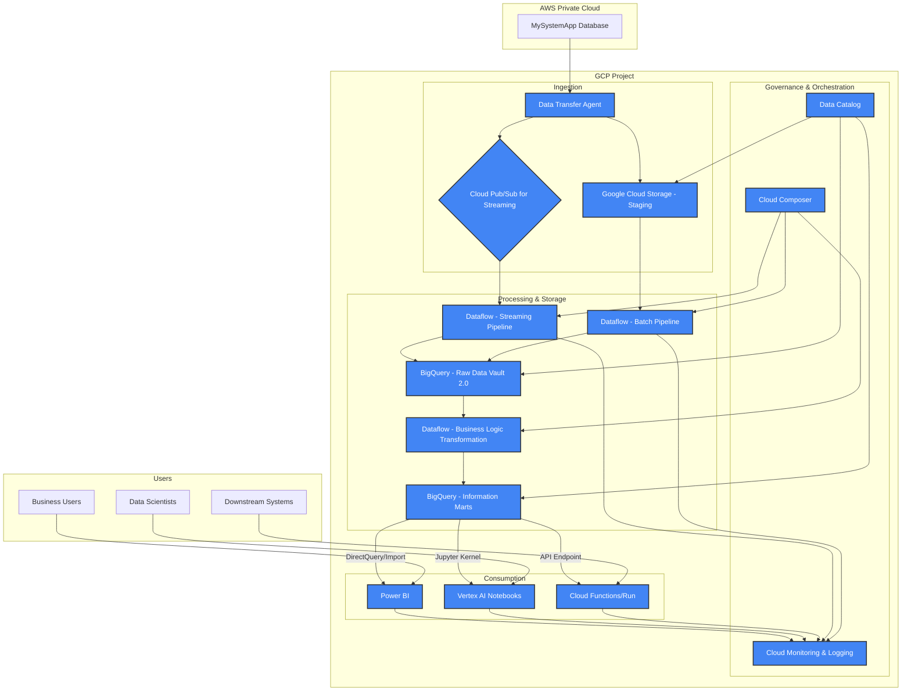
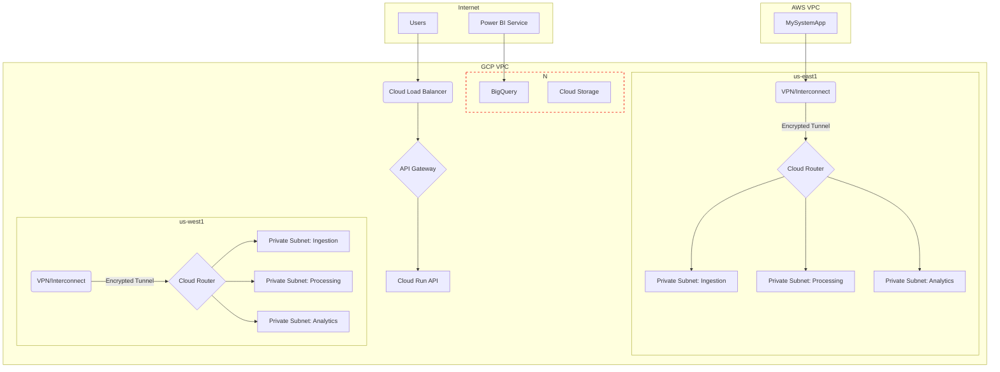
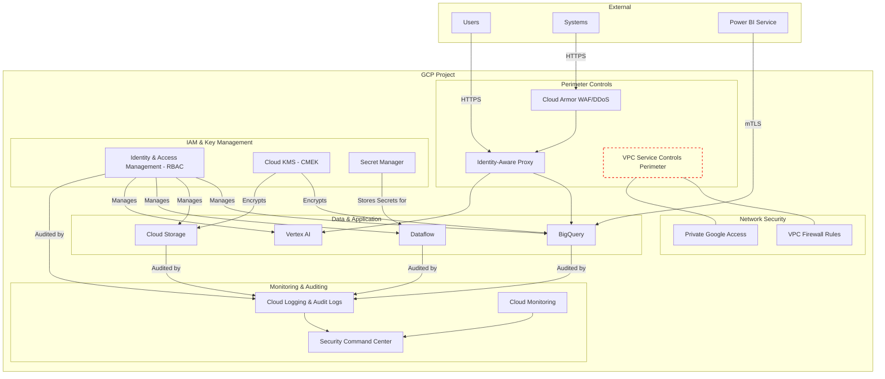

# Cloud Solution Architecture

**Project:** Cross-Cloud Data Lakehouse Analytics Platform

**Version:** 1.0

**Date:** June 25, 2025

## 1\. Overview & Executive Summary

### 1.1. Introduction & Business Problem

The organization currently faces significant challenges in accessing and analyzing critical business data stored in MySystemApp, which is hosted within a private AWS network. This data isolation creates barriers to data-driven decision-making, limits analytical capabilities, and prevents the organization from leveraging modern cloud analytics tools. The current state requires manual data extraction processes, lacks real-time insights, and cannot support the growing demands for self-service analytics and advanced data science capabilities.

### 1.2. Proposed Solution

The proposed solution implements a comprehensive cloud analytics platform that bridges AWS and Google Cloud Platform (GCP) environments through a modern data lakehouse architecture. The solution will establish secure data ingestion pipelines from the AWS-hosted MySystemApp into a GCP-based analytics environment featuring Data Vault 2.0 methodology for the raw vault layer and star schema-modeled information marts. The platform will support multiple consumption patterns including Power BI reporting, Vertex AI notebooks for data science, and RESTful APIs for downstream system integration. The primary cloud provider for the analytics platform will be Google Cloud Platform (GCP), leveraging key services such as Google Cloud Storage, Dataflow, BigQuery, Vertex AI, and Cloud Composer.

### 1.3. Key Benefits

This architecture will provide:

  * **Unified Data Access:** Eliminates data silos by centralizing analytics in a cloud-native lakehouse architecture, providing a single source of truth.
  * **Real-time Insights:** Enables near real-time data availability with a target latency of less than 5 minutes for streaming workloads.
  * **Scalable Architecture:** Supports over 500 concurrent users through an auto-scaling, serverless architecture capable of handling petabyte-scale data and high-volume processing loads.
  * **Advanced Analytics:** Provides data scientists with a flexible, GPU-accelerated Vertex AI notebook environment to build and deploy sophisticated machine learning models.
  * **Self-Service Capabilities:** Empowers business users with intuitive Power BI reporting tools, pre-built semantic models, and standardized connectors.
  * **Cost Optimization:** Aims to achieve a 30% reduction in data processing costs through the use of serverless technologies, lifecycle management, and committed use discounts.
  * **Enhanced Security and Compliance:** Implements a defense-in-depth security model with end-to-end encryption, role-based access control, and comprehensive audit trails to meet GDPR, CCPA, and SOC 2 standards.

## 2\. Scope

### 2.1. In Scope

  * **Cross-Cloud Connectivity:** Secure and reliable network integration between the private AWS VPC and the GCP environment.
  * **Data Ingestion Pipelines:** Development of both real-time streaming and batch data pipelines from the MySystemApp source.
  * **Data Lakehouse Implementation:**
      * **Raw Vault:** Implementation of a Data Vault 2.0 model in BigQuery to store historical, auditable data.
      * **Information Marts:** Creation of star schema-based information marts for optimized business intelligence and reporting.
  * **Data Transformation:** ETL/ELT pipelines using Dataflow for data cleansing, validation, and transformation.
  * **Analytics & BI Integration:**
      * Integration with Power BI, including the creation of semantic models.
      * Provisioning of a Vertex AI managed notebook environment for data science.
  * **API & Event Integration:** Development of RESTful APIs and webhook support for downstream system integration.
  * **Operational Framework:**
      * Comprehensive monitoring, logging, and alerting using Cloud Monitoring.
      * Implementation of a data governance framework with cataloging and lineage tracking.
      * A multi-region disaster recovery strategy with automated failover.

### 2.2. Out of Scope

  * Modification or migration of the source MySystemApp application.
  * Provisioning of the underlying network infrastructure (VPN/Interconnect).
  * Licensing and procurement of third-party tools (e.g., Power BI).
  * End-user training and organizational change management.
  * Custom application development beyond the defined analytics platform APIs.
  * Data migration from any system other than MySystemApp.
  * Development of a mobile application for analytics.

## 3\. Business Requirements & Architectural Drivers

### 3.1. Key Requirements Summary

**Functional Requirements:**

  * **Data Volume:** Ingest a 5TB initial load and 500GB of daily incremental data.
  * **Processing Load:** Handle peak ETL/ELT loads of up to 10TB/hour.
  * **Query Performance:** Achieve \<5 second response times for 95% of analytical queries.
  * **Concurrency:** Support 500+ concurrent users.
  * **Data Latency:** Provide near real-time data with \<5 minute end-to-end latency for streaming data.
  * **Data Accuracy:** Maintain 99.9% data accuracy and completeness.

**Non-Functional Requirements:**

  * **Availability:** \>99.9% system availability.
  * **Security:** End-to-end encryption for data at rest and in transit; role-based access control (RBAC).
  * **Compliance:** Adherence to GDPR, CCPA, SOC 2, and ISO 27001 standards.
  * **Disaster Recovery:** RTO \< 4 hours and RPO \< 1 hour.
  * **Auditability:** Comprehensive audit logging and data lineage tracking.

### 3.2. Architectural Decisions

  * **Requirement:** Secure, high-bandwidth data transfer between a private AWS network and GCP.
      * **Decision:** A dedicated, encrypted VPN/Interconnect will be established. Data will be ingested using secure data transfer agents deployed in the AWS VPC, ensuring network isolation and data integrity.
  * **Requirement:** Maintain a complete, auditable history of source data for compliance and regulatory purposes.
      * **Decision:** A Data Vault 2.0 methodology will be implemented in BigQuery. Its immutable hub, link, and satellite structures provide a non-destructive, auditable historical record.
  * **Requirement:** Support 500+ concurrent users and handle dynamic, high-volume processing loads.
      * **Decision:** A serverless, auto-scaling architecture will be built on GCP. Google Cloud Storage, Dataflow, and BigQuery will be used to dynamically scale resources based on data volume and user demand, eliminating the need for manual capacity management.
  * **Requirement:** Empower business users to create their own reports and dashboards (self-service BI).
      * **Decision:** Power BI will be integrated with BigQuery using the native connector. Pre-built, optimized semantic models (information marts) will be provided to ensure data governance and ease of use.
  * **Requirement:** Provide a powerful and flexible environment for advanced data science and machine learning.
      * **Decision:** A Vertex AI managed notebook environment will be provisioned. This provides data scientists with scalable, GPU-accelerated computing and seamless integration with other GCP ML services.
  * **Requirement:** Ensure high levels of data quality and reliability.
      * **Decision:** Automated data validation and quality checks will be embedded within the Dataflow pipelines. Anomaly detection and real-time alerting will be configured to proactively identify and address data quality issues.

## 4\. Cloud and Application Architecture

### 4.1. Recommended Cloud Provider

**Google Cloud Platform (GCP)** is the recommended provider for the core analytics platform.

**Justification:**

  * **Advanced Analytics and ML:** GCP offers a mature and integrated suite of data analytics and AI/ML services, particularly BigQuery and Vertex AI, which are central to meeting the business requirements for high-performance queries and advanced data science.
  * **Scalability and Performance:** GCP's serverless and auto-scaling services like Dataflow and BigQuery are well-suited to handle the specified high-volume, dynamic workloads without manual intervention.
  * **Data Lakehouse Vision:** BigQuery's architecture, which separates storage and compute, combined with its native integration with Google Cloud Storage and open formats, perfectly aligns with the implementation of a modern data lakehouse.

### 4.2. Architecture Diagram

### 4.3. Compute Architecture

  * **Data Ingestion & ETL (Dataflow):** Google's fully managed, serverless service for stream and batch data processing is chosen for its auto-scaling capabilities, which are essential for handling the 10TB/hour peak loads. It eliminates the need for managing compute clusters manually.
  * **Ad-hoc Analysis & ML (Vertex AI Notebooks):** A managed Jupyter notebook environment that provides data scientists with scalable and secure compute. It supports GPU acceleration, which is a key requirement for advanced analytics and model training.
  * **API Serving (Cloud Run / Cloud Functions):** These serverless compute platforms are ideal for hosting the RESTful APIs. They automatically scale based on request volume, including scaling to zero, which is highly cost-effective for services with variable traffic.

### 4.4. Application Architecture

The solution follows an **Event-Driven Architecture** combined with batch processing patterns, typical of a modern Data Lakehouse.

  * **Event-Driven for Real-time:** Streaming data from MySystemApp is treated as a continuous stream of events published to Cloud Pub/Sub. A streaming Dataflow pipeline subscribes to these events, processing them in near real-time to meet the \<5 minute latency requirement.
  * **Batch for Bulk Loads:** The initial 5TB load and daily 500GB incremental updates are handled by batch Dataflow pipelines, which are triggered on a schedule or by file arrival in Google Cloud Storage.
  * **Microservices for APIs:** The RESTful APIs for downstream systems are deployed as independent microservices on Cloud Run. This decouples the analytics consumption layer from the core data platform, allowing for independent scaling and development.

## 5\. Network Architecture

### 5.1. Network Topology

The network is designed around a central GCP Virtual Private Cloud (VPC) with strict segmentation and controlled access.

  * **VPC Configuration:** A single GCP VPC will be created with a /16 CIDR block to provide ample IP address space for future growth.
  * **Subnetting:** The VPC will be segmented into multiple private subnets across at least two regions for high availability and disaster recovery. Subnets will be created for different functional layers:
      * **Data Ingestion Subnet:** For data transfer agents and internal load balancers receiving data from AWS.
      * **Data Processing Subnet:** For Dataflow worker VMs and Cloud Composer environments.
      * **Analytics Subnet:** For private access to Vertex AI notebooks and internal API endpoints.
  * **Network Security:** All subnets will be private. Access from the public internet will be denied by default. Communication between services will leverage Private Google Access to avoid using external IPs.

### 5.2. Network Architecture Diagram

### 5.3. Traffic Flow

  * **Ingress (Cross-Cloud):** Data from the AWS MySystemApp is sent through the secure VPN/Interconnect tunnel to a regional Internal Load Balancer in the GCP Ingestion Subnet. This traffic does not traverse the public internet.
  * **Ingress (User/API):** User traffic from Power BI and API calls from downstream systems are routed through a global external HTTPS Load Balancer. The Load Balancer terminates TLS and forwards requests to the API Gateway.
  * **Internal Flow:** All communication between GCP services (Dataflow, BigQuery, Cloud Storage) occurs within the private VPC network using Private Google Access, ensuring traffic does not leave Google's network.
  * **Egress:** Egress traffic is strictly controlled. A Cloud NAT gateway is used for any necessary outbound connections from the processing layer (e.g., for accessing external package repositories), ensuring that internal resources do not have public IP addresses.

### 5.4. DNS & Connectivity

  * **DNS:** Cloud DNS will be used to manage private DNS zones for internal service discovery within the VPC. Public DNS records for the API endpoints will be managed via an enterprise DNS provider, pointing to the global external load balancer.
  * **Connectivity:** A high-availability VPN or a dedicated Interconnect connection will link the AWS VPC to the GCP VPC. This is a foundational requirement managed by the network team, as stated in the 'Out of Scope' section. Redundant tunnels to multiple GCP regions will be established for disaster recovery purposes.

## 6\. Data Storage & Management

### 6.1. Data Storage Solutions

  * **Raw Data / Staging (Google Cloud Storage):** Chosen for its virtually unlimited scalability, cost-effectiveness, and durability. It will serve as the landing zone for all ingested data from MySystemApp. Lifecycle management policies will automatically transition older data to lower-cost tiers (Nearline, Coldline) to optimize costs.
  * **Raw Vault & Information Marts (BigQuery):** A serverless, highly scalable, and cost-effective enterprise data warehouse. Its separation of storage and compute is ideal for the lakehouse architecture. It natively supports partitioning and clustering, which will be used to optimize query performance for the Data Vault and star schema tables as required.
  * **Metadata (Cloud SQL - PostgreSQL):** A managed relational database service chosen for its reliability and transactional consistency (ACID compliance). It will store critical operational metadata, including data lineage information, pipeline execution logs, and configuration parameters.

### 6.2. Data Flow & Lifecycle

1.  **Ingestion:** Data is extracted from MySystemApp and lands in a GCS staging bucket.
2.  **Processing:** Dataflow jobs are triggered, reading from GCS. Data is cleaned, validated, and loaded into the BigQuery Raw Vault using the Data Vault 2.0 methodology.
3.  **Transformation:** Downstream Dataflow jobs read from the Raw Vault, apply business logic, and build the star-schema-based Information Marts in separate BigQuery datasets.
4.  **Consumption:** Business users query the Information Marts via Power BI. Data scientists access both the marts and the raw vault from Vertex AI notebooks. Downstream systems consume data via REST APIs.
5.  **Archival & Deletion:** GCS Lifecycle policies automatically transition raw files to Coldline storage after a defined period (e.g., 90 days) and permanently delete them after the required retention period (e.g., 7 years) to comply with data retention policies and manage costs. BigQuery data is retained as per business requirements.

### 6.3. Backup and Recovery

  * **Primary Strategy:** Automated daily snapshots of all BigQuery datasets will be configured with a 30-day retention period. For business-critical information marts, these snapshots will be replicated to a secondary GCP region to protect against regional disasters.
  * **Point-in-Time Recovery (RPO \< 1 hour):** BigQuery's "time travel" feature will be utilized for operational recovery. It allows restoring any table to its state at any point in time within the last 7 days, easily meeting the \<1 hour RPO requirement for operational errors.
  * **Disaster Recovery (RTO \< 4 hours):** In the event of a primary region failure, a complete replication of the environment exists in a secondary region. Terraform scripts will be used to deploy the infrastructure, and failover will be managed by Cloud DNS, pointing users and applications to the secondary region. This strategy will be tested regularly to ensure the \<4 hour RTO can be met.

## 7\. Data and Application Integration

### 7.1. Internal Integration

  * **Service-to-Service Communication:** Microservices will communicate via REST APIs managed by API Gateway. For asynchronous processes and decoupling of services, Cloud Pub/Sub will be used as a messaging bus. This is crucial for the event-driven aspects of the architecture, such as triggering data processing upon file arrival.
  * **Data Pipeline Orchestration:** Cloud Composer (managed Apache Airflow) is selected to orchestrate the complex data pipelines. It will manage dependencies, scheduling, retries, and logging for the entire ETL/ELT workflow, from ingestion to the population of information marts.

### 7.2. External Integration

  * **Source System (MySystemApp):** Secure API connectors and potentially JDBC/ODBC database connections will be used to extract data. Authentication will be managed via dedicated service accounts and securely stored API keys/credentials in Secret Manager.
  * **Power BI:** Users will connect to BigQuery using Power BI's native connector, which supports both DirectQuery for real-time data and Import mode for performance. Data access within Power BI will be secured using service principal authentication and enforcing row-level security.
  * **Downstream Systems:** Standardized RESTful APIs with OpenAPI documentation will be provided for external systems. API Gateway will be used to manage these APIs, implementing rate limiting, authentication (API keys/OAuth), and monitoring.
  * **Identity Provider:** User authentication will be federated with the enterprise Active Directory using SAML 2.0 or OAuth 2.0, providing a seamless and secure single sign-on (SSO) experience for all users of the platform (Power BI, Vertex AI).

## 8\. Security & Compliance

### 8.1. Security Architecture Diagram

### 8.2. Identity and Access Management (IAM)

  * **Authentication:** Single sign-on (SSO) will be enforced by integrating with the enterprise identity provider (Active Directory) via SAML 2.0. All administrative access will require multi-factor authentication (MFA).
  * **Authorization:** A strict Role-Based Access Control (RBAC) model will be implemented, adhering to the principle of least privilege. Permissions will be granularly assigned to groups based on business functions (e.g., Data Analyst, Data Scientist, Platform Operator).
  * **Service Accounts:** Each application component (e.g., Dataflow job, Cloud Function) will use a dedicated service account with the minimum necessary permissions. Service account keys will be managed by GCP, automatically rotated, and never stored in code.

### 8.3. Data Protection

  * **Encryption at Rest:** All data stored in Google Cloud Storage and BigQuery will be encrypted by default. We will use Customer-Managed Encryption Keys (CMEK) stored in Cloud KMS to provide an additional layer of control and auditability. Separate key rings will be used for data of different sensitivity levels.
  * **Encryption in Transit:** All data transmission will be encrypted using TLS 1.3. Communication between the AWS and GCP VPCs will be encrypted via the VPN/Interconnect tunnel.
  * **Data Classification & Masking:** Cloud Data Loss Prevention (DLP) will be used to automatically scan for and classify sensitive data (PII, etc.) upon ingestion. Sensitive data can be automatically redacted or tokenized in certain datasets (e.g., for development) to minimize exposure.

### 8.4. Network Security

  * **Perimeter Security:** The external API endpoints will be protected by Google Cloud Armor, providing a Web Application Firewall (WAF) and DDoS mitigation. VPC Service Controls will be used to create a service perimeter around BigQuery and Cloud Storage, preventing data exfiltration by restricting data movement to authorized networks.
  * **Network Segmentation:** The VPC is segmented into private subnets for different layers (ingestion, processing, analytics). VPC firewall rules will be used to restrict traffic between subnets to only what is explicitly required.
  * **Internal Communication:** All internal GCP service-to-service communication will use Private Google Access, ensuring traffic stays on Google's private network backbone.

### 8.5. Compliance

The architecture is designed to support the following compliance standards:

  * **GDPR:** Data processing locations will be restricted to required jurisdictions. Data subject access request (DSAR) procedures will be supported by the Data Vault's structure, and data retention policies will be enforced by GCS lifecycle rules.
  * **CCPA:** Similar to GDPR, capabilities for data disclosure, deletion, and opt-out will be built into the platform's processes.
  * **SOC 2 Type II / ISO 27001:** The solution will be built on GCP services that are already compliant. The architecture incorporates the necessary controls for security, availability, and confidentiality, including IAM, encryption, logging, and DR. Comprehensive audit logs from Cloud Audit Logs will support third-party audits.

## 9\. Deployment & Operations (DevOps)

### 9.1. CI/CD Pipeline

A mature CI/CD pipeline will be established to ensure rapid, reliable, and secure deployment of all platform components.

  * **Source Control:** A Git-based repository (e.g., GitHub, Cloud Source Repositories) will be the single source of truth for all infrastructure-as-code (Terraform), data pipeline definitions (Dataflow), and API code.
  * **Build & Test:** Cloud Build will be used to automate the build and testing process. For data pipelines, this includes unit testing transformation logic and data quality rules. For APIs, it includes standard unit and integration tests.
  * **Deployment:** A blue-green deployment strategy will be used for critical components like the data processing pipelines and APIs. This allows for zero-downtime releases and immediate rollback capabilities. New versions are deployed to a parallel environment, and traffic is cut over only after successful validation.

### 9.2. Monitoring & Logging

  * **Centralized Monitoring:** Cloud Monitoring will be the central tool for monitoring the health and performance of all GCP services. It will track system metrics (CPU, memory), application performance (latency, error rates), and custom business KPIs. Proactive alerting with escalation policies will be configured for any metric that breaches a defined threshold.
  * **Centralized Logging:** Cloud Logging will aggregate logs from all services (Dataflow, BigQuery, Cloud Run, etc.) for centralized analysis, troubleshooting, and auditing.
  * **Data Quality Dashboards:** Specific dashboards will be created to monitor data quality metrics in real-time, tracking record counts, null values, and schema compliance. Alerts will be triggered for any data quality rule violations.
  * **Operational Dashboards:** A set of operational dashboards will provide a holistic view of the platform, including data ingestion rates, pipeline execution status, query performance, and user activity.

### 9.3. Disaster Recovery (DR)

The DR strategy is designed to meet the RTO of \<4 hours and RPO of \<1 hour.

  * **Multi-Region Architecture:** The entire platform will be architected for multi-region deployment. A primary region will handle the live workload, while a secondary region will act as a warm standby.
  * **Automated Failover:** Infrastructure and configurations will be replicated in the secondary region using Terraform. Data will be replicated using BigQuery and GCS cross-region replication. In the event of a primary region outage, Cloud DNS will be used to automatically fail over all traffic to the secondary region.
  * **Regular Testing:** The disaster recovery plan will be tested on a regular basis (e.g., quarterly) to validate the process and ensure the RTO and RPO can be met.

## 10\. Scalability & Performance

### 10.1. Scalability

The architecture is designed to scale horizontally and vertically to meet dynamic demands.

  * **Horizontal Scaling:**
      * **Dataflow:** Will automatically scale the number of worker nodes up or down based on the volume of data being processed in the pipelines.
      * **BigQuery:** As a serverless DWH, it scales compute resources transparently to handle hundreds of concurrent queries.
      * **Cloud Storage:** Scales automatically to accommodate the 500GB daily data growth without any manual intervention.
  * **Vertical Scaling:**
      * **Vertex AI Notebooks:** Data scientists can dynamically select and change the underlying compute instance (including adding GPUs) to match the requirements of their specific workload.
      * **Cloud SQL:** The instance size can be scaled up to handle increased metadata query loads.
  * **Global Scaling:** The multi-region design allows the platform to be deployed closer to global user bases, reducing latency and supporting data residency requirements.

### 10.2. Performance

Multiple strategies are employed to meet the \<5 second query performance requirement.

  * **Query Optimization:**
      * **BigQuery Partitioning & Clustering:** Tables in the information marts will be partitioned by date and clustered by frequently filtered columns (e.g., `customer_id`, `product_id`). This dramatically reduces the amount of data scanned per query.
      * **Materialized Views:** Pre-computed materialized views will be created for common, complex aggregations to provide near-instantaneous results.
  * **Caching:**
      * **BigQuery BI Engine:** A fast, in-memory analysis service that accelerates queries in Power BI by intelligently caching frequently accessed data.
      * **API Caching:** The API Gateway can be configured to cache responses from the backend APIs, reducing latency for repeated requests.
  * **Network Performance:** Using a Content Delivery Network (CDN) for any static assets served by the platform and leveraging GCP's global network will ensure low latency for end-users.

## 11\. Cost Estimation & Optimization

### 11.1. High-Level Cost Breakdown

The following is a rough order of magnitude (ROM) monthly cost estimate. Actual costs will vary based on usage.

  * **BigQuery (Storage & Compute):** $15,000 - $25,000
  * **Cloud Storage (Staging & Archive):** $3,000 - $5,000
  * **Dataflow (Processing):** $8,000 - $12,000
  * **Network & Data Transfer (Cross-Cloud & Egress):** $2,000 - $4,000
  * **Monitoring, Orchestration & Other Services:** $1,000 - $2,000
  * **Total Estimated Monthly Range:** **$29,000 - $48,000**

### 11.2. Cost Optimization Strategies

  * **Data Lifecycle Management:** GCS lifecycle policies will be used to automatically move older, less-frequently accessed data from Standard storage to cheaper tiers like Nearline or Coldline, significantly reducing storage costs.
  * **Resource Right-Sizing & Auto-scaling:** Dataflow's auto-scaling ensures that we only pay for the compute resources needed during pipeline execution. The serverless nature of BigQuery, Cloud Run, and Cloud Functions means there are no idle compute costs.
  * **Committed Use Discounts (CUDs):** For predictable and sustained workloads, such as the baseline BigQuery compute slots and Cloud SQL instances, 1-year or 3-year Committed Use Discounts will be purchased to achieve significant savings over on-demand pricing.
  * **Query Optimization:** Efficiently designed queries and the use of partitioning/clustering in BigQuery not only improve performance but also reduce costs, as BigQuery's on-demand pricing is based on bytes processed.

## 12\. Considerations & Limitations

### 12.1. Key Assumptions

  * The data structures and API contracts of the source MySystemApp will remain reasonably stable throughout the implementation.
  * Adequate network bandwidth for the projected data volumes can be provisioned between AWS and GCP.
  * Active participation from business stakeholders for requirements validation and user acceptance testing will be available.
  * Data growth will not drastically exceed the projected 500GB/day.
  * The core compliance requirements (GDPR, CCPA, SOC 2) will not undergo major revisions during the project lifecycle.

### 12.2. Risks & Mitigations

  * **Risk:** Cross-cloud network connectivity is a single point of failure and could be unreliable.
      * **Mitigation:** Implement redundant VPN tunnels or Direct Connect connections to multiple GCP regions. Configure comprehensive network monitoring with automated alerts and failover procedures.
  * **Risk:** Data volumes scale beyond the tested capacity of the pipelines, leading to performance degradation.
      * **Mitigation:** The architecture is designed with auto-scaling services. Perform rigorous load testing with simulated data volumes at 10x the expected load to validate scalability and identify bottlenecks early.
  * **Risk:** A security breach could occur due to the complexity of the multi-cloud environment.
      * **Mitigation:** A defense-in-depth security model is implemented. This includes continuous monitoring with Security Command Center, threat detection, and a well-defined incident response plan that is regularly tested.
  * **Risk:** Over-reliance on GCP-specific services could lead to vendor lock-in.
      * **Mitigation:** Where feasible, use open standards (e.g., SQL for queries, OpenAPI for APIs) and maintain data in open formats (e.g., Parquet, Avro) in Cloud Storage. This provides a degree of portability for the data and business logic.

### 12.3. Known Limitations

  * **Real-time Latency:** While the target is \<5 minutes, achieving this for 100% of data may be challenging due to inherent network latency between clouds and the complexity of some streaming transformations.
  * **Data Transfer Costs:** The cost of transferring 500GB of data daily from AWS to GCP can be significant and is subject to the pricing of both cloud providers. This cost must be closely monitored.
  * **Compliance Complexity:** Demonstrating compliance across a multi-cloud architecture adds complexity to audits and requires meticulous documentation and control mapping between AWS and GCP.
  * **Operational Overhead:** Managing, monitoring, and securing an architecture that spans two major cloud providers requires specialized skill sets and introduces higher operational complexity compared to a single-cloud solution.
