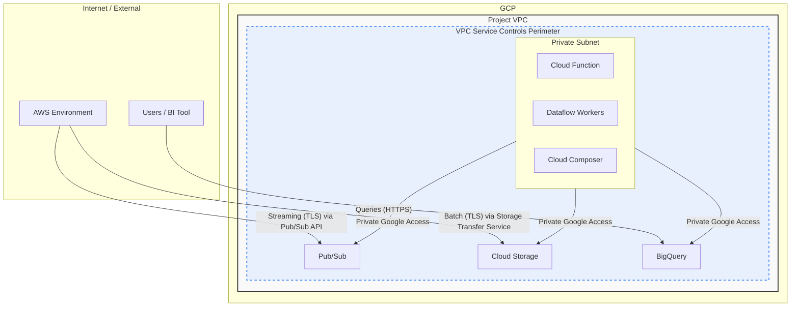

Cloud Solution Architecture
Project: Cross-Cloud Data Analytics Solution
Version: 1.2
Date: June 25, 2025

1. Overview & Executive Summary
1.1. Introduction & Business Problem
The organization requires a centralized and scalable platform to perform comprehensive business intelligence and analytics. Critical business data resides within the "MyApp" application, hosted on Amazon Web Services (AWS), which limits the ability of stakeholders to perform self-service analysis and derive timely insights. The core business problem is the siloed nature of this data and the lack of a robust, high-performance environment for data aggregation, reporting, and advanced analytics.

1.2. Proposed Solution
This document outlines a cloud-native, cross-cloud solution that establishes a data pipeline from the AWS source system into a modern Lake House architecture built on Google Cloud Platform (GCP). The architecture leverages a serverless-first approach to ensure scalability and cost-efficiency.

Data will be securely transferred from AWS to Google Cloud Storage (GCS). From there, it will be processed, cleansed, and transformed using Cloud Dataflow before being loaded into Google BigQuery, which will serve as the central analytical engine. A Medallion Architecture (Bronze, Silver, Gold) will be implemented to ensure data quality and governance. Business users will access the curated data via self-service BI tools like Looker Studio. The entire workflow will be orchestrated by Cloud Composer.

1.3. Key Benefits
This solution directly addresses the business requirements and provides the following key benefits:

Scalability: The serverless architecture, using services like BigQuery and Dataflow, automatically scales to handle fluctuating data volumes and processing demands without manual intervention.

Cost-Efficiency: A serverless model minimizes costs by only consuming resources when processing data. Furthermore, strategies like data compression before transfer and intelligent storage tiering will optimize cross-cloud and storage expenses.

Performance: BigQuery's columnar storage and massively parallel processing engine will provide sub-second query responses for most analytical workloads, significantly reducing time-to-insight.

Enhanced Analytics & Self-Service: By centralizing data in an accessible and performant warehouse, business users can conduct self-service analytics, build interactive dashboards, and move towards predictive analytics capabilities.

Security & Governance: The solution incorporates robust security controls, including end-to-end encryption, fine-grained access control with IAM, and network perimeter security with VPC Service Controls. Data governance is enhanced through a structured Medallion architecture and data lineage tracking.

2. Scope
2.1. In Scope
Design and deployment of network connectivity between AWS and GCP for data transfer.

Development of a data ingestion pipeline to handle both batch and near-real-time data from the AWS-hosted "MyApp" application.

Implementation of a Data Lake on Google Cloud Storage (GCS).

Implementation of a Medallion architecture (Bronze, Silver, Gold layers) for data processing and governance.

Setup and configuration of Google BigQuery as the enterprise data warehouse.

Development of data transformation and enrichment jobs using Cloud Dataflow.

Orchestration of data pipelines using Cloud Composer.

Integration with a BI tool (e.g., Looker Studio) for self-service reporting and dashboards.

Implementation of security, monitoring, and logging for the entire solution.

2.2. Out of Scope
Modifications to the source "MyApp" application on AWS, beyond what is necessary to facilitate data extraction.

Development of specific machine learning models (though the architecture provides readiness for this).

Management of the source AWS environment.

Creation of every specific departmental report; the focus is on providing the platform and tools for self-service.

Third-party application integration not explicitly mentioned in the BRD.

3. Business Requirements & Architectural Drivers
Requirement ID

Key Requirement (from BRD)

Architectural Decision & Justification

BRD 2.1.2

Secure, cost-effective cross-cloud data transfer.

Decision: Use Google's Storage Transfer Service for batch transfers from an S3 bucket and Google Pub/Sub for streaming. Data will be compressed before transfer to minimize AWS egress costs. All transfers use TLS encryption.

BRD 2.2.1

Medallion architecture (Bronze, Silver, Gold).

Decision: Utilize separate Google Cloud Storage (GCS) buckets for the Bronze (raw) and Silver (processed) layers, and BigQuery datasets for the Gold (aggregated, business-ready) layer. This separates concerns and improves governance.

BRD 2.2.2, 3.2

Auto-scaling batch and stream processing capabilities.

Decision: Employ Cloud Dataflow, a unified, serverless processing service. It automatically provisions and scales resources for both batch and stream workloads, ensuring performance and cost-efficiency.

BRD 2.3.1, 3.1

High-performance, large-scale aggregations & queries.

Decision: Use Google BigQuery as the analytical warehouse. Its serverless, distributed architecture is designed for petabyte-scale analysis and sub-second query performance, meeting the specified SLAs.

BRD 2.3.2

Self-service BI and reporting with role-based access.

Decision: Connect Looker Studio (or other standard BI tools) to BigQuery. Access control will be managed via GCP IAM and BigQuery's column-level and row-level security features.

BRD 5.1

Data governance, cataloging, and lineage documentation.

Decision: Integrate Google Cloud Data Catalog to automatically discover and catalog metadata from GCS and BigQuery. Dataflow jobs will be designed to emit lineage information to the catalog.

BRD 3.3

End-to-end encryption and compliance (GDPR/CCPA).

Decision: All data will be encrypted in transit (TLS) and at rest (Google-managed encryption keys). PII will be masked/anonymized using Dataflow or BigQuery dynamic data masking. VPC Service Controls will be used to create a secure data perimeter.

BRD 5.2

Automated monitoring, alerting, and orchestration.

Decision: Use Cloud Composer for workflow orchestration. Cloud Monitoring and Cloud Logging will provide a centralized platform for observability, with alerts configured for pipeline failures or performance anomalies.

4. Cloud and Application Architecture
4.1. Recommended Cloud Provider
The architecture will be implemented on Google Cloud Platform (GCP), as specified in the Business Requirements Document. This choice is strongly supported by the requirement to use Google BigQuery as the core analytical engine and the availability of a mature, integrated, and serverless data toolkit (Storage, Dataflow, Composer, etc.) that aligns perfectly with the project's scalability and performance goals.

4.2. Cloud Architecture Diagram
The following diagram describes the components and data flow of the proposed solution.

```mermaid
graph TD
    subgraph AWS Environment
        direction LR
        A[MyApp Application] --> B(AWS Kinesis/SQS for Real-time);
        A --> C{MyApp DB};
        D(Scheduled Export Job) --> E[AWS S3 Bucket (Source)];
        C --> D;
        B --> F(AWS Lambda Function);
    end

    subgraph Cross-Cloud Transfer
        direction TB
        E -- Batch Transfer via Storage Transfer Service --> G[GCS Bronze Bucket];
        F -- Real-time Push via Pub/Sub API --> H[GCP Pub/Sub Topic];
    end

    subgraph GCP Lake House Environment
        direction TB

        subgraph Ingestion & Processing
            G -- File Creation Event --> I(Cloud Function);
            H -- Message Push --> I;
            I -- Triggers Job --> J{Cloud Dataflow};
        end

        subgraph Storage & Warehousing
            J -- Writes Cleansed/Enriched Data (Parquet) --> K[GCS Silver Bucket];
            L(Cloud Composer / Airflow) -- Schedules & Loads --> M[BigQuery Gold Datasets];
            K -- Load Job --> M;
        end

        subgraph Analytics & Governance
            M -- SQL Queries --> N[Looker Studio / BI Tool];
            O(Data Analysts / Business Users) --> N;
            P(Cloud Data Catalog) -.-> G;
            P -.-> K;
            P -.-> M;
        end
    end

    subgraph Cross-Cutting Concerns
        Q[Cloud IAM] -- Manages Access --> GCP_Lake_House_Environment;
        R[Cloud Monitoring & Logging] -- Observes --> GCP_Lake_House_Environment;
        S[VPC Service Controls] -- Secures Perimeter --> GCP_Lake_House_Environment;
    end

    linkStyle 10 stroke:#ff9900,stroke-width:2px,stroke-dasharray: 3 3;
    linkStyle 11 stroke:#4285F4,stroke-width:2px,stroke-dasharray: 3 3;
```

4.3. Compute Architecture
Cloud Dataflow: The primary processing engine for both batch and streaming data. It is chosen for its serverless nature, auto-scaling capabilities, and unified programming model, which reduces development overhead.

Cloud Functions: Used as a lightweight, event-driven trigger. A function will initiate Dataflow jobs upon new file arrivals in the Bronze GCS bucket or from Pub/Sub messages, decoupling the ingestion and processing stages.

Cloud Composer: A managed Apache Airflow service used to schedule, orchestrate, and monitor the complex workflows, particularly the batch loading from the Silver layer into the Gold BigQuery tables and subsequent aggregation tasks.

4.4. Application Architecture
The solution employs an Event-Driven Architecture combined with a Medallion Lake House pattern.

Events (a new file in GCS, a new message in Pub/Sub) trigger downstream processing.

Bronze Layer (GCS): Stores raw, immutable data exactly as it arrived from the source. This ensures a permanent audit trail and the ability to replay pipelines.

Silver Layer (GCS): Stores cleansed, filtered, and enriched data, often converted to an optimized columnar format like Parquet. This layer serves as the "single source of truth" for further analytics.

Gold Layer (BigQuery): Stores business-level aggregations and data models optimized for reporting and analysis. These are the tables that end-users will query directly.

5. Network Architecture
5.1. Network Topology
A new Virtual Private Cloud (VPC) will be created in the target GCP region.

CIDR Range: A non-overlapping IP address range will be selected to prevent conflicts with on-premises or other cloud networks.

Subnets: The VPC will be segmented into private subnets for deploying resources. No resources will have public IP addresses unless explicitly required. Access to GCP services will use Private Google Access.

VPC Service Controls: A service perimeter will be established around the key project services (GCS, BigQuery, Dataflow) to prevent data exfiltration and ensure that data can only be accessed by authorized identities and services within the perimeter.

5.2. Traffic Flow
Ingress (AWS to GCP):

Batch: Google's Storage Transfer Service will pull data from the source AWS S3 bucket. This traffic securely traverses the public internet, encrypted via TLS.

Real-time: The AWS Lambda function will push messages to the GCP Pub/Sub public endpoint, secured with IAM authentication and TLS encryption.

Internal Flow: All traffic between GCP services (e.g., Dataflow reading from GCS, loading to BigQuery) will remain on Google's internal network by leveraging Private Google Access from within the VPC.

Egress (Analytics): Users will access Looker Studio via their web browsers. Looker Studio will then connect to BigQuery's endpoint within the secure perimeter.

5.3. DNS & Connectivity
Standard Google Cloud DNS will be used for service resolution within the VPC.

No requirement for a dedicated VPN or Interconnect is identified in the BRD. The proposed transfer methods are secure and cost-effective for the described use case. Should data volumes grow exponentially, a dedicated Interconnect could be considered in a future phase to reduce egress costs further.

5.4. Network Architecture Diagram
The following diagram illustrates the network topology and traffic flow.



6. Data Storage & Management
6.1. Data Storage Solutions
Google Cloud Storage (GCS): The data lake foundation.

Use Case: Stores raw data (Bronze) and processed data (Silver).

Justification: Highly durable, scalable, and cost-effective object storage. Tiered storage classes (e.g., Standard, Nearline, Archive) will be used to manage costs based on data access frequency.

Google BigQuery: The data warehouse.

Use Case: Stores the curated, aggregated Gold layer data for high-speed analytics.

Justification: Serverless, fully managed, and provides exceptional query performance on large datasets. Its separation of storage and compute allows for flexible scaling and cost management.

6.2. Data Flow & Lifecycle
Ingestion: Raw data lands in the Bronze GCS bucket with a short-term lifecycle policy (e.g., 30 days), as it is primarily for replayability.

Processing: Dataflow processes Bronze data and writes it to the Silver GCS bucket in Parquet format. Silver data is the long-term source of truth and will have a longer retention policy based on business and compliance needs.

Serving: Data from the Silver layer is loaded into BigQuery Gold tables. Older data in the Silver GCS bucket can be moved to cheaper storage classes (Nearline/Archive) using lifecycle policies.

Archival/Deletion: GCS lifecycle policies will automatically transition or delete objects based on defined rules (e.g., move data older than 1 year to Archive, delete after 7 years).

6.3. Backup and Recovery
GCS: Object versioning will be enabled on all buckets to protect against accidental deletion or modification. Cross-region replication can be configured for the Silver bucket for disaster recovery.

BigQuery: BigQuery automatically maintains a 7-day history of changes, allowing for point-in-time recovery (time travel). For longer-term backup, table snapshots can be created on a scheduled basis.

7. Data and Application Integration
7.1. Internal Integration
Event-Driven: GCS object creation events and Pub/Sub messages are used to trigger Cloud Functions, creating a loosely coupled and resilient system.

Service-to-Service: Communication between services like Dataflow, GCS, and BigQuery is handled via Google's internal APIs and managed through IAM service accounts.

Orchestration: Cloud Composer will invoke Dataflow templates, execute BigQuery load jobs, and run data quality checks in a defined, dependent sequence.

7.2. External Integration
AWS S3: Google Storage Transfer Service provides a native, configuration-driven integration for batch transfers.

MyApp Real-time Feed: The recommended pattern is a lightweight function on the AWS side (e.g., Lambda) that listens to an application stream (Kinesis) or queue (SQS) and forwards messages to a GCP Pub/Sub topic using the Pub/Sub SDK and a GCP service account key.

BI Tools: BI tools like Looker Studio, Tableau, or Power BI have native, optimized connectors for Google BigQuery.

8. Security & Compliance
8.1. Identity and Access Management (IAM)
Principle of Least Privilege: Each component (Cloud Function, Dataflow job, service account) will be granted only the specific IAM roles required for its function.

Service Accounts: Dedicated service accounts will be used for all automated processes. User-managed keys will be avoided; Google-managed keys will be used where possible.

User Access: Business users will be grouped in Google Groups, and these groups will be assigned appropriate IAM roles (e.g., roles/bigquery.user, roles/lookerstudio.viewer) for access to datasets and reports.

8.2. Data Protection
Encryption in Transit: All traffic between AWS and GCP, and within GCP, is encrypted using TLS 1.2+.

Encryption at Rest: All data stored in GCS and BigQuery is automatically encrypted at rest by Google using AES-256. Customer-Managed Encryption Keys (CMEK) can be used if required for enhanced control.

Data Masking: Sensitive data (PII) identified during data profiling will be programmatically pseudonymized or masked by the Dataflow processing job before being written to the Silver layer. BigQuery's dynamic data masking can provide an additional layer of protection for specific user roles.

8.3. Network Security
VPC Service Controls: A security perimeter will be created to prevent unauthorized copying or transfer of data from GCS and BigQuery.

Firewall Rules: GCP Firewall Rules will be configured to deny all ingress traffic by default, with specific rules to allow necessary connections.

Private Google Access: Ensures that services within the VPC communicate with Google APIs without traversing the public internet.

8.4. Compliance
The architecture is designed to be compliant with regulations like GDPR and CCPA. Key features supporting this are data masking capabilities, clear data retention policies managed by GCS lifecycle rules, robust access control logs, and the ability to locate and delete user data upon request by querying the Silver/Gold layers. Regular audits of IAM policies and access logs will be implemented.

9. Deployment & Operations (DevOps)
9.1. CI/CD Pipeline
Infrastructure as Code (IaC): All GCP resources (VPC, GCS, BigQuery datasets, IAM policies) will be defined using Terraform.

CI/CD Automation: Cloud Build will be used to create a CI/CD pipeline that automatically tests and deploys Terraform code and Dataflow job templates upon commits to a Git repository (e.g., GitHub, Cloud Source Repositories).

9.2. Monitoring & Logging
Centralized Logging: Cloud Logging will aggregate logs from all services (Dataflow, Functions, BigQuery, etc.).

Performance Monitoring: Cloud Monitoring will be used to track key metrics like pipeline throughput, error rates, Dataflow CPU/memory utilization, and BigQuery query latency.

Alerting: Alerts will be configured in Cloud Monitoring to notify the operations team of pipeline failures, security policy violations, or performance degradation via channels like PagerDuty or Slack.

9.3. Disaster Recovery (DR)
Regional Redundancy: The primary architecture will be deployed in a single GCP region. Key GCP services are regionally resilient by default.

Data Backup: For DR, GCS buckets can be configured with dual-region or multi-region settings. BigQuery data can be replicated to a dataset in another region on a scheduled basis.

Recovery: In the event of a regional outage, the IaC scripts can be used to redeploy the infrastructure in a secondary region, and data can be restored from replicated GCS buckets and BigQuery datasets. The RTO/RPO will depend on the frequency of the replication schedule.

10. Scalability & Performance
10.1. Scalability
The architecture is inherently scalable due to its serverless design:

Ingestion: Pub/Sub and GCS scale automatically to handle virtually any volume of incoming data.

Processing: Cloud Dataflow automatically scales the number of worker nodes up or down based on the workload.

Warehousing: BigQuery's architecture separates compute and storage, allowing both to scale independently and seamlessly to petabyte levels.

10.2. Performance
Low Latency Ingestion: Pub/Sub provides a low-latency path for streaming data.

Optimized Storage: Using Parquet format in the Silver layer improves I/O performance for Dataflow and BigQuery load jobs.

Fast Queries: In BigQuery, tables will be partitioned by date (e.g., event date) and clustered by frequently filtered columns (e.g., customer ID, product category) to minimize the amount of data scanned and accelerate query performance. Pre-computed aggregations in the Gold layer will further accelerate common dashboard queries.

11. Cost Estimation & Optimization
11.1. High-Level Cost Breakdown
A precise cost cannot be provided without specific data volume and query load details. However, the primary cost drivers will be:

AWS Data Egress: The cost to transfer data out of AWS. This is often the most significant cross-cloud expense.

GCP Storage: Cost for storing data in GCS (Bronze/Silver) and BigQuery (Gold).

GCP Processing: Costs for Cloud Dataflow execution, Cloud Function invocations, and Cloud Composer environment uptime.

GCP Analytics: BigQuery costs, which are based on the amount of data processed by queries (analysis) and the amount of data stored. The new BigQuery pricing models (e.g., autoscaling slots) can also be considered.

11.2. Cost Optimization Strategies
Minimize Egress Costs: Compress all data on the AWS side before initiating a transfer to GCP. Schedule large batch transfers during off-peak hours if egress pricing varies.

GCS Lifecycle Policies: Automatically transition data from Standard to cheaper Nearline, Coldline, or Archive storage classes as it ages and is accessed less frequently.

BigQuery Optimization: Partition and cluster tables to reduce data scanned per query. Materialize results of common, expensive queries into summary tables.

Committed Use Discounts (CUDs): For predictable workloads, CUDs for BigQuery compute capacity can provide significant savings over on-demand pricing.

Right-Sizing: Monitor Dataflow jobs and select appropriate machine types to avoid over-provisioning.

12. Considerations & Limitations
12.1. Key Assumptions
The [Specify] placeholders in the BRD (for data volume, types, frequency) will be filled in, but the architecture is designed to be flexible.

The "MyApp" application on AWS has, or can be fitted with, a stable mechanism for batch export (e.g., to S3) and/or a real-time event stream.

Network connectivity between AWS and the public internet is reliable and has sufficient bandwidth for the required data transfer volumes.

The project has access to personnel with skills in both AWS (for extraction) and GCP (for pipeline implementation), or a willingness to train them.

12.2. Risks & Mitigations
Risk

Mitigation Strategy

High Cross-Cloud Data Transfer Costs

Mitigation: Implement aggressive data compression on the AWS side. Continuously monitor AWS egress costs and use GCP budget alerts. For very high volumes, evaluate a future move to Google Cloud Interconnect.

Data Quality Issues

Mitigation: Implement robust data validation checks within the Dataflow jobs. Use Cloud Monitoring to create dashboards and alerts for data quality metrics (e.g., null counts, schema mismatches).

Pipeline Latency / Bottlenecks

Mitigation: Use Cloud Monitoring to identify bottlenecks in the pipeline. Dataflow and BigQuery can be scaled to meet performance requirements. Optimize transformations and BigQuery table schemas (clustering).

Schema Evolution Management

Mitigation: Design Dataflow jobs to be resilient to schema changes. Use a "dead-letter" queue for data that fails schema validation, allowing for manual inspection without halting the entire pipeline.

Low User Adoption of BI Tools

Mitigation: Engage business stakeholders early in the development of Gold tables and dashboards. Provide comprehensive training and create high-value, performant initial reports to demonstrate utility.

12.3. Known Limitations
Real-time Latency: While near-real-time is achievable, there will always be some latency (seconds to a few minutes) in a cross-cloud streaming architecture. This solution is not suitable for sub-second, real-time control systems.

Initial Complexity: Setting up a secure, cross-cloud environment with IaC and CI/CD requires specialized skills and an initial investment in engineering effort.

Dependency on Source System: The reliability of this entire pipeline is dependent on the stability and performance of the data extraction process from the "MyApp" application on AWS.